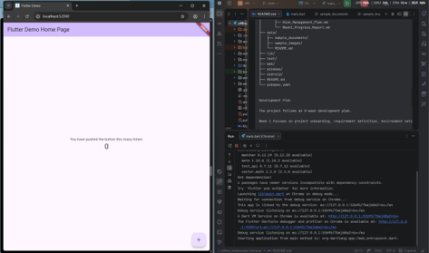
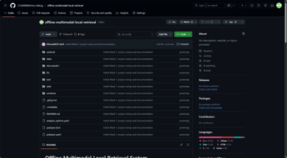
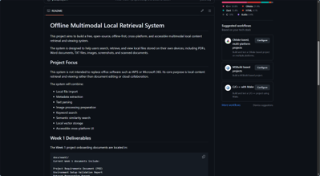
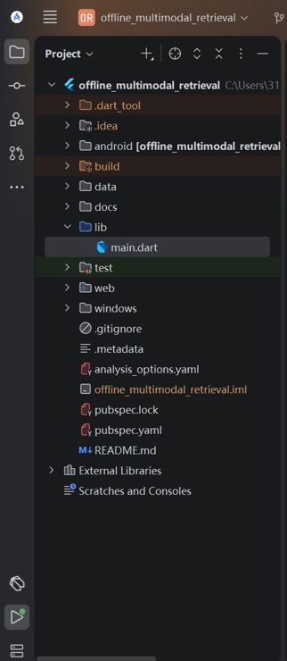
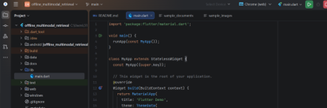
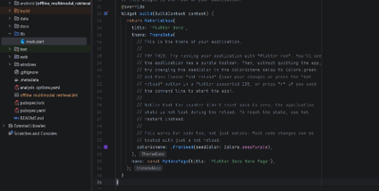

# Week 1 Progress Report

## Project Title

Offline Accessible Multimodal Local Content Retrieval System

## 1. Reporting Period

Week 1: Project Onboarding, Requirement Definition, and Environment Setup

## 2. Purpose of This Report

This report summarizes the progress completed during Week 1 of the project. The main purpose of Week 1 is to understand the project requirements, clarify the project scope, set up the development environment, identify suitable datasets, and prepare a risk management plan.

The work completed in this stage provides the foundation for later system architecture design, file parsing module development, multimodal embedding integration, vector database implementation, and user interface development.

## 3. Project Understanding

My current understanding is that this project aims to build a free, open-source, offline-first, easy-to-use, and cross-platform multimodal local content retrieval and viewing system.

The system is not intended to be a full replacement for WPS or Microsoft 365, because its core purpose is not document editing, cloud collaboration, or online office work. Instead, the main focus is local content retrieval and viewing.

The system is designed to help users search and retrieve files stored on their own devices, including PDFs, Word documents, TXT files, images, screenshots, and scanned documents. Traditional file search usually depends on file names or exact keywords. This project aims to improve that process by combining keyword search with semantic similarity search.

The expected workflow is that the system imports or indexes local files, extracts metadata, parses document text, converts text and image content into vector embeddings, stores embeddings and metadata in a local vector database, and then returns relevant files when the user enters a search query.

In this system, embeddings are not direct file pointers. Instead, they represent the semantic meaning or visual features of file content. The system uses embeddings to compare similarity, while metadata such as file path, file name, page number, text chunk ID, and image ID is used to locate the original file after a relevant result is found.

## 4. Week 1 Completed Work

The following Week 1 tasks have been completed or started:

### 4.1 Project Requirement Analysis

A Project Requirements Document (PRD) has been prepared. The PRD defines:

* Project overview
* Problem statement
* Target users
* Project objectives
* Functional requirements
* Non-functional requirements
* Project scope
* Out-of-scope features
* High-level system workflow
* Initial technical stack
* Success criteria

The PRD also clarifies that the first development stage should focus on building a practical local retrieval system rather than attempting to develop a full office software suite.

### 4.2 Environment Setup

The initial Flutter UI development environment has been configured and validated.

Completed setup includes:

* Android Studio installed
* Flutter plugin installed
* Dart plugin installed
* Flutter SDK installed
* Flutter SDK added to system PATH
* Android SDK installed
* Android SDK Command-line Tools installed
* Android SDK licenses accepted
* Flutter Doctor validation completed
* Test Flutter project created
* Test Flutter application successfully launched in Chrome

The successful test run confirms that the Flutter development environment is working correctly for Web-based testing. Android toolchain support is also available.

The only remaining Flutter Doctor warning is related to Visual Studio C++ desktop components, which are required for Windows desktop Flutter builds. This is not currently blocking the Week 1 environment validation because the current validation focuses on Flutter Web and Android toolchain readiness. If Windows desktop packaging becomes necessary later, the Visual Studio C++ workload will be installed.



Figure 1 shows that the Flutter test application was successfully launched. The result confirms that the Flutter environment, Android Studio configuration, and basic project execution were working correctly during Week 1.

### 4.3 Dataset Preparation Planning

A Dataset Preparation Report has been prepared. The report identifies the official dataset sources and explains their planned use in this project.

The planned datasets include:

* Google Natural Questions (NQ) for text retrieval and text embedding validation
* COCO for image retrieval and multimodal retrieval testing
* RVL-CDIP for scanned document and image-based document retrieval testing
* Wikipedia Text Corpus for long-document retrieval and batch processing testing

For Week 1, the full large-scale datasets do not need to be downloaded immediately. The current strategy is to use small validation subsets or manually selected local sample files first. This helps reduce complexity and supports faster early-stage development.

### 4.4 Risk Management Planning

A Risk Management Plan has been prepared. The main risks identified include:

* Project scope may be too large for 8 weeks
* Multimodal model integration may be difficult
* Local model inference may be slow
* Official datasets may be too large
* File parsing across multiple formats may be complex
* Chroma DB integration may cause issues
* Accessibility requirements may be difficult to fully meet
* Cross-platform support may increase complexity
* Windows desktop build dependencies are not fully configured yet
* Limited development time may affect final delivery quality

Mitigation strategies have also been defined. The main strategy is to first build a minimum viable product (MVP) focusing on text-based local retrieval, metadata extraction, local vector storage, and basic result display. More advanced functions, such as full image retrieval, OCR, advanced accessibility validation, and desktop packaging, can be added after the core pipeline becomes stable.

## 5. Week 1 Deliverables

The following Week 1 deliverables have been prepared:

1. Project Requirements Document (PRD)
2. Environment Setup Validation Report
3. Dataset Preparation Report
4. Risk Management Plan
5. Week 1 Progress Report



Figure 2 shows the GitHub repository created for version control, project backup, and weekly progress tracking.



Figure 3 shows the README page in the GitHub repository. It presents the project aim, project focus, system workflow, and Week 1 deliverables.
## 6. Current Technical Status

The current technical status is summarized below:

| Area                                 | Status             | Notes                                                    |
| ------------------------------------ |--------------------| -------------------------------------------------------- |
| Android Studio                       | Completed          | Installed and opened successfully                        |
| Flutter plugin                       | Completed          | Installed in Android Studio                              |
| Dart plugin                          | Completed          | Installed with Flutter support                           |
| Flutter SDK                          | Completed          | Installed and added to PATH                              |
| Android SDK                          | Completed          | Installed through Android Studio                         |
| Android SDK licenses                 | Completed          | Accepted through command line                            |
| Test Flutter app                     | Completed          | Successfully launched in Chrome                          |
| Git / GitHub                         | Completed          | Repository created and pushed to GitHub for version control          |
| Python environment                   | Pending            | To be configured for retrieval logic and data processing |
| Chroma DB                            | Pending            | To be installed for vector database prototype            |
| TensorFlow Lite                      | Planned            | To be configured when embedding engine development starts |
| Visual Studio C++ desktop components | Pending / Optional | Needed only for Windows desktop build packaging          |



Figure 4 shows the initial Flutter project structure created in Android Studio, including the `lib`, `test`, `web`, `windows`, `android`, `docs`, and `data` folders.
## 7. Key Code Snippet

The following screenshots show the initial `lib/main.dart` file used for the Week 1 Flutter environment validation. At this stage, the code focuses on confirming that the Flutter application can be launched successfully before the later file parsing and retrieval modules are implemented.





The code defines the main application entry point, creates a basic `MaterialApp`, and displays a simple home page. This confirms that the project can compile and run successfully in the Flutter development environment.
## 8. Key Decisions Made

Several initial project decisions have been made during Week 1:

1. The project will be treated as a local content retrieval and viewing system, not as a full office software replacement.
2. The system will prioritize offline-first operation to protect user privacy.
3. The early MVP will focus on text-based retrieval before full image retrieval is added.
4. Large public datasets will not be fully downloaded in Week 1. Small validation samples will be used first.
5. Flutter will be used for the user interface because the project requires cross-platform UI development.
6. Metadata and embeddings will be treated separately: embeddings support similarity comparison, while metadata helps locate the original file.
7. Accessibility will be included from the early design stage, but full WCAG 2.1 AA validation will be treated as an iterative goal.
## 9. Problems Encountered and Solutions

### Problem 1: Android SDK Command-line Tools Missing

During the initial `flutter doctor` validation, the Android SDK Command-line Tools were missing.

**Solution:**
The Android SDK Command-line Tools were installed through Android Studio SDK Manager.

### Problem 2: Android SDK License Status Unknown

Flutter Doctor initially reported that the Android SDK license status was unknown.

**Solution:**
The following command was used to accept Android SDK licenses:

```bash
flutter doctor --android-licenses
```

All SDK package licenses were accepted successfully.

### Problem 3: Visual Studio C++ Component Warning

Flutter Doctor reported that Visual Studio was missing required C++ desktop components for Windows desktop development.

**Solution:**
This issue has been recorded as a non-blocking warning. It does not affect Flutter Web or Android testing. It will be resolved later if Windows desktop packaging is required.

## 10. Plan for Week 2

The planned focus for Week 2 is system architecture design and core file parsing module development.

The Week 2 work will include:

1. Designing the modular system architecture.
2. Defining major system layers, including:

    * File I/O Layer
    * Parsing Layer
    * Embedding Engine Layer
    * Vector Storage Layer
    * Retrieval Logic Layer
    * UI and Accessibility Layer
3. Creating the initial project repository structure.
4. Starting the file parsing module.
5. Testing basic parsing for simple file types such as TXT and PDF.
6. Preparing initial metadata extraction logic.
7. Drafting the Technical Design Document (TDD).

The main goal for Week 2 is to move from project preparation into system structure and core ingestion pipeline development.

## 11. Support or Feedback Needed

At this stage, feedback would be helpful on the following points:

1. Whether the current project understanding is aligned with the expected direction.
2. Whether the proposed project boundary is appropriate for an 8-week development period.
3. Whether the MVP should prioritize text retrieval first before image retrieval.
4. Whether the selected technical stack should be adjusted before Week 2 begins.
5. Whether the current Week 1 deliverables meet the expected standard.

## 12. Conclusion

Week 1 focused on understanding the project, preparing initial documentation, setting up the development environment, identifying dataset sources, and planning risk mitigation strategies.

The Flutter UI development environment has been successfully installed and validated through a test Flutter project running in Chrome. The main project requirements and risks have been documented. Dataset sources and early development strategies have also been clarified.

The project is now ready to move into Week 2, where the focus will shift to system architecture design and the development of the core file parsing module.
