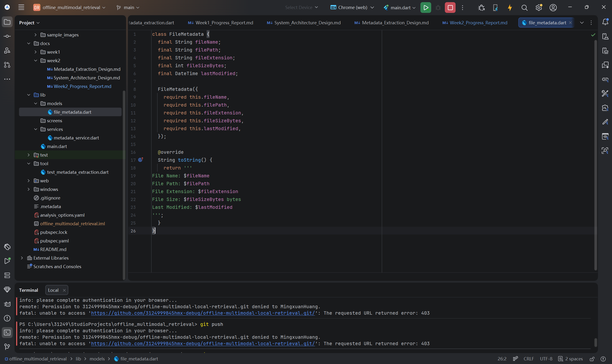
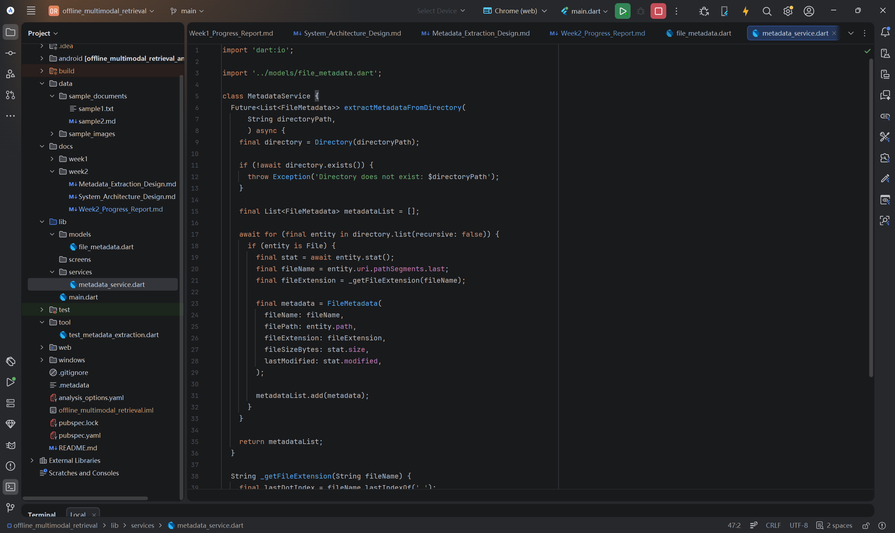
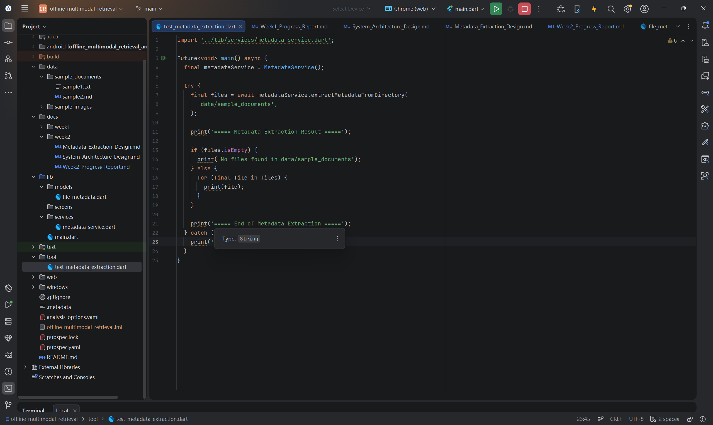
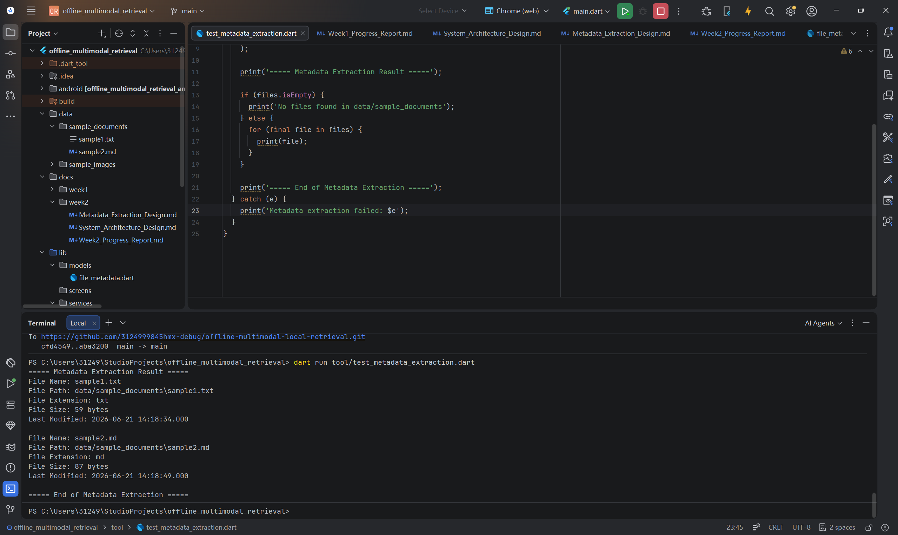
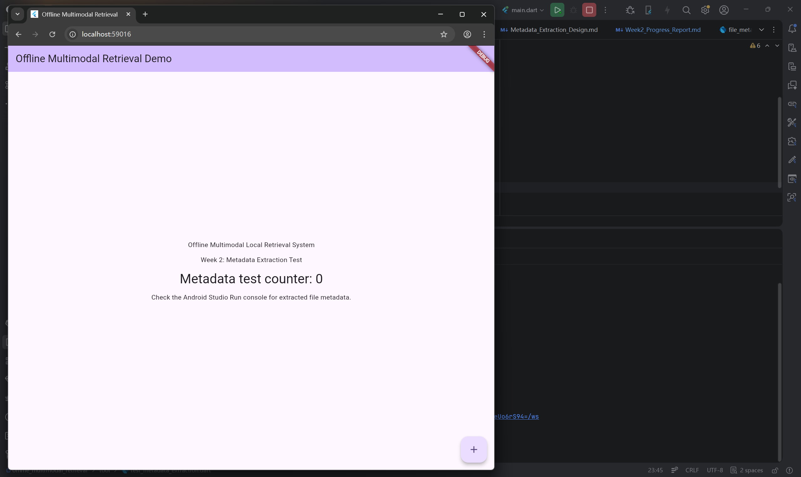
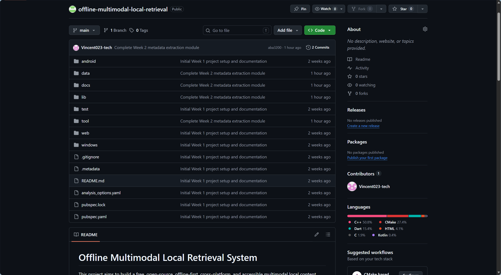

# Offline Multimodal Local Retrieval System

# Week 2 Progress Report

Student Name: Mingxuan Huang
Project Title: Offline Multimodal Local Retrieval System
Week: Week 2
Date: 2026/06/21

## 1. Week 2 Objectives

The main objective of Week 2 was to move from project initialization to the first functional development stage. Based on the Week 1 project setup, Week 2 focused on designing the initial system architecture and implementing a basic metadata extraction module.

The specific objectives were:

* Design the initial modular system architecture.
* Define the role of the File I/O Layer, Metadata Extraction Layer, Parsing Layer, Embedding Layer, Vector Storage Layer, Retrieval Layer, and Flutter UI Layer.
* Create the FileMetadata data model.
* Implement a basic MetadataService for local file metadata extraction.
* Prepare simple sample files for early-stage testing.
* Create a Dart command-line test script for metadata extraction.
* Run the metadata extraction test and validate the output through the console.
* Update the project documentation and push the Week 2 work to GitHub.

## 2. System Architecture Design

The planned system follows a modular architecture. Each module is responsible for a specific part of the local retrieval workflow.

The File I/O Layer is responsible for accessing local files and directories. The Metadata Extraction Layer extracts basic file information, such as file name, file path, file extension, file size, and last modified time. The Parsing Layer will later process text-based files, such as TXT, Markdown, PDF, and Word documents. The Embedding Layer will convert text and image content into vector representations. The Vector Storage Layer will store these vectors locally. The Retrieval Layer will support keyword-based search and semantic similarity search. Finally, the Flutter UI Layer will display files and retrieval results to users.

In Week 2, the project mainly implemented the early foundation of this architecture by focusing on local file metadata extraction.

Figure 1. Week 2 project structure with documentation, metadata model, service module, sample files, and test script.

## 3. Metadata Extraction Implementation

A new FileMetadata model was created in `lib/models/file_metadata.dart`. This model stores basic information about each local file, including file name, file path, file extension, file size in bytes, and last modified time.

A new MetadataService was created in `lib/services/metadata_service.dart`. This service scans a local directory, checks whether the directory exists, reads files from the directory, extracts their metadata, and returns a list of FileMetadata objects.

At this stage, the implementation focuses only on metadata extraction. The project has not yet implemented full document parsing, image processing, embedding generation, vector database storage, semantic search, or final search result display. These components will be developed in later weeks.

## 4. Sample Files for Testing

Several simple sample files were manually created in the `data/sample_documents` directory to validate the metadata extraction module. These files are not the final dataset. They are used only for early-stage functional testing.

The sample files include:

* `sample1.txt`
* `sample2.md`

The purpose of using simple test files is to verify that the system can correctly read local files and extract basic metadata before more complex document parsing and retrieval functions are added.

## 5. Key Code Snippets

### 5.1 FileMetadata Model

The FileMetadata model defines the basic data structure used to store local file information. It includes fields for file name, file path, file extension, file size, and last modified time.

Figure 2. FileMetadata model for storing local file metadata.

### 5.2 MetadataService

The MetadataService is responsible for scanning a local directory and extracting metadata from files. It checks whether the directory exists, loops through files in the selected directory, reads file status information, and creates FileMetadata objects.

Figure 3. MetadataService implementation for extracting metadata from local files.

### 5.3 Dart Command-Line Test Script

A separate Dart command-line test script was created in `tool/test_metadata_extraction.dart`. This script allows the metadata extraction logic to be tested independently from the Flutter UI.

Figure 4. Dart command-line test script for metadata extraction.

## 6. Running Result

The metadata extraction module was tested by running the Dart command-line test script. The test scanned the `data/sample_documents` directory and printed the extracted metadata in the console.

The output included:

* File name
* File path
* File extension
* File size
* Last modified time

Figure 5. Metadata extraction result printed in the Dart command-line console.

The successful console output confirms that the basic metadata extraction module works correctly and that the project is ready for the next stage of file parsing development.

## 7. Flutter UI Test

The Flutter application was also launched successfully in Chrome. The Week 2 test interface displayed the project title and indicated that the metadata extraction test should be checked through the Android Studio Run console.

However, direct local file metadata extraction through Flutter Web produced an unsupported operation issue because the implementation uses `dart:io` for local file system access. This is a platform limitation of the web runtime rather than a failure of the metadata extraction logic.

Therefore, the metadata extraction logic was tested separately through the Dart command-line script. This allowed the file system module to be validated independently before later integration with a desktop runtime or a file picker interface.

## 8. Problems and Solutions

One issue identified during Week 2 was that no external dataset had been provided for testing. To solve this, simple sample files were manually created in the sample document folder. This approach is suitable for early-stage testing because the purpose of Week 2 is to validate metadata extraction rather than evaluate final retrieval performance.

Another issue was that Flutter Web does not support direct local file system access through `dart:io`. To solve this, the metadata extraction function was tested through a Dart command-line script. This separated the core file system logic from the UI layer and made the test result more reliable.

The project also needed to clearly distinguish completed work from planned future functionality. Therefore, this report states that metadata extraction has been implemented, while document parsing, embedding generation, vector database integration, semantic search, and final UI result display remain future tasks.

## 9. GitHub Update

The Week 2 changes were committed and pushed to the GitHub repository. This update includes the Week 2 documentation files, metadata model, metadata service, sample files, and the Dart command-line test script.

Figure 6. Week 2 metadata extraction module successfully pushed to the GitHub repository.

## 10. Week 2 Summary

During Week 2, the project moved from environment setup to initial functional development. The modular architecture was defined, the FileMetadata model was created, and the MetadataService module was implemented. Simple sample files were prepared for testing, and the metadata extraction function was validated through Dart command-line output.

This progress provides a clear foundation for Week 3, where the project can begin implementing basic file parsing and preparing extracted text for retrieval.

## 11. Week 3 Plan

The next stage will focus on the initial file parsing module. The planned tasks include:

* Implement basic text file parsing for TXT and Markdown files.
* Prepare the system to support PDF and Word document parsing in later stages.
* Store parsed text content in a structured format.
* Connect metadata extraction with text parsing.
* Begin designing the local search data structure.
* Continue updating documentation and screenshots for progress tracking.
