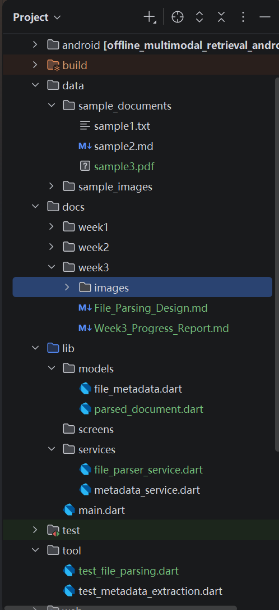
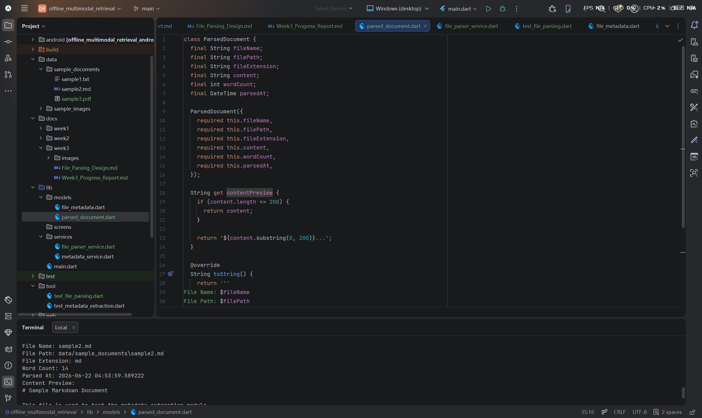
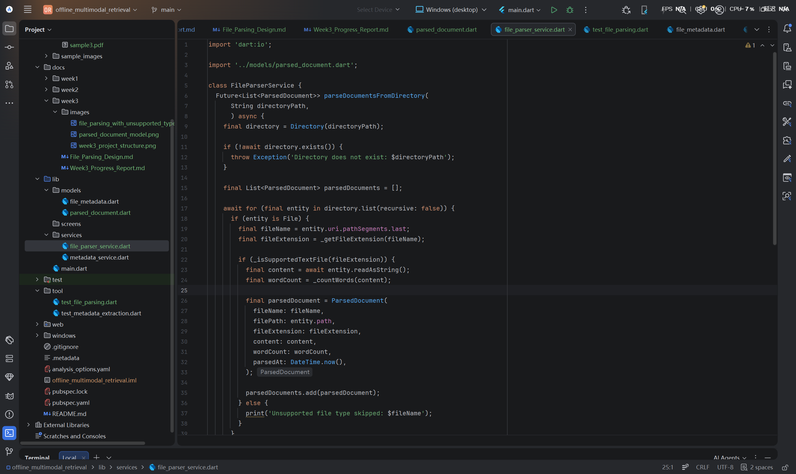
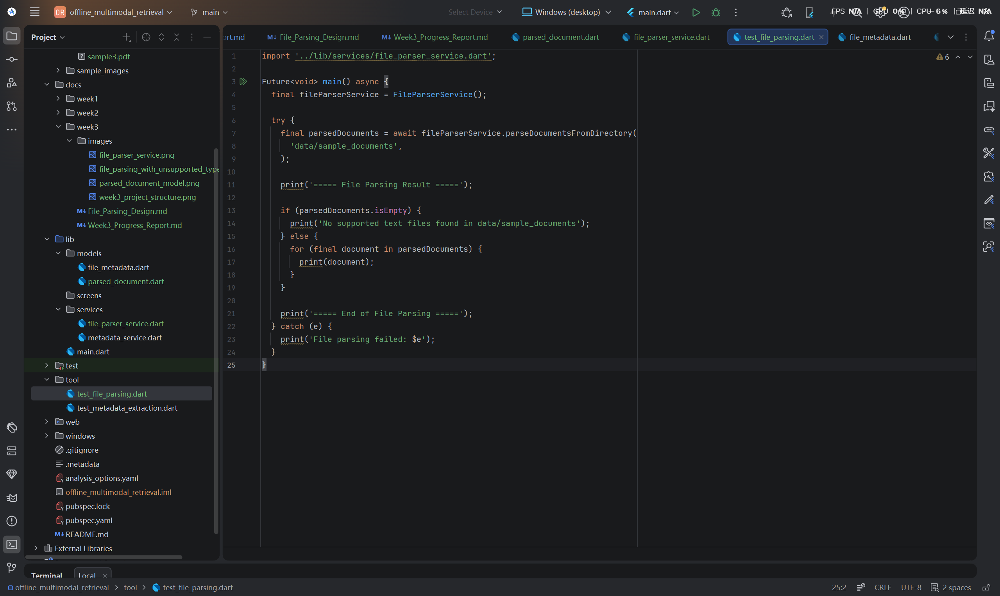
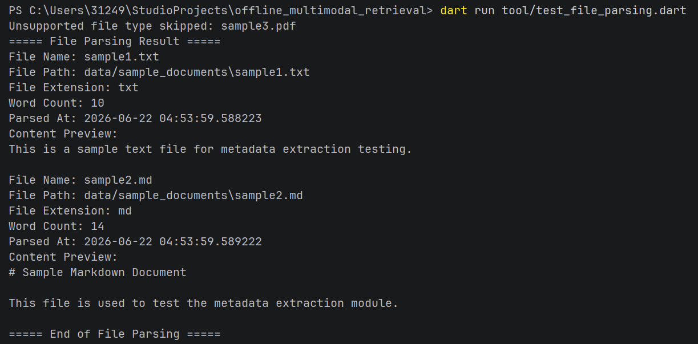
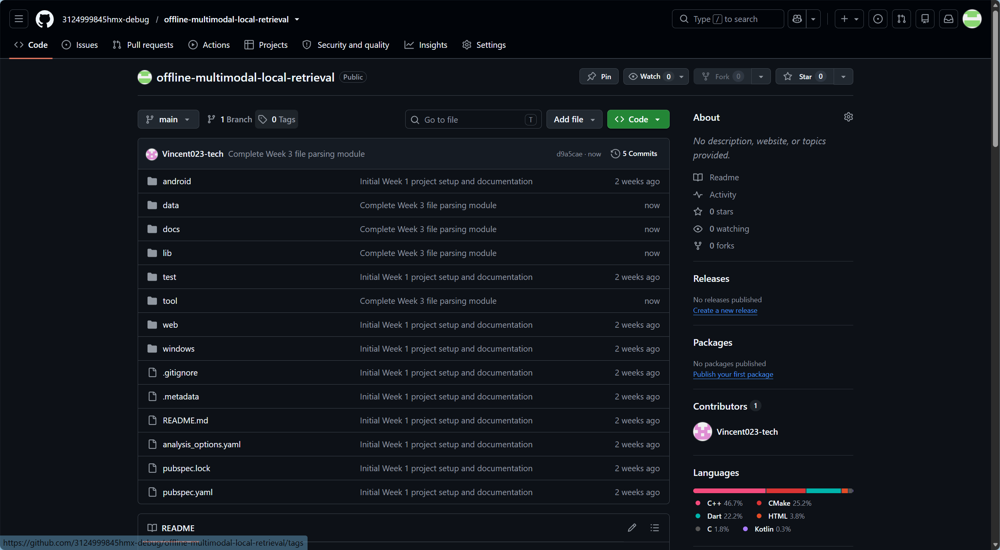

# Offline Multimodal Local Retrieval System

# Week 3 Progress Report

Student Name: Mingxuan Huang
Project Title: Offline Multimodal Local Retrieval System
Week: Week 3
Date: 2026/06/22

## 1. Week 3 Objectives

The main objective of Week 3 was to move from metadata extraction to basic file parsing. In Week 2, the system was able to extract basic file metadata, such as file name, file path, file extension, file size, and last modified time. Based on that foundation, Week 3 focused on reading the actual content of supported local files.

The specific objectives of Week 3 were:

* Design the initial file parsing module.
* Create a new ParsedDocument data model.
* Implement a FileParserService for local text file parsing.
* Support basic TXT and Markdown file parsing.
* Extract parsed text content from supported files.
* Calculate a basic word count for parsed documents.
* Provide a content preview for each parsed document.
* Add handling for unsupported file types.
* Validate the parsing module using a Dart command-line test script.
* Update project documentation and push Week 3 work to GitHub.

## 2. Week 3 Project Structure

During Week 3, new folders and files were added to support the file parsing module. A new `docs/week3` folder was created for Week 3 documentation. A new `parsed_document.dart` model was added under `lib/models`, and a new `file_parser_service.dart` file was added under `lib/services`. A separate Dart command-line test script named `test_file_parsing.dart` was also created under the `tool` folder.

The sample document folder was also updated. In addition to `sample1.txt` and `sample2.md`, a `sample3.pdf` file was added to test how the system handles unsupported file types.



Figure 1. Week 3 project structure with file parsing model, service, test script, and sample files.

## 3. File Parsing Design

The file parsing module is designed as the next layer after metadata extraction. While the metadata extraction module focuses on basic file information, the file parsing module focuses on reading file content.

The overall workflow for this stage is:

```text
Local sample files
→ Check file extension
→ Parse supported text files
→ Extract file content
→ Calculate word count
→ Create ParsedDocument object
→ Print parsing result in the terminal
```

At this stage, the parser supports TXT and Markdown files. These two formats were selected because they are simple text-based formats and are suitable for early-stage validation. PDF, Word, and image parsing are not fully implemented in this stage because they require additional parsing libraries or OCR-related processing. However, unsupported file types are handled safely by the system instead of causing runtime failure.

This design keeps the project development process controlled and modular. It also prepares the project for later stages, where PDF parsing, Word document parsing, image processing, embedding generation, vector database storage, and semantic search will be added.

## 4. Implementation

### 4.1 ParsedDocument Model

A new `ParsedDocument` model was created in `lib/models/parsed_document.dart`. This model stores the result of parsing a local document.

The model includes the following fields:

* `fileName`
* `filePath`
* `fileExtension`
* `content`
* `wordCount`
* `parsedAt`

Compared with the Week 2 `FileMetadata` model, the `ParsedDocument` model stores not only file information but also the extracted text content. This means the system has moved from basic metadata handling to actual content processing.

The model also includes a `contentPreview` getter. This is used to show a shortened version of the parsed content, which will be useful later when search results are displayed in the Flutter interface.



Figure 2. ParsedDocument model for storing parsed file content.

### 4.2 FileParserService

A new `FileParserService` was created in `lib/services/file_parser_service.dart`. This service is responsible for scanning a local directory, identifying supported file types, reading file content, calculating word count, and returning a list of `ParsedDocument` objects.

The main method in this service is `parseDocumentsFromDirectory`. It receives a directory path, checks whether the directory exists, loops through the files in the directory, and parses supported text files.

The current implementation supports:

* TXT files
* Markdown files

For unsupported file types, such as PDF at this stage, the system prints a message and skips the file safely. This avoids program crashes and makes the parser more robust for future extension.



Figure 3. FileParserService implementation for parsing supported local text files.

### 4.3 Dart Command-Line Test Script

A separate Dart command-line test script was created in `tool/test_file_parsing.dart`. This script was used to validate the file parsing module independently from the Flutter user interface.

The script calls `FileParserService`, scans the `data/sample_documents` folder, and prints the parsing result in the terminal. This testing method is useful because file system logic can be verified directly without depending on UI integration.



Figure 4. Dart command-line test script for validating the file parsing module.

## 5. Testing and Running Result

The file parsing module was tested by running the following command:

```bash
dart run tool/test_file_parsing.dart
```

The test successfully parsed two supported files:

* `sample1.txt`
* `sample2.md`

The result showed that the parser could read the file name, file path, file extension, word count, parsing time, and content preview. The TXT file was parsed as plain text, while the Markdown file was also read as text content.

An unsupported PDF file named `sample3.pdf` was also added to the sample document folder. The system correctly skipped this file and printed an unsupported file type message. This confirmed that the parser can handle unsupported files safely without crashing.



Figure 5. File parsing test result showing TXT and Markdown parsing with unsupported PDF skipping.

The successful output confirms that the Week 3 file parsing module works as expected. The system can now move beyond metadata extraction and begin processing actual document content.

## 6. Problems and Solutions

One issue in Week 3 was deciding how much parsing functionality should be implemented at this stage. Full PDF, Word, and image parsing would require additional dependencies and more complex processing. To keep the development process manageable, the Week 3 implementation focused on TXT and Markdown files first.

Another issue was how to handle unsupported file types. Instead of ignoring this problem, the parser was designed to detect unsupported extensions and skip them safely. This was tested using `sample3.pdf`. The result showed that the system could continue running normally even when unsupported files were present in the sample folder.

This approach makes the system more stable and prepares it for future extension.

## 7. GitHub Update

The Week 3 changes were committed and pushed to the GitHub repository. This update includes the new file parsing model, file parsing service, test script, sample unsupported file, Week 3 documentation, and related screenshots.



Figure 6. Week 3 file parsing module successfully pushed to the GitHub repository.

## 8. Week 3 Summary

During Week 3, the project moved from metadata extraction to basic file content parsing. A new `ParsedDocument` model was created to store parsed file content, word count, and parsing time. A new `FileParserService` was implemented to parse TXT and Markdown files from the local sample document folder.

The module was validated using a Dart command-line test script. The test confirmed that supported files could be parsed successfully and that unsupported files, such as PDF files, could be skipped safely without causing errors.

This progress provides a clear foundation for the next stage of development. The project can now begin preparing parsed text for local search, embedding generation, and later vector-based retrieval.

## 9. Week 4 Plan

The next stage will focus on improving the parsing and preparation process for retrieval. The planned tasks for Week 4 include:

* Improve parsed text cleaning and normalization.
* Prepare a structured format for storing parsed content.
* Connect metadata extraction and file parsing results more clearly.
* Begin designing a simple local search data structure.
* Explore basic keyword search for parsed text.
* Prepare for later embedding generation and vector database integration.
* Continue documenting progress and testing results.
