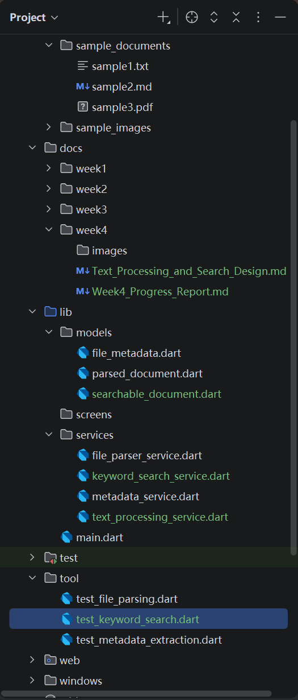
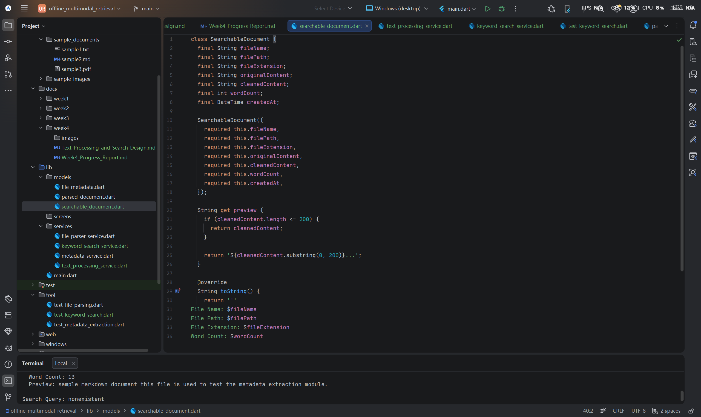
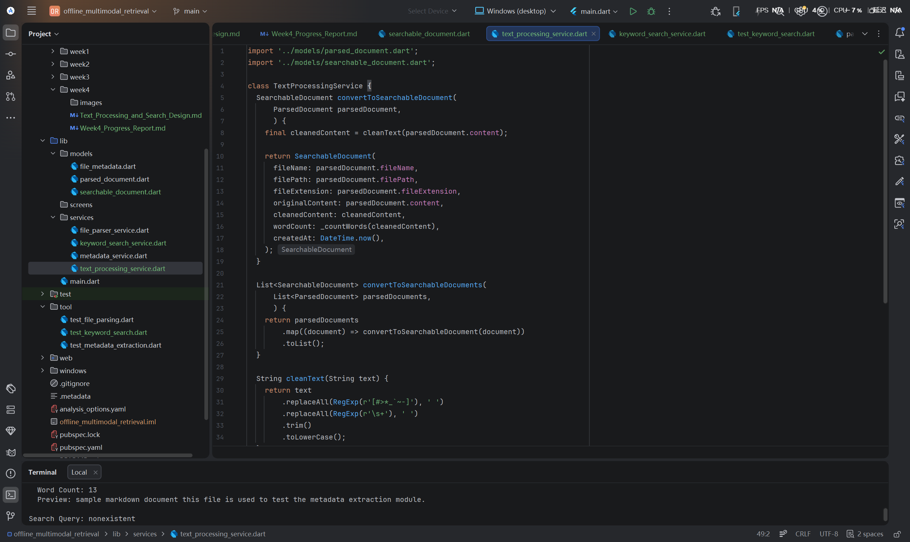
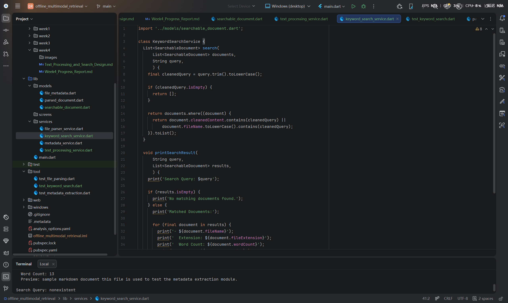
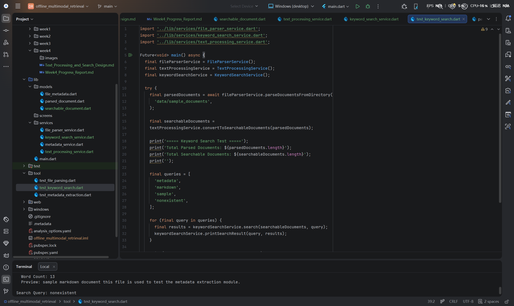
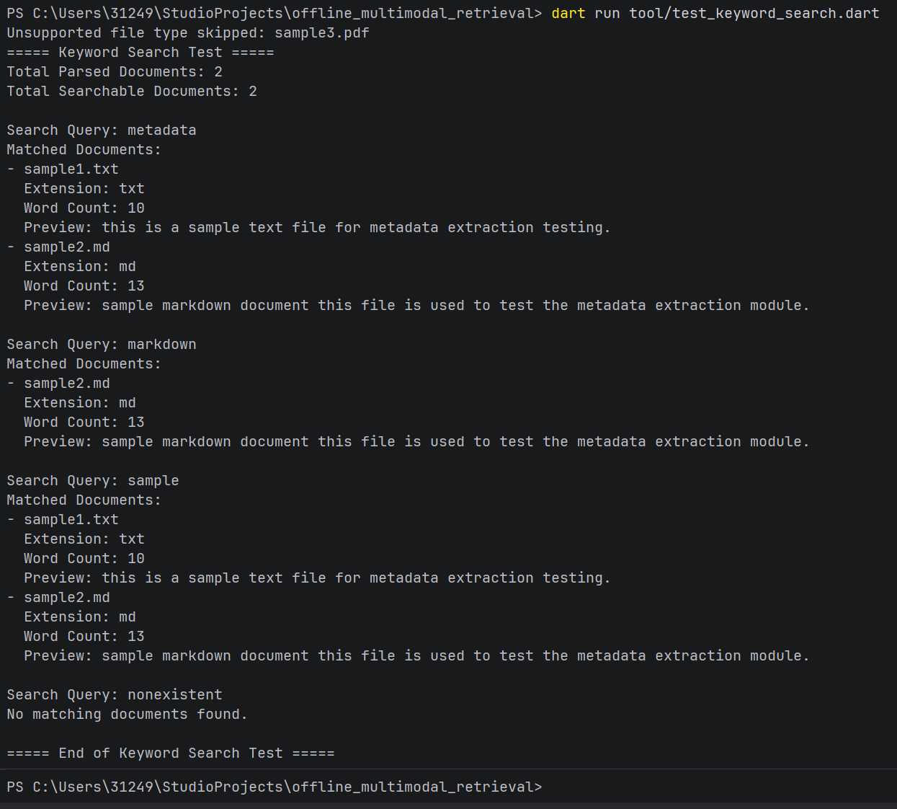

# Offline Multimodal Local Retrieval System

# Week 4 Progress Report

Student Name: Mingxuan Huang
Project Title: Offline Multimodal Local Retrieval System
Week: Week 4
Date: 2026/06/22

## 1. Week 4 Objectives

The main objective of Week 4 was to move from basic file parsing to initial text processing and keyword-based retrieval. In Week 3, the system was able to parse TXT and Markdown files and extract their text content. Based on that foundation, Week 4 focused on preparing parsed text for search and implementing a simple keyword search function.

The specific objectives of Week 4 were:

* Create a searchable document data model.
* Convert parsed documents into searchable documents.
* Implement basic text cleaning and normalization.
* Remove simple Markdown symbols from parsed text.
* Convert text to lowercase for search consistency.
* Implement a keyword search service.
* Search documents by file name and cleaned content.
* Test different keyword queries using a Dart command-line script.
* Validate matching and non-matching search results.
* Update documentation and push Week 4 work to GitHub.

## 2. Week 4 Project Structure

During Week 4, several new files were added to support text processing and keyword search. A new `docs/week4` folder was created for Week 4 documentation and screenshots. A new `SearchableDocument` model was added under `lib/models`. Two new service files were added under `lib/services`: `text_processing_service.dart` and `keyword_search_service.dart`. A new test script named `test_keyword_search.dart` was also created under the `tool` folder.

The Week 4 structure builds directly on the previous Week 2 and Week 3 modules. The metadata extraction module identifies basic file information, the file parsing module reads file content, and the new Week 4 modules prepare the parsed content for keyword-based retrieval.



Figure 1. Week 4 project structure with text processing and keyword search modules.

## 3. Text Processing and Keyword Search Design

The Week 4 module is designed as the next step after file parsing. The Week 3 parser extracts raw text content from supported files. However, raw parsed text is not always suitable for search because it may contain formatting symbols, inconsistent capitalization, and unnecessary whitespace. Therefore, Week 4 introduces a text processing stage before keyword search.

The overall Week 4 workflow is:

```text
Local sample files
→ File parsing
→ ParsedDocument objects
→ Text cleaning and normalization
→ SearchableDocument objects
→ Keyword search
→ Terminal output
```

The current keyword search module works by comparing the user query with each document's cleaned content and file name. If the cleaned content or file name contains the query, the document is returned as a matched result.

At this stage, the search function is intentionally simple. It focuses on keyword matching rather than semantic search. This is suitable for Week 4 because it provides a clear retrieval foundation before later embedding generation and vector database integration.

## 4. Implementation

### 4.1 SearchableDocument Model

A new `SearchableDocument` model was created in `lib/models/searchable_document.dart`. This model stores the processed version of parsed documents and prepares them for search.

The model includes the following fields:

* `fileName`
* `filePath`
* `fileExtension`
* `originalContent`
* `cleanedContent`
* `wordCount`
* `createdAt`

Compared with the Week 3 `ParsedDocument` model, the new `SearchableDocument` model stores both the original parsed text and the cleaned text. This makes the document more suitable for retrieval because the system can search against normalized content while still keeping the original content for reference.

The model also includes a `preview` getter, which provides a shortened version of the cleaned content. This is useful for displaying search results in a readable format.



Figure 2. SearchableDocument model for storing original and cleaned searchable text.

### 4.2 TextProcessingService

A new `TextProcessingService` was created in `lib/services/text_processing_service.dart`. This service converts `ParsedDocument` objects into `SearchableDocument` objects.

The service performs basic text cleaning, including:

* Removing simple Markdown symbols.
* Replacing multiple spaces with a single space.
* Trimming unnecessary spaces.
* Converting text to lowercase.
* Recalculating word count after cleaning.

This step is important because search results are more reliable when the text is normalized. For example, converting text to lowercase allows the system to match keywords regardless of capitalization.



Figure 3. TextProcessingService implementation for cleaning parsed text and creating searchable documents.

### 4.3 KeywordSearchService

A new `KeywordSearchService` was created in `lib/services/keyword_search_service.dart`. This service performs simple keyword-based search over a list of `SearchableDocument` objects.

The service cleans the query by trimming spaces and converting it to lowercase. It then checks whether the cleaned query appears in either the document's cleaned content or file name. If a match is found, the document is returned as a search result.

The service also includes a method for printing search results in the terminal. This allows the search function to be tested clearly through a Dart command-line script.



Figure 4. KeywordSearchService implementation for keyword-based document retrieval.

### 4.4 Dart Command-Line Test Script

A new Dart command-line test script was created in `tool/test_keyword_search.dart`. This script connects the Week 3 file parsing module with the new Week 4 text processing and keyword search modules.

The test script performs the following steps:

* Calls `FileParserService` to parse local sample files.
* Calls `TextProcessingService` to convert parsed documents into searchable documents.
* Calls `KeywordSearchService` to search different keywords.
* Prints matched and unmatched results in the terminal.

The tested search queries were:

* `metadata`
* `markdown`
* `sample`
* `nonexistent`

These queries were selected to test both successful and unsuccessful search cases.



Figure 5. Dart command-line test script for validating the keyword search workflow.

## 5. Testing and Running Result

The Week 4 keyword search module was tested by running the following command:

```bash
dart run tool/test_keyword_search.dart
```

The test successfully completed the full Week 4 workflow. The system parsed the supported TXT and Markdown files, skipped the unsupported PDF file, converted the parsed documents into searchable documents, and performed keyword search using different queries.

The result showed that:

* `metadata` matched both `sample1.txt` and `sample2.md`.
* `markdown` matched `sample2.md`.
* `sample` matched both `sample1.txt` and `sample2.md`.
* `nonexistent` returned no matching documents.

The test also showed that `sample3.pdf` was skipped safely because PDF parsing is not supported at this stage. This confirms that the system can continue working even when unsupported file types are present in the sample folder.



Figure 6. Keyword search result showing matched and unmatched query results.

The successful result confirms that the Week 4 module works as expected. The system can now process parsed text and perform simple keyword-based retrieval.

## 6. Problems and Solutions

One issue in Week 4 was deciding how to prepare parsed text for search. Raw text from TXT and Markdown files may include formatting symbols and inconsistent capitalization. To solve this, a basic text cleaning function was implemented. The function removes simple Markdown symbols, normalizes whitespace, trims unnecessary spaces, and converts text to lowercase.

Another issue was how to test keyword search clearly. Instead of testing the search logic only through the Flutter interface, a separate Dart command-line script was used. This made it easier to validate the backend logic step by step.

A further issue was handling unsupported file types. The sample folder includes `sample3.pdf`, but PDF parsing is not implemented yet. The existing parsing module skips unsupported files safely, which allows the keyword search test to continue without crashing.

## 7. Current Limitations

Although the Week 4 text processing and keyword search module was successfully implemented and tested, the current system still has several limitations.

First, the search function is based only on simple keyword matching. It does not yet support semantic search. This means the system can find documents containing the exact query word, but it cannot understand similar meanings, related concepts, or user intent.

Second, the current search function does not include ranking or relevance scoring. If multiple documents match the query, the system returns them without calculating which result is more relevant. In later stages, a scoring mechanism should be added to improve result ordering.

Third, the text cleaning process is still basic. It removes simple Markdown symbols and normalizes whitespace, but it does not perform advanced natural language processing. For example, it does not remove stop words, apply stemming, detect document sections, or process tables.

Fourth, the test dataset is still very small. The current validation uses only simple sample files. This is useful for checking functionality, but it is not enough to evaluate performance with larger document collections or more complex real-world files.

Fifth, the system still does not support full PDF, Word, PowerPoint, or image parsing. Unsupported files can be skipped safely, but they cannot yet be processed or searched.

Finally, the search result is still displayed through the Dart command-line terminal rather than the Flutter user interface. Future work should connect the keyword search module with the UI so that users can enter queries and view results directly in the application.

Overall, Week 4 successfully introduced basic text processing and keyword search, but the current implementation remains an early-stage retrieval prototype. The next stage should focus on improving retrieval quality and preparing for embedding-based semantic search.

## 8. GitHub Update

The Week 4 changes were committed and pushed to the GitHub repository. This update includes the searchable document model, text processing service, keyword search service, keyword search test script, Week 4 documentation folder, and related screenshots.


Figure 7. Week 4 text processing and keyword search module successfully pushed to the GitHub repository.

## 9. Week 4 Summary

During Week 4, the project moved from basic file parsing to initial text processing and keyword-based retrieval. A new `SearchableDocument` model was created to store original and cleaned text content. A new `TextProcessingService` was implemented to clean parsed text and convert parsed documents into searchable documents. A new `KeywordSearchService` was also implemented to perform simple keyword matching.

The module was validated using a Dart command-line test script. The result confirmed that the system could parse supported files, clean their text content, search different keywords, return matched documents, and handle unmatched queries correctly.

This progress provides a clear foundation for the next stage of development. The project can now move toward more advanced retrieval methods, including result ranking, embedding generation, vector database storage, and semantic search.

## 10. Week 5 Plan

The next stage will focus on improving retrieval capability and preparing for semantic search. The planned tasks for Week 5 include:

* Improve the keyword search result structure.
* Add basic relevance scoring or ranking.
* Explore text chunking for longer documents.
* Prepare parsed and cleaned text for embedding generation.
* Research suitable local embedding models or lightweight embedding methods.
* Begin designing vector storage for semantic retrieval.
* Continue documenting progress, testing results, and current limitations.
