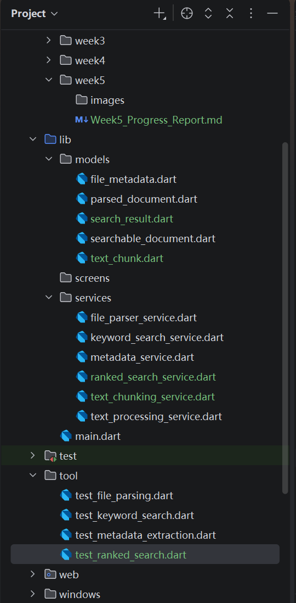
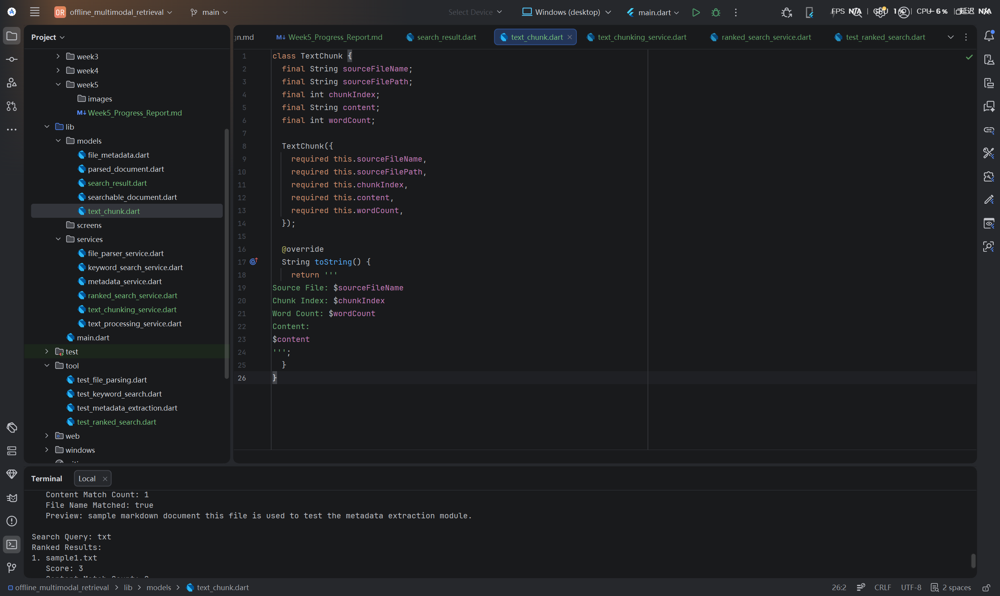
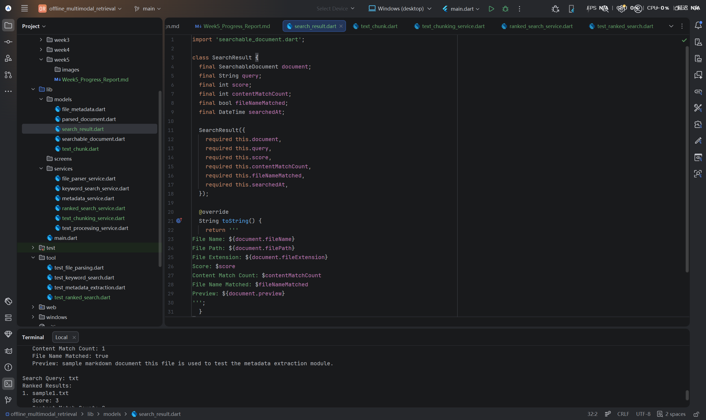
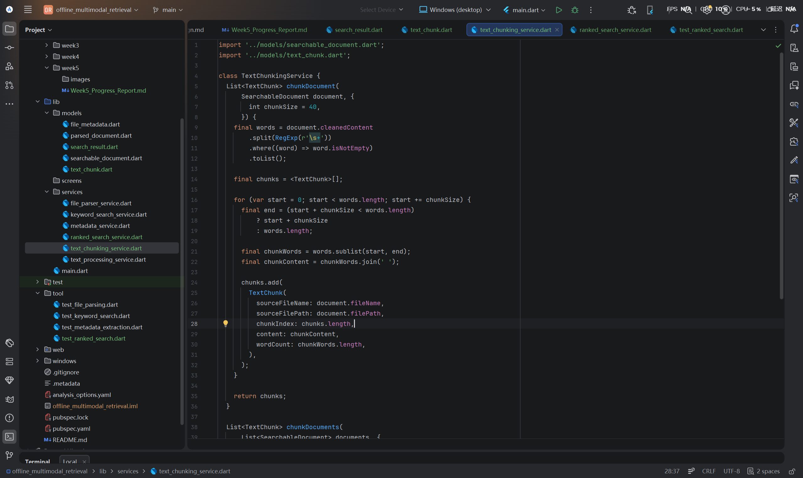
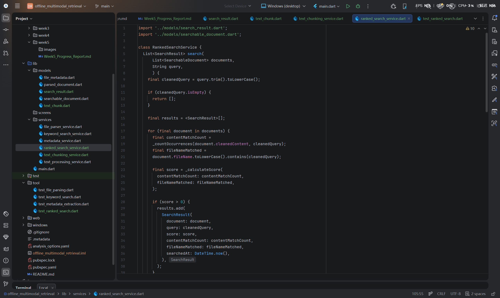
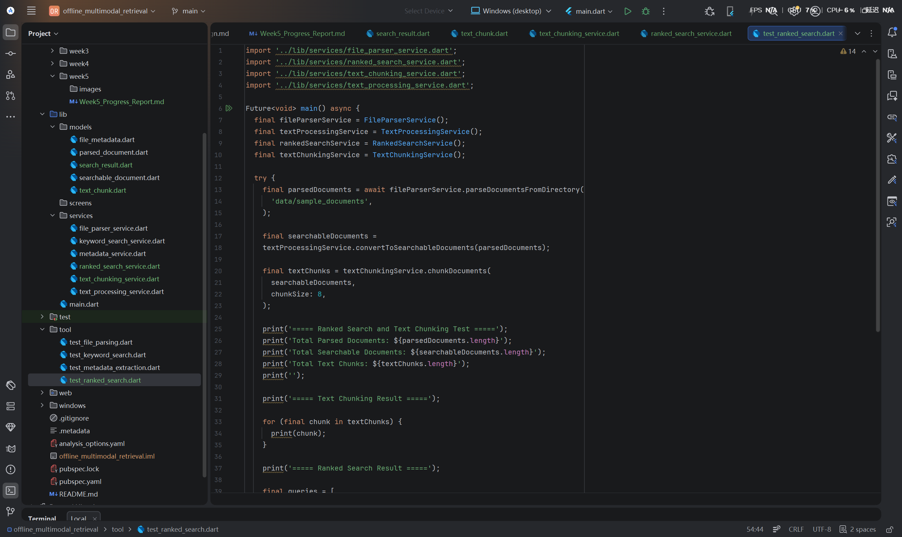
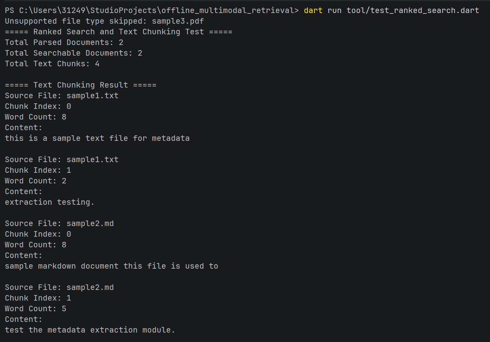
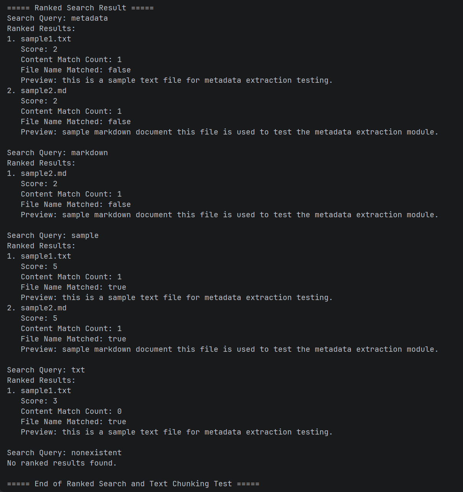
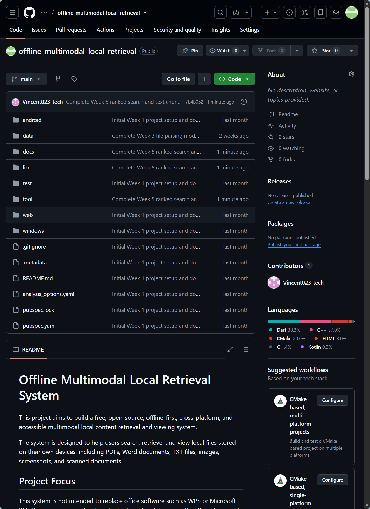

# Offline Multimodal Local Retrieval System

# Week 5 Progress Report

Student Name: Mingxuan Huang  
Project Title: Offline Multimodal Local Retrieval System  
Week: Week 5  
Date: 2026/06/23

## 1. Week 5 Objectives

The main objective of Week 5 was to improve the retrieval function of the system by adding text chunking and ranked keyword search. In Week 4, the system was able to clean parsed text and perform basic keyword search. However, the search result only showed whether a document matched a query or not. It did not include ranking, scoring, or detailed matching information.

Therefore, Week 5 focused on upgrading the retrieval process. The first focus was to divide cleaned document text into smaller chunks. This prepares the project for future embedding generation and semantic search. The second focus was to implement ranked search, so that matched documents can be given a relevance score and sorted by score.

The specific objectives were:

* Create a `TextChunk` model for storing smaller text sections.
* Create a `SearchResult` model for storing ranked search results.
* Implement a `TextChunkingService` to split searchable documents into chunks.
* Implement a `RankedSearchService` to calculate simple relevance scores.
* Count keyword occurrences in document content.
* Check whether the query matches the file name.
* Sort matched documents by score.
* Create a Dart command-line test script for Week 5.
* Validate text chunking and ranked search through terminal output.
* Update the project documentation and push Week 5 work to GitHub.

## 2. Week 5 Project Structure

During Week 5, new model, service, and test files were added to extend the existing retrieval pipeline. A new `docs/week5` folder was created to store the Week 5 progress report and screenshots.

The new model files include `text_chunk.dart` and `search_result.dart`. The new service files include `text_chunking_service.dart` and `ranked_search_service.dart`. A new test script named `test_ranked_search.dart` was created in the `tool` folder.

The Week 5 structure builds on the previous work. Week 2 implemented metadata extraction, Week 3 implemented basic file parsing, and Week 4 implemented text processing and keyword search. Week 5 extends this foundation by adding text chunking and ranked search.



Figure 1. Week 5 project structure with text chunking and ranked search modules.

## 3. Text Chunking and Ranked Search Design

The Week 5 module is designed as the next step after text processing and keyword search. In Week 4, each document was searched as a whole. This is acceptable for small sample files, but it is not suitable for longer files. In a real local retrieval system, longer documents need to be split into smaller text chunks before they can be used for embedding-based retrieval.

The Week 5 workflow is:

```text
Local sample files
→ File parsing
→ ParsedDocument objects
→ Text processing
→ SearchableDocument objects
→ Text chunking
→ TextChunk objects
→ Ranked keyword search
→ SearchResult objects
→ Terminal output
```

The text chunking module divides cleaned document content into smaller word-based chunks. The ranked search module calculates a simple score for each matched document. The score is based on content matching and file name matching.

This design improves the Week 4 search function. Instead of only returning matched documents, the system can now return ranked results with score, content match count, and file name match information.

## 4. Implementation

### 4.1 TextChunk Model

A new `TextChunk` model was created in `lib/models/text_chunk.dart`. This model stores smaller sections of a searchable document.

The model includes the following fields:

* `sourceFileName`
* `sourceFilePath`
* `chunkIndex`
* `content`
* `wordCount`

The `sourceFileName` and `sourceFilePath` fields identify the original document. The `chunkIndex` field records the position of the chunk. The `content` field stores the chunk text. The `wordCount` field records the number of words in the chunk.

This model is important because future semantic retrieval will need to process text in smaller chunks instead of full documents.



Figure 2. TextChunk model for storing smaller sections of searchable documents.

### 4.2 SearchResult Model

A new `SearchResult` model was created in `lib/models/search_result.dart`. This model stores the result of ranked keyword search.

The model includes the following fields:

* `document`
* `query`
* `score`
* `contentMatchCount`
* `fileNameMatched`
* `searchedAt`

Compared with the Week 4 search result, this model provides more detailed information. It records the matched document, the query, the relevance score, the number of content matches, whether the file name matched the query, and the search time.

This makes the search output clearer and prepares the system for future ranking improvements.



Figure 3. SearchResult model for storing ranked keyword search results.

### 4.3 TextChunkingService

A new `TextChunkingService` was created in `lib/services/text_chunking_service.dart`. This service is responsible for splitting cleaned document content into smaller chunks.

The service first splits the cleaned text into words. It then groups the words based on a selected chunk size. Each group is converted into a `TextChunk` object.

The default chunk size is 40 words. However, in the Week 5 test script, the chunk size was set to 8 words so that the chunking result could be clearly displayed in the terminal.



Figure 4. TextChunkingService implementation for splitting searchable documents into text chunks.

### 4.4 RankedSearchService

A new `RankedSearchService` was created in `lib/services/ranked_search_service.dart`. This service improves the previous keyword search by adding scoring and sorting.

The service performs the following steps:

* Clean the search query.
* Count how many times the query appears in the document content.
* Check whether the query appears in the file name.
* Calculate a relevance score.
* Create `SearchResult` objects for matched documents.
* Sort matched documents by score.

The scoring method is simple but useful for this stage. Content matches increase the score, and file name matches add extra score. This allows the system to rank results instead of only returning them in the original document order.



Figure 5. RankedSearchService implementation for scoring and sorting keyword search results.

### 4.5 Dart Command-Line Test Script

A new Dart command-line test script was created in `tool/test_ranked_search.dart`. This script connects the previous modules with the new Week 5 functions.

The script performs the following steps:

* Use `FileParserService` to parse sample files.
* Use `TextProcessingService` to create searchable documents.
* Use `TextChunkingService` to split documents into chunks.
* Use `RankedSearchService` to perform ranked keyword search.
* Print the chunking and search results in the terminal.

The tested search queries were:

* `metadata`
* `markdown`
* `sample`
* `txt`
* `nonexistent`

These queries were used to test different types of matches, including content matching, file name matching, combined scoring, and no-result cases.



Figure 6. Dart command-line test script for validating text chunking and ranked search.

## 5. Testing and Running Result

The Week 5 module was tested by running the following command:

```bash
dart run tool/test_ranked_search.dart
```

The test successfully completed the full Week 5 workflow. The system parsed the supported TXT and Markdown files, skipped the unsupported PDF file, converted parsed documents into searchable documents, divided the cleaned text into chunks, and performed ranked keyword search.

The first part of the output confirmed that text chunking worked correctly. The system parsed two supported documents, created two searchable documents, and generated four text chunks.



Figure 7. Text chunking result showing four chunks created from two searchable documents.

The second part of the output confirmed that ranked search worked correctly. The query `metadata` matched both sample files. The query `markdown` matched only `sample2.md`. The query `sample` matched both sample files and received a higher score because it matched both the content and the file name. The query `txt` matched `sample1.txt` through the file name. The query `nonexistent` returned no ranked results.



Figure 8. Ranked search result showing scores, content match counts, and file name matching.

The successful test result shows that the Week 5 module works as expected. The system can now split documents into chunks and return ranked search results with basic relevance scores.

## 6. Problems and Solutions

One issue in Week 5 was how to demonstrate text chunking clearly. Since the sample files are small, using a large chunk size would not show multiple chunks clearly. To solve this, the test script used a smaller chunk size of 8 words. This made the chunking result easier to observe in the terminal.

Another issue was how to design the relevance score. At this stage, the system does not use advanced retrieval algorithms. Therefore, a simple rule-based score was used. The score considers both content match count and file name matching. This is easy to understand and suitable for the current development stage.

A further issue was ensuring that the new Week 5 module worked with the existing Week 3 and Week 4 code. To solve this, the test script was written as a complete pipeline. It connects file parsing, text processing, text chunking, and ranked search in one process.

The system also continues to handle unsupported file types safely. The PDF file in the sample folder is skipped during parsing, so the test can continue without crashing.

## 7. Current Limitations

Although the Week 5 module was successfully implemented and tested, several limitations remain.

First, the ranked search function is still based on exact keyword matching. It cannot understand semantic meaning, similar words, or related concepts. This means the system can only find documents that contain the exact query word.

Second, the relevance score is still simple. It only considers content match count and file name matching. It does not yet use more advanced retrieval methods such as TF-IDF, BM25, or embedding similarity.

Third, the text chunking method is based only on word count. It does not consider sentence boundaries, paragraphs, headings, or semantic structure. This may be improved in later stages.

Fourth, the test dataset is still very small. The current test uses simple TXT and Markdown files. More realistic documents will be needed to evaluate performance properly.

Fifth, unsupported file formats such as PDF, Word, PowerPoint, and image files are still not fully parsed. The system can skip them safely, but it cannot yet search their content.

Finally, the output is still displayed in the Dart command-line terminal rather than the Flutter user interface. Future development should connect the ranked search results to the UI.

Overall, Week 5 successfully improves the retrieval pipeline, but the system is still an early-stage local retrieval prototype.

## 8. GitHub Update

The Week 5 changes were committed and pushed to the GitHub repository. This update includes the `TextChunk` model, `SearchResult` model, `TextChunkingService`, `RankedSearchService`, the test script, documentation folder, and screenshots.



Figure 9. Week 5 ranked search and text chunking module successfully pushed to the GitHub repository.

## 9. Week 5 Summary

During Week 5, the project moved from simple keyword search to ranked keyword retrieval and text chunking. A new `TextChunk` model was created to store smaller text sections. A new `SearchResult` model was created to store ranked search results.

The `TextChunkingService` was implemented to split cleaned document content into chunks. The `RankedSearchService` was implemented to calculate simple search scores and sort matched documents. The full workflow was validated through a Dart command-line test script.

The result confirms that the system can now generate text chunks, calculate search scores, sort matched documents, and handle no-result queries correctly.

This progress provides a foundation for the next stage of development, where the project can begin preparing text chunks for embedding generation and semantic search.

## 10. Week 6 Plan

The next stage will focus on preparing the system for embedding-based retrieval. The planned tasks include:

* Prepare text chunks as embedding input.
* Design an embedding data model.
* Create a simple embedding service prototype.
* Explore lightweight local embedding methods.
* Store generated embeddings in a structured local format.
* Test similarity calculation between query text and document chunks.
* Continue updating documentation, screenshots, and current limitations.