# Offline Multimodal Local Retrieval System

# Week 6 Progress Report

**Student Name:** Mingxuan Huang  
**Project Title:** Offline Multimodal Local Retrieval System  
**Week:** Week 6  
**Date:** 2026/07/14

---

## 1. Week 6 Objectives

The main objective of Week 6 was to move from text chunking and ranked keyword search to an initial embedding preparation and similarity search prototype.

In Week 5, the system was able to divide searchable documents into smaller text chunks and rank keyword search results using simple relevance scores. However, the retrieval process was still based mainly on direct keyword occurrences and file name matching.

Based on that foundation, Week 6 focused on converting text chunks into numerical vector representations and comparing a user query with those vectors using cosine similarity.

The specific objectives of Week 6 were:

- Create an `EmbeddingVector` model.
- Create a `SimilarityResult` model.
- Build a shared vocabulary from all text chunks.
- Convert text chunks into normalized term-frequency vectors.
- Convert search queries into vectors using the same vocabulary.
- Implement cosine similarity calculation.
- Rank similarity results by score.
- Add minimum-score filtering and result limits.
- Add zero-vector and vector-dimension validation.
- Create a Dart command-line test for the complete Week 6 pipeline.
- Validate related and unrelated search queries.
- Update project documentation and prepare Week 6 screenshots.
- Commit and push the completed Week 6 implementation to GitHub.

---

## 2. Week 6 Project Structure

During Week 6, new model, service, test, documentation, and image files were added to the project.

The new model files are:

```text
lib/models/embedding_vector.dart
lib/models/similarity_result.dart
```

The new service files are:

```text
lib/services/simple_embedding_service.dart
lib/services/similarity_search_service.dart
```

The new command-line test file is:

```text
tool/test_similarity_search.dart
```

The Week 6 documentation folder is:

```text
docs/week6/
docs/week6/images/
```

The Week 6 structure extends the previous retrieval pipeline. Week 5 produced smaller `TextChunk` objects. Week 6 converts these chunks into numerical vectors and uses cosine similarity to return ranked similarity results.

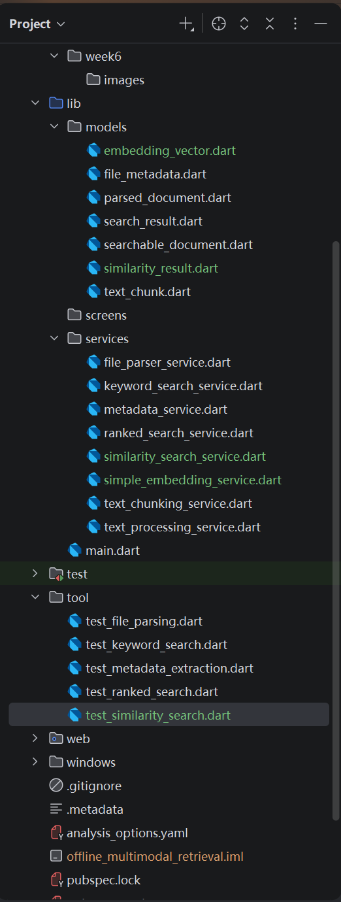

**Figure 1.** Week 6 project structure with embedding models, similarity-search services, test script, and documentation images.

---

## 3. Week 6 Retrieval Workflow

The Week 6 retrieval workflow is:

```text
Local sample files
→ File parsing
→ ParsedDocument objects
→ Text processing
→ SearchableDocument objects
→ Text chunking
→ TextChunk objects
→ Shared vocabulary generation
→ Term-frequency vector generation
→ EmbeddingVector objects
→ Query vector generation
→ Cosine similarity calculation
→ Ranked SimilarityResult objects
→ Terminal output
```

The prototype uses normalized term-frequency vectors rather than a trained machine-learning embedding model.

This design was selected because it allows the complete vector retrieval workflow to be validated before integrating more complex technologies such as BERT, TensorFlow Lite, or a local vector database.

All text chunks and user queries must use the same shared vocabulary. This ensures that every vector has the same dimension and that each vector position represents the same vocabulary term.

---

## 4. Implementation

### 4.1 EmbeddingVector Model

A new `EmbeddingVector` model was created in:

```text
lib/models/embedding_vector.dart
```

The model stores:

- The original `TextChunk`
- The shared vocabulary
- The numerical vector values
- The vector generation time
- The vector dimension
- Whether the vector contains only zero values

The model connects each numerical vector to its original text chunk. This allows the system to identify the source file, source path, chunk index, and content after a similarity match is found.

The complete implementation is shown below:

```dart
import 'text_chunk.dart';

/// Stores the vector representation of a text chunk.
///
/// Week 6 currently uses a lightweight term-frequency vector.
/// In later development, the vector can be replaced by an embedding
/// generated by a neural model such as BERT or TensorFlow Lite.
class EmbeddingVector {
  /// The original text chunk represented by this vector.
  final TextChunk chunk;

  /// Ordered vocabulary used to build the vector.
  final List<String> vocabulary;

  /// Numerical vector values corresponding to the vocabulary.
  final List<double> values;

  /// Time when the vector was generated.
  final DateTime generatedAt;

  EmbeddingVector({
    required this.chunk,
    required this.vocabulary,
    required this.values,
    required this.generatedAt,
  });

  /// Number of dimensions in the vector.
  int get dimension => values.length;

  /// Returns true when every vector value is zero.
  bool get isZeroVector => values.every((value) => value == 0.0);

  @override
  String toString() {
    return 'EmbeddingVector('
        'file: ${chunk.sourceFileName}, '
        'chunkIndex: ${chunk.chunkIndex}, '
        'dimension: $dimension, '
        'generatedAt: $generatedAt'
        ')';
  }
}
```

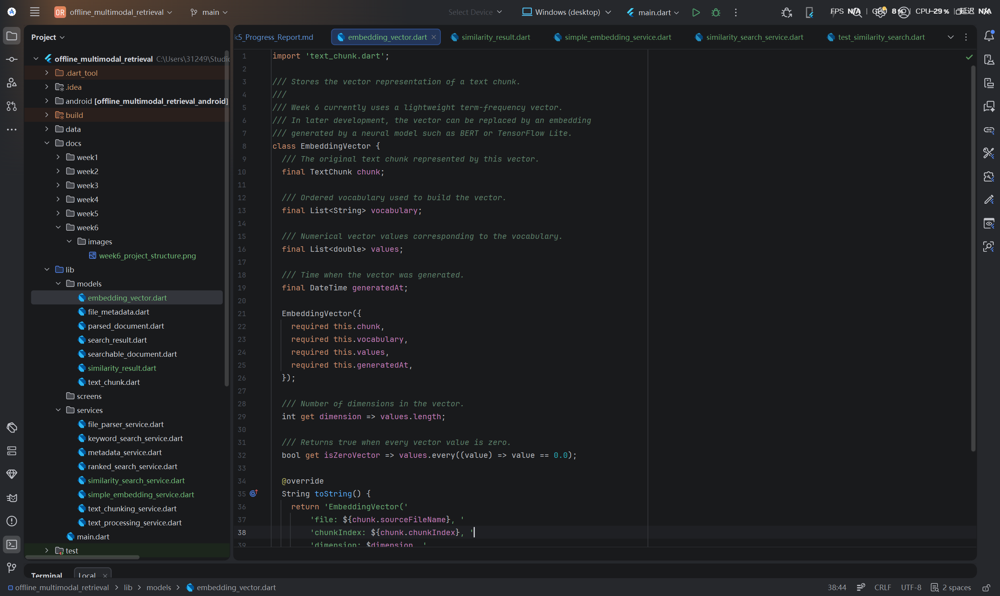

**Figure 2.** `EmbeddingVector` model for storing text chunks, vocabulary, numerical values, and vector metadata.

---

### 4.2 SimilarityResult Model

A new `SimilarityResult` model was created in:

```text
lib/models/similarity_result.dart
```

The model stores:

- The matched `EmbeddingVector`
- The original user query
- The cosine similarity score
- The search time
- The source file name
- The source file path
- The matched chunk index
- The matched text content
- A shortened content preview

This model provides a structured result format that can later be used by a Flutter user interface.

The complete implementation is shown below:

```dart
import 'embedding_vector.dart';

/// Stores one similarity-search result.
///
/// Each result connects an embedding vector with its cosine similarity
/// score for the current query.
class SimilarityResult {
  /// Embedding vector of the matched text chunk.
  final EmbeddingVector embeddingVector;

  /// Original user query.
  final String query;

  /// Cosine similarity score between the query and the text chunk.
  ///
  /// A higher score indicates a stronger similarity.
  final double similarityScore;

  /// Time when the search was performed.
  final DateTime searchedAt;

  SimilarityResult({
    required this.embeddingVector,
    required this.query,
    required this.similarityScore,
    required this.searchedAt,
  });

  /// Convenient access to the matched file name.
  String get sourceFileName =>
      embeddingVector.chunk.sourceFileName;

  /// Convenient access to the original file path.
  String get sourceFilePath =>
      embeddingVector.chunk.sourceFilePath;

  /// Convenient access to the matched chunk index.
  int get chunkIndex =>
      embeddingVector.chunk.chunkIndex;

  /// Convenient access to the matched text content.
  String get content =>
      embeddingVector.chunk.content;

  /// Short content preview for terminal output or future UI display.
  String get preview {
    const maximumLength = 120;

    if (content.length <= maximumLength) {
      return content;
    }

    return '${content.substring(0, maximumLength)}...';
  }

  @override
  String toString() {
    return 'SimilarityResult('
        'file: $sourceFileName, '
        'chunkIndex: $chunkIndex, '
        'score: ${similarityScore.toStringAsFixed(4)}, '
        'query: $query'
        ')';
  }
}
```

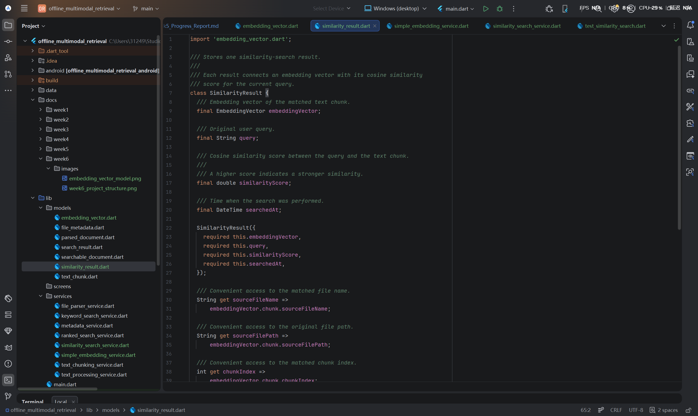

**Figure 3.** `SimilarityResult` model for storing ranked similarity-search results.

---

### 4.3 SimpleEmbeddingService

A new `SimpleEmbeddingService` was created in:

```text
lib/services/simple_embedding_service.dart
```

This service is responsible for:

- Tokenizing text
- Building a shared vocabulary
- Sorting vocabulary terms for stable vector dimensions
- Counting word occurrences
- Generating normalized term-frequency vectors
- Generating vectors for all text chunks
- Generating a query vector using the existing vocabulary

The vocabulary is generated from all text chunks. A `Set<String>` is used to avoid duplicate vocabulary terms. The final vocabulary is sorted so that vector dimensions remain stable and repeatable.

The normalized term-frequency value is calculated using:

```text
Term frequency =
word occurrence count / total number of tokens
```

For example, if a word appears two times in a text containing eight tokens, its normalized term-frequency value is:

```text
2 / 8 = 0.25
```

Before vector generation, the input text is processed by:

- Converting text to lowercase
- Removing punctuation and unsupported symbols
- Replacing multiple spaces with a single space
- Trimming leading and trailing spaces
- Splitting the text into tokens

The complete implementation is shown below:

```dart
import '../models/embedding_vector.dart';
import '../models/text_chunk.dart';

/// Generates lightweight numerical vectors from text.
///
/// This Week 6 prototype uses term-frequency vectors rather than a
/// machine-learning embedding model. The service can later be replaced
/// with BERT or TensorFlow Lite inference without changing the overall
/// similarity-search pipeline.
class SimpleEmbeddingService {
  /// Builds a shared vocabulary from a collection of text chunks.
  ///
  /// A shared vocabulary is important because every text chunk and query
  /// must use vectors with the same dimensions and word order.
  List<String> buildVocabulary(List<TextChunk> chunks) {
    final vocabularySet = <String>{};

    for (final chunk in chunks) {
      final tokens = tokenize(chunk.content);
      vocabularySet.addAll(tokens);
    }

    final vocabulary = vocabularySet.toList();

    // Sorting ensures stable and repeatable vector dimensions.
    vocabulary.sort();

    return vocabulary;
  }

  /// Converts all text chunks into embedding vectors using a shared
  /// vocabulary.
  List<EmbeddingVector> generateEmbeddings(
    List<TextChunk> chunks, {
    List<String>? vocabulary,
  }) {
    if (chunks.isEmpty) {
      return [];
    }

    final sharedVocabulary =
        vocabulary ?? buildVocabulary(chunks);

    return chunks.map((chunk) {
      return generateEmbedding(
        chunk,
        vocabulary: sharedVocabulary,
      );
    }).toList();
  }

  /// Converts one text chunk into a term-frequency vector.
  EmbeddingVector generateEmbedding(
    TextChunk chunk, {
    required List<String> vocabulary,
  }) {
    final values = generateVector(
      chunk.content,
      vocabulary: vocabulary,
    );

    return EmbeddingVector(
      chunk: chunk,
      vocabulary: List<String>.unmodifiable(vocabulary),
      values: List<double>.unmodifiable(values),
      generatedAt: DateTime.now(),
    );
  }

  /// Converts arbitrary text, such as a user query, into a numerical
  /// vector based on an existing vocabulary.
  List<double> generateQueryVector(
    String query, {
    required List<String> vocabulary,
  }) {
    return generateVector(
      query,
      vocabulary: vocabulary,
    );
  }

  /// Generates a normalized term-frequency vector.
  ///
  /// Each vector position corresponds to one word in the vocabulary.
  /// The value represents how frequently that word appears in the text.
  List<double> generateVector(
    String text, {
    required List<String> vocabulary,
  }) {
    if (vocabulary.isEmpty) {
      return [];
    }

    final tokens = tokenize(text);

    if (tokens.isEmpty) {
      return List<double>.filled(vocabulary.length, 0.0);
    }

    final frequencyMap = <String, int>{};

    for (final token in tokens) {
      frequencyMap[token] = (frequencyMap[token] ?? 0) + 1;
    }

    final totalTokenCount = tokens.length.toDouble();

    return vocabulary.map((word) {
      final count = frequencyMap[word] ?? 0;

      // Normalized term frequency:
      // word occurrence count divided by total number of tokens.
      return count / totalTokenCount;
    }).toList();
  }

  /// Converts text into searchable word tokens.
  ///
  /// Processing steps:
  /// 1. Convert text to lowercase.
  /// 2. Remove punctuation and unsupported symbols.
  /// 3. Replace multiple spaces with one space.
  /// 4. Split text into individual words.
  List<String> tokenize(String text) {
    final normalizedText = text
        .toLowerCase()
        .replaceAll(
          RegExp(r'[^\p{L}\p{N}\s]', unicode: true),
          ' ',
        )
        .replaceAll(RegExp(r'\s+'), ' ')
        .trim();

    if (normalizedText.isEmpty) {
      return [];
    }

    return normalizedText
        .split(' ')
        .where((token) => token.trim().isNotEmpty)
        .toList();
  }
}
```

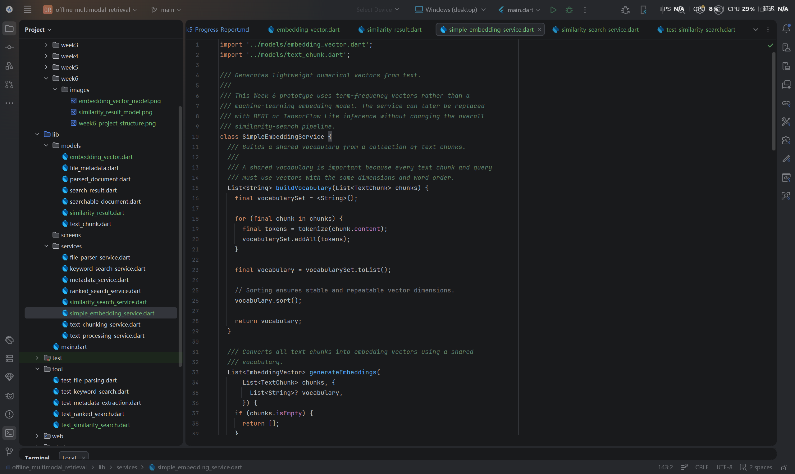

**Figure 4.** Shared vocabulary generation and embedding service structure.

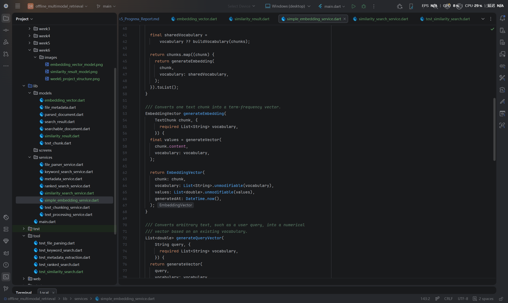

**Figure 5.** Text chunk embedding generation and user query vector generation.

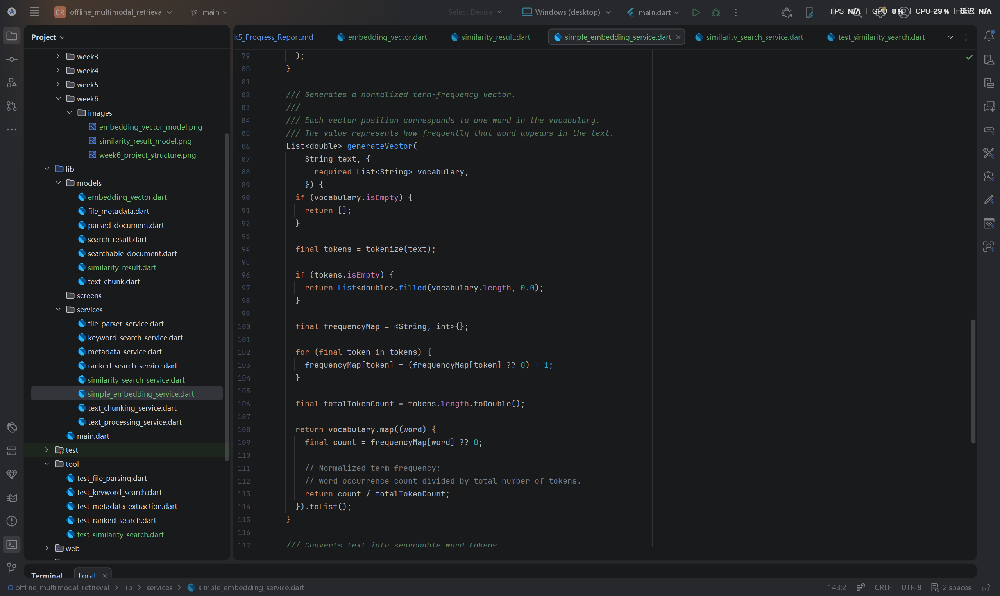

**Figure 6.** Frequency map creation and normalized term-frequency vector generation.

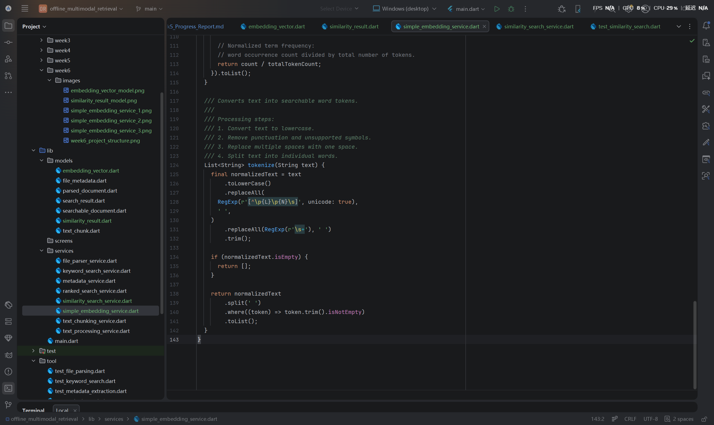

**Figure 7.** Text tokenization and normalization logic.

---

### 4.4 SimilaritySearchService

A new `SimilaritySearchService` was created in:

```text
lib/services/similarity_search_service.dart
```

The service performs the following steps:

1. Validate the user query.
2. Read the shared vocabulary from the stored embeddings.
3. Validate vector dimensions.
4. Generate a query vector.
5. Reject zero query vectors.
6. Compare the query vector with every text-chunk vector.
7. Calculate cosine similarity.
8. Filter results using a minimum score.
9. Sort results from highest score to lowest score.
10. Apply an optional result limit.

Cosine similarity is calculated using:

```text
Cosine similarity =
dot product / (magnitude of vector A × magnitude of vector B)
```

The implementation calculates:

- Dot product
- First vector magnitude
- Second vector magnitude
- Final similarity score

If either vector has a magnitude of zero, the method returns `0.0`.

The final score is clamped between `0.0` and `1.0` to protect against small floating-point precision errors.

The complete implementation is shown below:

```dart
import 'dart:math';

import '../models/embedding_vector.dart';
import '../models/similarity_result.dart';
import 'simple_embedding_service.dart';

/// Performs similarity search over locally generated embedding vectors.
///
/// The service converts a user query into a vector and compares it with
/// each text-chunk vector using cosine similarity.
class SimilaritySearchService {
  final SimpleEmbeddingService embeddingService;

  SimilaritySearchService({
    SimpleEmbeddingService? embeddingService,
  }) : embeddingService =
            embeddingService ?? SimpleEmbeddingService();

  /// Searches text-chunk embeddings using cosine similarity.
  ///
  /// Results are filtered using [minimumScore] and sorted from the
  /// highest similarity score to the lowest.
  List<SimilarityResult> search({
    required String query,
    required List<EmbeddingVector> embeddings,
    double minimumScore = 0.0,
    int? limit,
  }) {
    final normalizedQuery = query.trim();

    if (normalizedQuery.isEmpty || embeddings.isEmpty) {
      return [];
    }

    final vocabulary = embeddings.first.vocabulary;

    if (vocabulary.isEmpty) {
      return [];
    }

    _validateEmbeddingDimensions(
      embeddings,
      vocabulary.length,
    );

    final queryVector = embeddingService.generateQueryVector(
      normalizedQuery,
      vocabulary: vocabulary,
    );

    if (_isZeroVector(queryVector)) {
      return [];
    }

    final results = <SimilarityResult>[];

    for (final embedding in embeddings) {
      final score = calculateCosineSimilarity(
        queryVector,
        embedding.values,
      );

      if (score > minimumScore) {
        results.add(
          SimilarityResult(
            embeddingVector: embedding,
            query: normalizedQuery,
            similarityScore: score,
            searchedAt: DateTime.now(),
          ),
        );
      }
    }

    results.sort(
      (first, second) => second.similarityScore.compareTo(
        first.similarityScore,
      ),
    );

    if (limit != null && limit > 0 && results.length > limit) {
      return results.take(limit).toList();
    }

    return results;
  }

  /// Calculates cosine similarity between two vectors.
  ///
  /// Formula:
  ///
  /// cosine similarity =
  /// dot product / (magnitude of vector A × magnitude of vector B)
  ///
  /// The result normally ranges from 0 to 1 for the non-negative
  /// term-frequency vectors used in this project.
  double calculateCosineSimilarity(
    List<double> firstVector,
    List<double> secondVector,
  ) {
    if (firstVector.length != secondVector.length) {
      throw ArgumentError(
        'Vectors must have the same number of dimensions. '
        'First vector: ${firstVector.length}, '
        'second vector: ${secondVector.length}.',
      );
    }

    if (firstVector.isEmpty) {
      return 0.0;
    }

    double dotProduct = 0.0;
    double firstMagnitudeSquared = 0.0;
    double secondMagnitudeSquared = 0.0;

    for (var index = 0; index < firstVector.length; index++) {
      final firstValue = firstVector[index];
      final secondValue = secondVector[index];

      dotProduct += firstValue * secondValue;
      firstMagnitudeSquared += firstValue * firstValue;
      secondMagnitudeSquared += secondValue * secondValue;
    }

    final firstMagnitude = sqrt(firstMagnitudeSquared);
    final secondMagnitude = sqrt(secondMagnitudeSquared);

    if (firstMagnitude == 0.0 || secondMagnitude == 0.0) {
      return 0.0;
    }

    final similarity =
        dotProduct / (firstMagnitude * secondMagnitude);

    // Protect against minor floating-point precision errors.
    return similarity.clamp(0.0, 1.0).toDouble();
  }

  /// Checks whether all vector values are zero.
  bool _isZeroVector(List<double> vector) {
    return vector.every((value) => value == 0.0);
  }

  /// Ensures that all stored embeddings use the same dimensions.
  void _validateEmbeddingDimensions(
    List<EmbeddingVector> embeddings,
    int expectedDimension,
  ) {
    for (final embedding in embeddings) {
      if (embedding.values.length != expectedDimension) {
        throw StateError(
          'Embedding vectors do not use consistent dimensions. '
          'Expected $expectedDimension dimensions, but '
          '${embedding.chunk.sourceFileName} chunk '
          '${embedding.chunk.chunkIndex} contains '
          '${embedding.values.length} dimensions.',
        );
      }

      if (embedding.vocabulary.length != expectedDimension) {
        throw StateError(
          'Embedding vocabulary and vector dimensions do not match for '
          '${embedding.chunk.sourceFileName} chunk '
          '${embedding.chunk.chunkIndex}.',
        );
      }
    }
  }
}
```

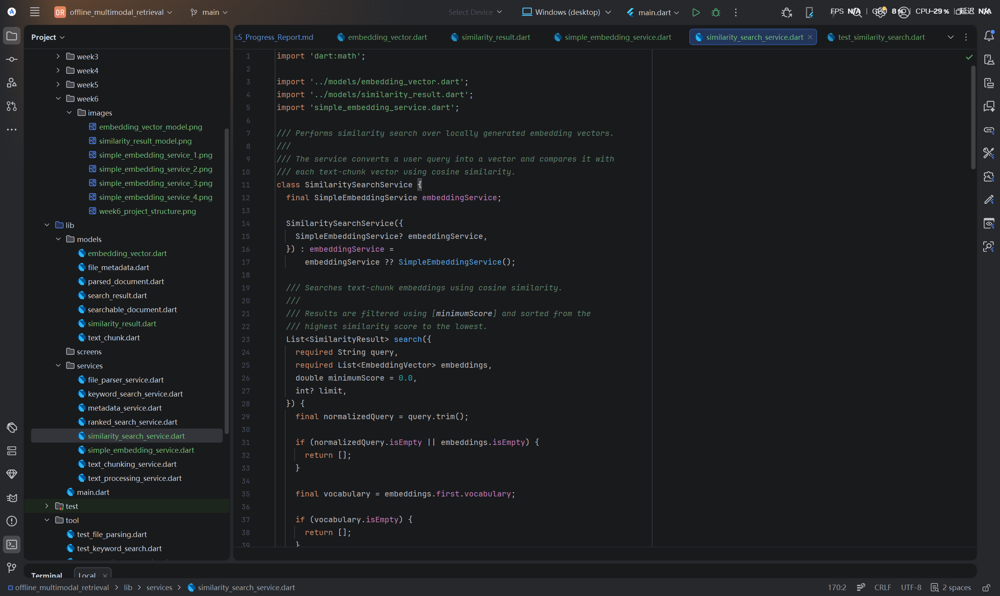

**Figure 8.** Similarity-search service structure and search input validation.

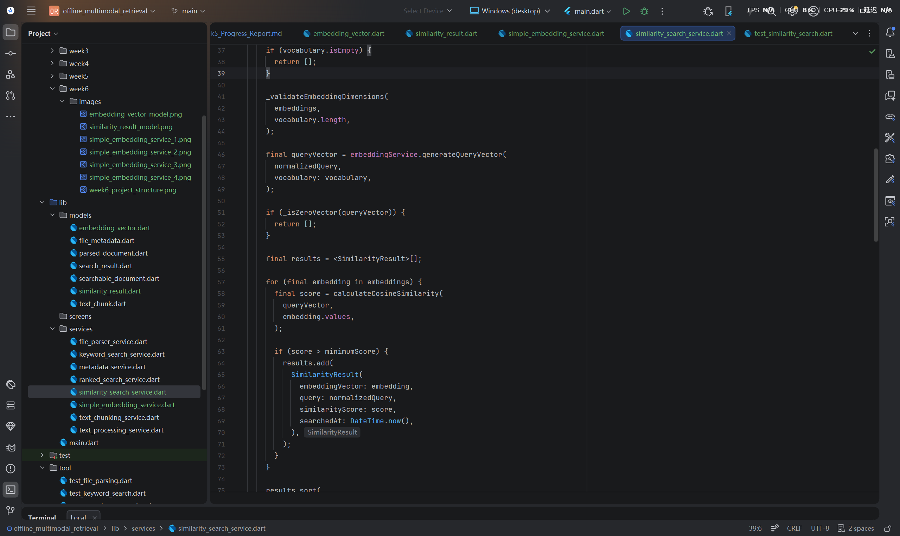

**Figure 9.** Query vector generation, similarity calculation, filtering, and result creation.

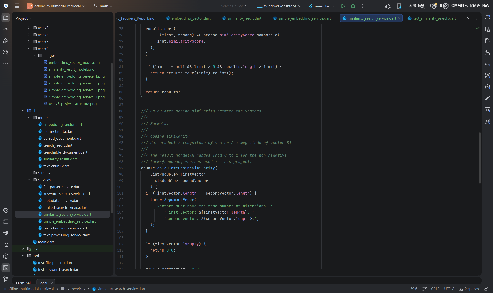

**Figure 10.** Similarity-result sorting and result-limit handling.

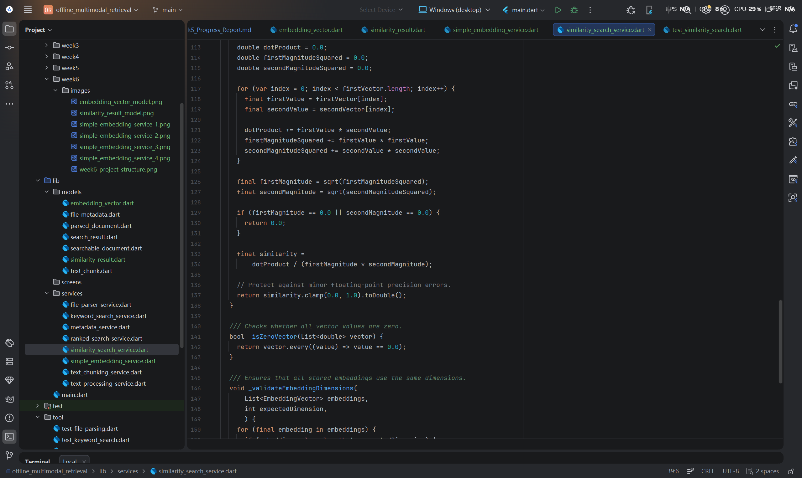

**Figure 11.** Dot product, vector magnitude, zero-vector handling, and cosine similarity calculation.

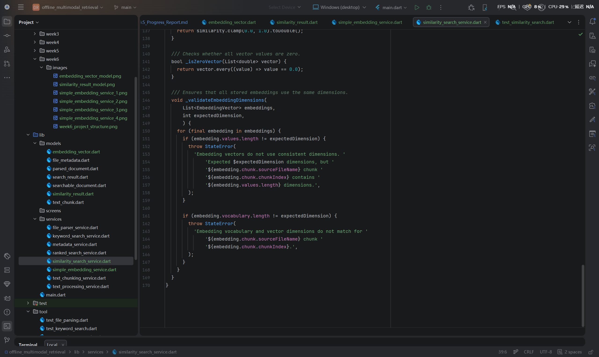

**Figure 12.** Embedding-dimension and vocabulary-length validation.

---

## 5. Week 6 Test Script

A Dart command-line test script was created in:

```text
tool/test_similarity_search.dart
```

The test script connects all existing modules:

```text
FileParserService
→ TextProcessingService
→ TextChunkingService
→ SimpleEmbeddingService
→ SimilaritySearchService
```

The script performs the following operations:

1. Parse supported local files.
2. Convert parsed files into searchable documents.
3. Divide searchable documents into smaller text chunks.
4. Build one shared vocabulary.
5. Generate one embedding vector for each chunk.
6. Print pipeline statistics.
7. Run multiple related and unrelated queries.
8. Display ranked similarity results.
9. Display an empty-result message when no query term exists in the vocabulary.

The complete implementation is shown below:

```dart
import '../lib/models/similarity_result.dart';
import '../lib/models/text_chunk.dart';
import '../lib/services/file_parser_service.dart';
import '../lib/services/simple_embedding_service.dart';
import '../lib/services/similarity_search_service.dart';
import '../lib/services/text_chunking_service.dart';
import '../lib/services/text_processing_service.dart';

Future<void> main() async {
  const sampleDirectoryPath = 'data/sample_documents';

  final fileParserService = FileParserService();
  final textProcessingService = TextProcessingService();
  final textChunkingService = TextChunkingService();
  final embeddingService = SimpleEmbeddingService();

  final similaritySearchService = SimilaritySearchService(
    embeddingService: embeddingService,
  );

  print('===== Similarity Search Test =====');
  print('');

  try {
    // Step 1: Parse supported local files.
    final parsedDocuments =
        await fileParserService.parseDocumentsFromDirectory(
      sampleDirectoryPath,
    );

    // Step 2: Convert parsed documents into searchable documents.
    final searchableDocuments =
        textProcessingService.convertToSearchableDocuments(
      parsedDocuments,
    );

    // Step 3: Split searchable documents into smaller chunks.
    //
    // A small chunk size is used so that the generated chunks can
    // be displayed clearly in the terminal.
    final textChunks = textChunkingService.chunkDocuments(
      searchableDocuments,
      chunkSize: 8,
    );

    // Step 4: Build a shared vocabulary for all chunks.
    final vocabulary = embeddingService.buildVocabulary(
      textChunks,
    );

    // Step 5: Generate one embedding vector for every text chunk.
    final embeddingVectors =
        embeddingService.generateEmbeddings(
      textChunks,
      vocabulary: vocabulary,
    );

    print('Pipeline Summary');
    print('----------------');
    print(
      'Total Parsed Documents: ${parsedDocuments.length}',
    );
    print(
      'Total Searchable Documents: '
      '${searchableDocuments.length}',
    );
    print(
      'Total Text Chunks: ${textChunks.length}',
    );
    print(
      'Vocabulary Size: ${vocabulary.length}',
    );
    print(
      'Total Embedding Vectors: '
      '${embeddingVectors.length}',
    );

    if (embeddingVectors.isNotEmpty) {
      print(
        'Embedding Dimension: '
        '${embeddingVectors.first.dimension}',
      );
    }

    print('');

    _printChunkInformation(textChunks);

    print('');
    print('Vocabulary');
    print('----------');

    if (vocabulary.isEmpty) {
      print('No vocabulary generated.');
    } else {
      print(vocabulary.join(', '));
    }

    print('');

    // Queries used to test related and unrelated searches.
    final queries = <String>[
      'metadata extraction',
      'markdown document',
      'local search',
      'unrelated query',
    ];

    for (final query in queries) {
      final results = similaritySearchService.search(
        query: query,
        embeddings: embeddingVectors,
        minimumScore: 0.0,
        limit: 3,
      );

      _printSimilarityResults(
        query: query,
        results: results,
      );
    }

    print(
      '===== Similarity Search Test Completed =====',
    );
  } catch (error, stackTrace) {
    print('Similarity search test failed.');
    print('Error: $error');
    print('');
    print('Stack trace:');
    print(stackTrace);
  }
}

/// Prints the text chunks generated before embedding.
void _printChunkInformation(List<TextChunk> chunks) {
  print('Generated Text Chunks');
  print('---------------------');

  if (chunks.isEmpty) {
    print('No text chunks were generated.');
    return;
  }

  for (final chunk in chunks) {
    print(
      '${chunk.sourceFileName} '
      '- chunk ${chunk.chunkIndex}',
    );
    print('Word Count: ${chunk.wordCount}');
    print('Content: ${chunk.content}');
    print('');
  }
}

/// Prints cosine-similarity results in descending order.
void _printSimilarityResults({
  required String query,
  required List<SimilarityResult> results,
}) {
  final separator = List<String>.filled(
    query.length,
    '-',
  ).join();

  print('Search Query: $query');
  print('--------------$separator');

  if (results.isEmpty) {
    print('No similar chunks found.');
    print('');
    return;
  }

  print('Similarity Results:');

  for (var index = 0; index < results.length; index++) {
    final result = results[index];

    print(
      '${index + 1}. '
      '${result.sourceFileName} '
      '- chunk ${result.chunkIndex}',
    );

    print(
      '   Similarity Score: '
      '${result.similarityScore.toStringAsFixed(4)}',
    );

    print(
      '   Content Preview: ${result.preview}',
    );
  }

  print('');
}
```

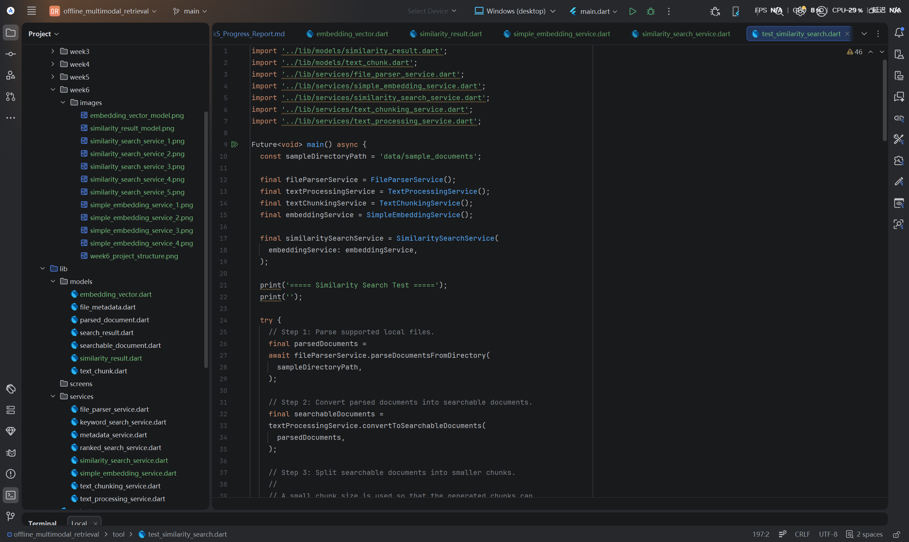

**Figure 13.** Service initialization, file parsing, and searchable-document generation.

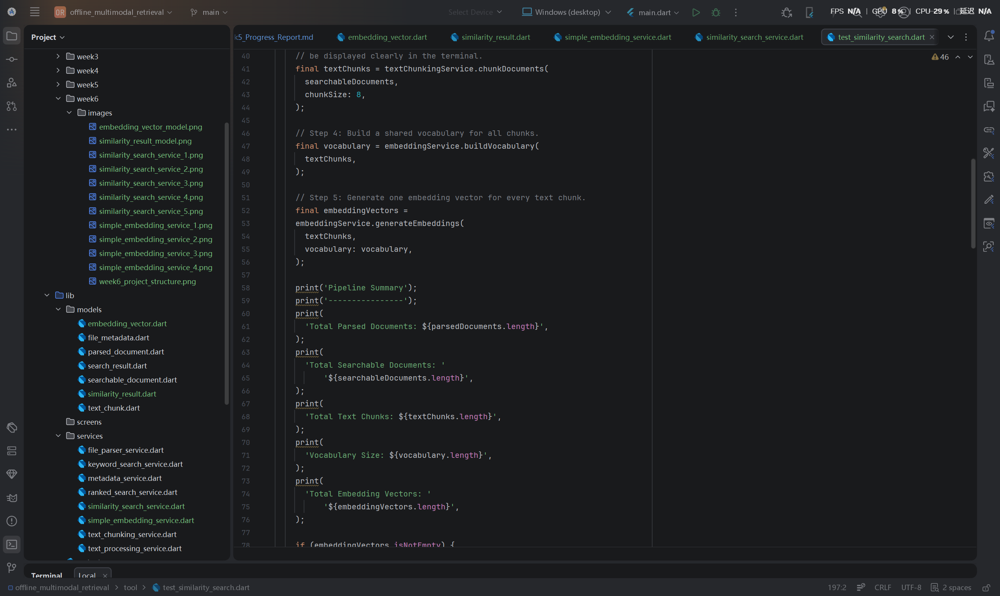

**Figure 14.** Text chunking, vocabulary generation, embedding generation, and pipeline summary.

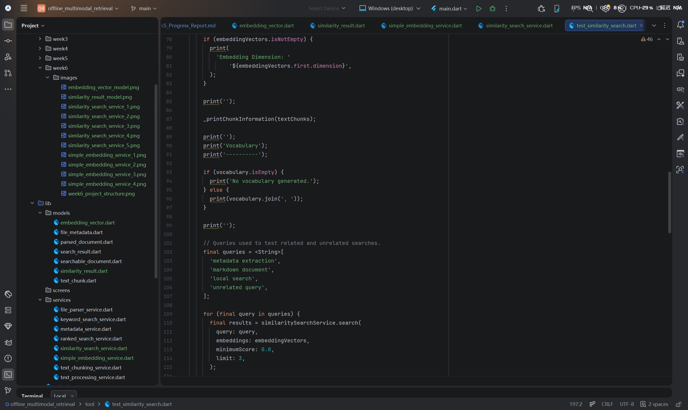

**Figure 15.** Related and unrelated queries and similarity-search execution.

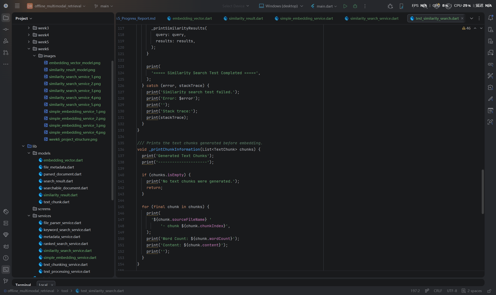

**Figure 16.** Exception handling and generated text-chunk output logic.

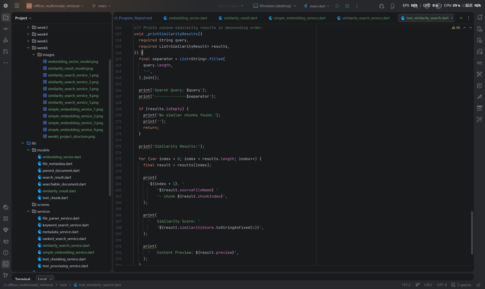

**Figure 17.** Ranked result output and empty-result handling.

---

## 6. Running the Week 6 Test

The Week 6 test was executed using:

```bash
dart run tool/test_similarity_search.dart
```

The system successfully skipped the unsupported PDF file:

```text
Unsupported file type skipped: sample3.pdf
```

The pipeline summary showed:

```text
Total Parsed Documents: 2
Total Searchable Documents: 2
Total Text Chunks: 4
Vocabulary Size: 17
Total Embedding Vectors: 4
Embedding Dimension: 17
```


**Figure 18.** Pipeline summary, generated text chunks, vocabulary size, and embedding dimension.

The successful result confirms that:

- Two supported documents were parsed.
- Two searchable documents were generated.
- Four text chunks were generated.
- A shared vocabulary containing 17 terms was created.
- Four embedding vectors were generated.
- Every vector used 17 dimensions.
- The number of generated vectors matched the number of text chunks.
- The complete retrieval pipeline executed without an unhandled error.

---

## 7. Similarity Search Results

### 7.1 Query: metadata extraction

The query `metadata extraction` returned three ranked results.

The highest-ranked result was:

```text
sample2.md - chunk 1
Similarity Score: 0.6325
```

The second result was:

```text
sample1.txt - chunk 1
Similarity Score: 0.5000
```

The third result was:

```text
sample1.txt - chunk 0
Similarity Score: 0.2500
```

The highest-ranked chunk contained both words from the query:

```text
test the metadata extraction module.
```

This explains why it received the highest cosine similarity score.

---

### 7.2 Query: markdown document

The query `markdown document` correctly returned:

```text
sample2.md - chunk 0
Similarity Score: 0.5000
```

The matching text chunk contained:

```text
sample markdown document this file is used to
```

This result confirms that the system can identify a text chunk containing both query terms.

---

### 7.3 Query: local search

The query `local search` returned:

```text
No similar chunks found.
```

This occurred because the shared vocabulary did not contain the words `local` or `search`.

The query therefore generated a zero vector, which was detected by the similarity-search service.

---

### 7.4 Query: unrelated query

The query `unrelated query` also returned:

```text
No similar chunks found.
```

This confirms that the system correctly handles queries that cannot be represented using the current shared vocabulary.


**Figure 19.** Ranked similarity results and no-result handling for unrelated queries.

---

## 8. Problems and Solutions

### 8.1 Incorrect TextProcessingService Method Name

The first version of the Week 6 test script attempted to call:

```text
processDocuments()
```

However, this method did not exist in the current `TextProcessingService`.

A second attempt used:

```text
processDocument()
```

This method also did not exist.

The existing Week 4 method was:

```text
convertToSearchableDocuments()
```

The test script was updated to use the correct existing method.

---

### 8.2 Dynamic List Type Error

Because the incorrect method call was used inside a `map()` operation, Dart inferred the result as:

```text
List<dynamic>
```

This could not be passed to `chunkDocuments()`, which requires:

```text
List<SearchableDocument>
```

Using the existing typed batch conversion method solved the problem and preserved the correct data type.

The corrected code was:

```dart
final searchableDocuments =
    textProcessingService.convertToSearchableDocuments(
  parsedDocuments,
);
```

---

### 8.3 Unsupported PDF Parsing

The current parser still does not support PDF content extraction.

The `sample3.pdf` file was therefore safely skipped instead of causing the complete pipeline to fail.

The terminal displayed:

```text
Unsupported file type skipped: sample3.pdf
```

This behaviour remains consistent with the previous file-parsing implementation.

---

### 8.4 Out-of-Vocabulary Queries

Queries containing only words that are not present in the shared vocabulary generate zero vectors.

The similarity-search service detects these zero query vectors and returns an empty result list.

This prevents invalid or misleading similarity calculations.

---

### 8.5 Consistent Vector Dimensions

All document vectors and query vectors must use the same vocabulary and dimension.

If one embedding contains an inconsistent vector length or vocabulary length, the service throws a `StateError`.

This defensive validation helps prevent incorrect cosine-similarity calculations.

---

## 9. Current Limitations

The Week 6 implementation is an early similarity-search prototype.

### 9.1 No True Semantic Understanding

The current embedding service uses normalized term-frequency vectors.

It can identify shared words, but it cannot understand synonyms or related meanings.

For example:

```text
car
automobile
```

may receive a similarity score of zero because the words are different, even though they have similar meanings.

---

### 9.2 Vocabulary Is Dataset-Dependent

The vocabulary is created only from the currently loaded text chunks.

A query word that is not present in those chunks cannot be represented.

This means that the current system depends strongly on exact vocabulary overlap.

---

### 9.3 No TF-IDF Weighting

All vocabulary terms are currently treated using normalized term frequency.

Common words may receive too much importance because inverse document frequency is not yet used.

TF-IDF could improve the ranking by reducing the weight of common terms and increasing the importance of more distinctive terms.

---

### 9.4 Small Test Dataset

The test uses only:

```text
sample1.txt
sample2.md
sample3.pdf
```

The current result does not represent performance on a large local document collection.

A larger dataset is required for reliable retrieval evaluation.

---

### 9.5 No Persistent Vector Storage

Embedding vectors currently exist only in memory during program execution.

They are not yet saved to a local database or vector store.

The vectors must therefore be regenerated whenever the test script is executed.

---

### 9.6 Text-Only Prototype

The current Week 6 implementation supports only text chunks.

Image embeddings and multimodal retrieval have not yet been implemented.

---

### 9.7 PDF Parsing Is Not Implemented

The current parser supports TXT and Markdown files.

PDF content extraction is still pending, so PDF files are skipped.

---

### 9.8 No Flutter UI Integration

The Week 6 retrieval pipeline is tested through a Dart command-line script.

Search input and results are not yet displayed through the Flutter user interface.

---

### 9.9 No Trained Embedding Model

The current vectors are manually generated from word frequencies.

BERT, MobileCLIP, TensorFlow Lite, or another trained embedding model has not yet been integrated.

---

## 10. Week 6 Deliverables

The following Week 6 deliverables were completed:

1. `EmbeddingVector` model
2. `SimilarityResult` model
3. Shared vocabulary generation
4. Text tokenization and normalization
5. Normalized term-frequency vector generation
6. Query vector generation
7. Cosine similarity calculation
8. Similarity-score filtering
9. Descending similarity ranking
10. Result-limit support
11. Zero-vector validation
12. Embedding-dimension validation
13. Vocabulary-length validation
14. Complete Week 6 command-line test
15. Related-query validation
16. Unrelated-query validation
17. Week 6 screenshots
18. Week 6 Progress Report
19. Week 6 GitHub commit and remote push

---

## 11. GitHub Update

After the Week 6 implementation, documentation, screenshots, and test results were completed, the new source code and supporting project files were committed and pushed to the remote GitHub repository.

The Week 6 update included:

```text
lib/models/embedding_vector.dart
lib/models/similarity_result.dart
lib/services/simple_embedding_service.dart
lib/services/similarity_search_service.dart
tool/test_similarity_search.dart
docs/week6/
```

The commit message was:

```text
Complete Week 6 embedding and similarity search prototype
```

The changes were successfully pushed to the `main` branch of the remote GitHub repository.

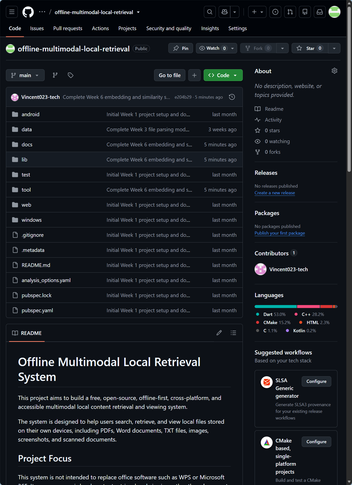

**Figure 20.** GitHub repository after the successful Week 6 push. The latest Week 6 commit appears on the `main` branch, and the updated `docs`, `lib`, and `tool` folders are visible in the repository.

The successful GitHub update confirms that the Week 6 source code, screenshots, documentation, and progress report were stored in the remote repository for version control, backup, and future development.

---

## 12. Current Technical Status

| Area | Status | Notes |
|---|---|---|
| Metadata extraction | Completed | Reads local file metadata |
| TXT parsing | Completed | Supported |
| Markdown parsing | Completed | Supported |
| PDF parsing | Pending | Unsupported files are skipped |
| Text processing | Completed | Cleaning and normalization |
| Keyword search | Completed | File name and content matching |
| Ranked keyword search | Completed | Score-based document ranking |
| Text chunking | Completed | Word-based chunk generation |
| Shared vocabulary | Completed | Generated from text chunks |
| Text tokenization | Completed | Lowercase conversion and symbol removal |
| Term-frequency vectors | Completed | Normalized numerical vectors |
| Query vector generation | Completed | Uses shared vocabulary |
| Cosine similarity | Completed | Vector comparison |
| Similarity filtering | Completed | Removes zero-score results |
| Similarity ranking | Completed | Highest score first |
| Result limit | Completed | Optional maximum result count |
| Zero-vector validation | Completed | Empty query vectors return no results |
| Vector-dimension validation | Completed | Prevents inconsistent vector comparison |
| GitHub version control | Completed | Week 6 changes pushed to main |
| Vector database | Pending | Vectors currently stored in memory |
| BERT/TFLite embedding | Planned | Future semantic embedding |
| Image embedding | Planned | Future multimodal stage |
| Flutter search UI | Pending | Current validation uses terminal |
| Accessibility UI testing | Pending | Planned for later development |

---

## 13. Week 7 Plan

The next development stage should focus on moving from a command-line similarity prototype toward a more practical retrieval system.

Possible Week 7 tasks include:

- Create a basic Flutter search interface.
- Add a text input field for user queries.
- Display ranked search results in the UI.
- Show file name, chunk index, similarity score, and content preview.
- Connect the existing retrieval pipeline to the Flutter interface.
- Add loading states.
- Add empty-result states.
- Add basic error messages.
- Improve keyboard navigation.
- Add basic accessibility labels.
- Prepare for persistent local vector storage.
- Evaluate whether TF-IDF should replace simple term frequency.
- Prepare a future BERT or TensorFlow Lite embedding interface.
- Consider adding larger sample documents for retrieval testing.
- Prepare a clearer separation between the embedding interface and the current term-frequency implementation.

The Week 6 implementation provides a working vector-search foundation that can later be reused when a trained semantic embedding model is introduced.