# Offline Multimodal Local Retrieval System

# Week 7 Progress Report

**Student Name:** Mingxuan Huang  
**Project Title:** Offline Multimodal Local Retrieval System  
**Week:** Week 7  
**Date:** 2026/07/27

---

## 1. Week 7 Objectives

The main objective of Week 7 was to integrate the existing local retrieval pipeline into a usable Flutter desktop interface.

Before Week 7, the project already supported:

- Local file metadata extraction
- TXT and Markdown file parsing
- Text cleaning and normalisation
- Keyword search
- Ranked keyword search
- Text chunking
- Term-frequency vector generation
- Cosine-similarity search

However, these functions were mainly validated through Dart command-line test scripts. Users still needed to run terminal commands to test the retrieval system.

Week 7 therefore focused on converting the command-line prototype into an interactive Windows desktop application.

The specific objectives were:

- Create a dedicated Flutter search screen.
- Connect the Week 3 to Week 6 retrieval modules to the Flutter UI.
- Load and index local sample documents when the application starts.
- Add a search query input field.
- Add Search, Clear, and Reload controls.
- Display document, text chunk, vocabulary, and vector statistics.
- Display ranked similarity-search results.
- Show source file names, chunk indices, similarity scores, previews, and paths.
- Add loading, empty-result, validation, and error states.
- Support keyboard-based search.
- Add basic accessibility semantics.
- Replace the old Week 2 metadata demonstration page.
- Configure the Windows desktop development toolchain.
- Run and validate the application on Windows.
- Prepare screenshots and Week 7 documentation.

---

## 2. Background and Motivation

The Week 6 implementation completed the following command-line pipeline:

```text
Local files
→ File parsing
→ Text processing
→ Text chunking
→ Shared vocabulary
→ Term-frequency vectors
→ Query vector
→ Cosine similarity
→ Ranked results
```

Although the pipeline worked correctly, it was executed using:

```bash
dart run tool/test_similarity_search.dart
```

This was useful for technical validation, but it was not suitable for normal end users.

A practical retrieval application requires a graphical user interface where users can:

```text
Enter a query
→ Start a search
→ View ranked results
→ Clear the current search
→ Reload local documents
```

Week 7 therefore reused the existing backend modules and connected them to a new Flutter user interface.

This approach avoided rewriting the retrieval algorithms and demonstrated modular software integration.

---

## 3. Week 7 Project Structure

The main Week 7 files are:

```text
lib/main.dart
lib/screens/search_screen.dart
docs/week7/Week7_Progress_Report.md
docs/week7/images/
```

The Week 7 image folder contains:

```text
main_dart_update.png
search_screen_code_1.png
search_screen_code_2.png
search_screen_code_3.png
search_screen_code_4.png
search_screen_code_5.png
search_ui_initial.png
search_ui_metadata_results.png
search_ui_markdown_results.png
search_ui_empty_result.png
week7_project_structure.png
github_week7_update.png
```

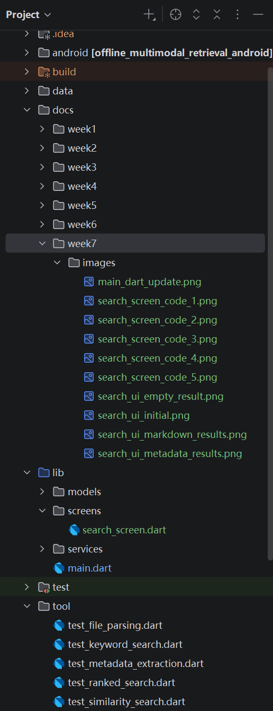

**Figure 1.** Week 7 project structure showing the Flutter search screen, updated application entry point, previous command-line tests, and documentation screenshots.

---

## 4. Week 7 System Workflow

The integrated Week 7 workflow is:

```text
Flutter application starts
→ SearchScreen is created
→ Local sample directory is loaded
→ Supported files are parsed
→ Parsed documents are cleaned
→ Searchable documents are created
→ Documents are divided into text chunks
→ Shared vocabulary is built
→ Text chunks are converted into vectors
→ Pipeline statistics are displayed
→ User enters a query
→ Query is converted into a vector
→ Cosine similarity is calculated
→ Results are ranked
→ Ranked results are displayed in the UI
```

The current sample directory is:

```text
data/sample_documents
```

The UI calls the following services:

```text
FileParserService
TextProcessingService
TextChunkingService
SimpleEmbeddingService
SimilaritySearchService
```

The UI therefore acts as the presentation layer, while the existing models and services continue to provide the retrieval logic.

---

## 5. Updated Application Entry Point

The old `main.dart` was originally created during Week 2.

It contained:

- A metadata extraction demonstration
- A test counter
- A temporary `MyHomePage`
- Instructions to inspect the Android Studio console

This temporary page was replaced with the Week 7 search application.

The modified file is:

```text
lib/main.dart
```

The complete implementation is shown below:

```dart
import 'package:flutter/material.dart';

import 'screens/search_screen.dart';

void main() {
  WidgetsFlutterBinding.ensureInitialized();

  runApp(const MyApp());
}

class MyApp extends StatelessWidget {
  const MyApp({super.key});

  @override
  Widget build(BuildContext context) {
    return MaterialApp(
      title: 'Offline Multimodal Retrieval',
      debugShowCheckedModeBanner: false,
      theme: ThemeData(
        useMaterial3: true,
        colorScheme: ColorScheme.fromSeed(
          seedColor: Colors.deepPurple,
          brightness: Brightness.light,
        ),
        scaffoldBackgroundColor: const Color(0xFFF7F7FA),
        appBarTheme: const AppBarTheme(
          centerTitle: false,
          elevation: 0,
        ),
        inputDecorationTheme: const InputDecorationTheme(
          filled: true,
          fillColor: Colors.white,
        ),
        cardTheme: const CardThemeData(
          elevation: 1,
          margin: EdgeInsets.zero,
        ),
      ),
      home: const SearchScreen(),
    );
  }
}
```

The main changes were:

```text
Removed:
MetadataService startup test
MyHomePage
Metadata counter
FloatingActionButton

Added:
SearchScreen import
Material 3 theme
SearchScreen as the application home page
Debug banner removal
Shared input and card styling
```

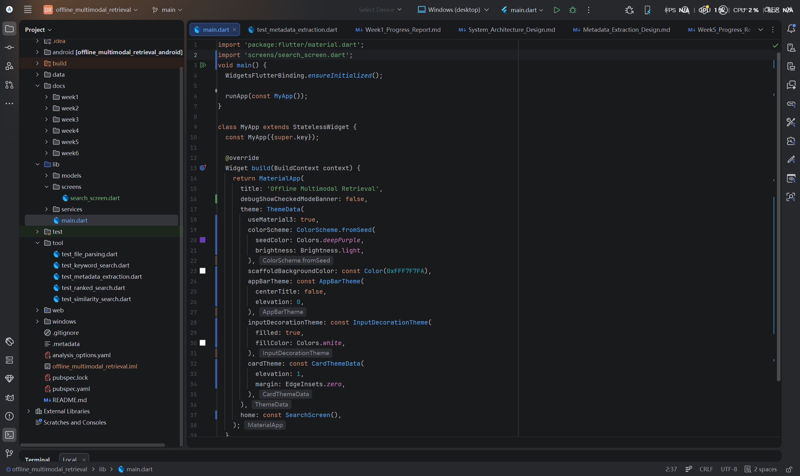

**Figure 2.** Updated `main.dart` showing the `SearchScreen` import, Material 3 application theme, and the search interface as the application home page.

---

## 6. SearchScreen Implementation

A new Flutter screen was created in:

```text
lib/screens/search_screen.dart
```

The screen is responsible for both retrieval-pipeline integration and user-interface presentation.

Its main responsibilities are:

- Create and manage service instances.
- Load local documents.
- Build the in-memory vector index.
- Manage search input.
- Run similarity search.
- Display pipeline statistics.
- Display ranked results.
- Handle loading and empty-result states.
- Handle initialisation and search errors.
- Support keyboard interaction.
- Provide basic accessibility descriptions.

The complete implementation is shown below.

```dart
import 'package:flutter/material.dart';
import 'package:flutter/services.dart';

import '../models/embedding_vector.dart';
import '../models/similarity_result.dart';
import '../services/file_parser_service.dart';
import '../services/simple_embedding_service.dart';
import '../services/similarity_search_service.dart';
import '../services/text_chunking_service.dart';
import '../services/text_processing_service.dart';

/// Main search interface for the offline local retrieval prototype.
///
/// This screen integrates the existing parsing, text processing,
/// text chunking, embedding generation, and similarity-search modules.
class SearchScreen extends StatefulWidget {
  const SearchScreen({super.key});

  @override
  State<SearchScreen> createState() => _SearchScreenState();
}

class _SearchScreenState extends State<SearchScreen> {
  static const String _sampleDirectoryPath =
      'data/sample_documents';

  final TextEditingController _searchController =
      TextEditingController();

  final FocusNode _searchFocusNode = FocusNode();

  final FileParserService _fileParserService =
      FileParserService();

  final TextProcessingService _textProcessingService =
      TextProcessingService();

  final TextChunkingService _textChunkingService =
      TextChunkingService();

  final SimpleEmbeddingService _embeddingService =
      SimpleEmbeddingService();

  late final SimilaritySearchService _similaritySearchService;

  List<EmbeddingVector> _embeddingVectors = [];
  List<SimilarityResult> _searchResults = [];

  bool _isInitialising = true;
  bool _isSearching = false;
  bool _hasSearched = false;

  String? _initialisationError;
  String? _searchError;

  int _parsedDocumentCount = 0;
  int _textChunkCount = 0;
  int _vocabularySize = 0;

  @override
  void initState() {
    super.initState();

    _similaritySearchService = SimilaritySearchService(
      embeddingService: _embeddingService,
    );

    _initialiseRetrievalPipeline();
  }

  @override
  void dispose() {
    _searchController.dispose();
    _searchFocusNode.dispose();
    super.dispose();
  }

  /// Loads local documents and prepares all text-chunk vectors.
  Future<void> _initialiseRetrievalPipeline() async {
    setState(() {
      _isInitialising = true;
      _initialisationError = null;
    });

    try {
      // Step 1: Parse supported local files.
      final parsedDocuments =
          await _fileParserService.parseDocumentsFromDirectory(
        _sampleDirectoryPath,
      );

      // Step 2: Convert parsed documents into searchable documents.
      final searchableDocuments =
          _textProcessingService.convertToSearchableDocuments(
        parsedDocuments,
      );

      // Step 3: Split documents into smaller text chunks.
      final textChunks = _textChunkingService.chunkDocuments(
        searchableDocuments,
        chunkSize: 40,
      );

      // Step 4: Build one shared vocabulary.
      final vocabulary = _embeddingService.buildVocabulary(
        textChunks,
      );

      // Step 5: Generate one vector for every text chunk.
      final embeddingVectors =
          _embeddingService.generateEmbeddings(
        textChunks,
        vocabulary: vocabulary,
      );

      if (!mounted) {
        return;
      }

      setState(() {
        _embeddingVectors = embeddingVectors;
        _parsedDocumentCount = parsedDocuments.length;
        _textChunkCount = textChunks.length;
        _vocabularySize = vocabulary.length;
        _isInitialising = false;
      });

      _searchFocusNode.requestFocus();
    } catch (error) {
      if (!mounted) {
        return;
      }

      setState(() {
        _isInitialising = false;
        _initialisationError =
            'Failed to initialise the retrieval pipeline.\n$error';
      });
    }
  }

  /// Runs cosine-similarity search using the current query.
  Future<void> _runSearch() async {
    final query = _searchController.text.trim();

    if (_isInitialising || _isSearching) {
      return;
    }

    if (query.isEmpty) {
      setState(() {
        _hasSearched = false;
        _searchResults = [];
        _searchError = 'Please enter a search query.';
      });

      _searchFocusNode.requestFocus();
      return;
    }

    setState(() {
      _isSearching = true;
      _hasSearched = true;
      _searchError = null;
    });

    try {
      // Small asynchronous delay allows the loading state to appear.
      await Future<void>.delayed(
        const Duration(milliseconds: 150),
      );

      final results = _similaritySearchService.search(
        query: query,
        embeddings: _embeddingVectors,
        minimumScore: 0.0,
        limit: 10,
      );

      if (!mounted) {
        return;
      }

      setState(() {
        _searchResults = results;
        _isSearching = false;
      });
    } catch (error) {
      if (!mounted) {
        return;
      }

      setState(() {
        _searchResults = [];
        _isSearching = false;
        _searchError = 'Search failed.\n$error';
      });
    }
  }

  /// Clears the current query and results.
  void _clearSearch() {
    _searchController.clear();

    setState(() {
      _searchResults = [];
      _hasSearched = false;
      _searchError = null;
    });

    _searchFocusNode.requestFocus();
  }

  @override
  Widget build(BuildContext context) {
    return Shortcuts(
      shortcuts: const <ShortcutActivator, Intent>{
        SingleActivator(LogicalKeyboardKey.enter):
            _SearchIntent(),
      },
      child: Actions(
        actions: <Type, Action<Intent>>{
          _SearchIntent: CallbackAction<_SearchIntent>(
            onInvoke: (_) {
              _runSearch();
              return null;
            },
          ),
        },
        child: Scaffold(
          appBar: AppBar(
            title: const Text(
              'Offline Multimodal Local Retrieval',
            ),
            actions: [
              Semantics(
                button: true,
                label: 'Reload local documents',
                child: IconButton(
                  tooltip: 'Reload local documents',
                  onPressed: _isInitialising
                      ? null
                      : _initialiseRetrievalPipeline,
                  icon: const Icon(Icons.refresh),
                ),
              ),
            ],
          ),
          body: SafeArea(
            child: _buildBody(),
          ),
        ),
      ),
    );
  }

  Widget _buildBody() {
    if (_isInitialising) {
      return _buildInitialisingState();
    }

    if (_initialisationError != null) {
      return _buildInitialisationError();
    }

    return Column(
      children: [
        _buildSearchSection(),
        const Divider(height: 1),
        Expanded(
          child: _buildResultsSection(),
        ),
      ],
    );
  }

  Widget _buildInitialisingState() {
    return Center(
      child: Semantics(
        label: 'Loading and indexing local documents',
        liveRegion: true,
        child: const Column(
          mainAxisSize: MainAxisSize.min,
          children: [
            CircularProgressIndicator(),
            SizedBox(height: 16),
            Text(
              'Loading and indexing local documents...',
              textAlign: TextAlign.center,
            ),
          ],
        ),
      ),
    );
  }

  Widget _buildInitialisationError() {
    return Center(
      child: Padding(
        padding: const EdgeInsets.all(24),
        child: Semantics(
          liveRegion: true,
          label: 'Retrieval pipeline initialisation failed',
          child: Column(
            mainAxisSize: MainAxisSize.min,
            children: [
              const Icon(
                Icons.error_outline,
                size: 56,
              ),
              const SizedBox(height: 16),
              const Text(
                'Unable to load local documents',
                style: TextStyle(
                  fontSize: 20,
                  fontWeight: FontWeight.bold,
                ),
                textAlign: TextAlign.center,
              ),
              const SizedBox(height: 12),
              Text(
                _initialisationError ??
                    'Unknown initialisation error.',
                textAlign: TextAlign.center,
              ),
              const SizedBox(height: 20),
              FilledButton.icon(
                onPressed: _initialiseRetrievalPipeline,
                icon: const Icon(Icons.refresh),
                label: const Text('Try Again'),
              ),
            ],
          ),
        ),
      ),
    );
  }

  Widget _buildSearchSection() {
    return Padding(
      padding: const EdgeInsets.all(20),
      child: Column(
        crossAxisAlignment: CrossAxisAlignment.start,
        children: [
          const Text(
            'Search local content',
            style: TextStyle(
              fontSize: 24,
              fontWeight: FontWeight.bold,
            ),
          ),
          const SizedBox(height: 8),
          const Text(
            'Enter keywords to search the indexed local text chunks.',
          ),
          const SizedBox(height: 16),
          Row(
            crossAxisAlignment: CrossAxisAlignment.start,
            children: [
              Expanded(
                child: Semantics(
                  textField: true,
                  label: 'Local content search query',
                  hint:
                      'Enter keywords such as metadata extraction',
                  child: TextField(
                    controller: _searchController,
                    focusNode: _searchFocusNode,
                    textInputAction: TextInputAction.search,
                    onSubmitted: (_) => _runSearch(),
                    decoration: const InputDecoration(
                      labelText: 'Search query',
                      hintText:
                          'Example: metadata extraction',
                      prefixIcon: Icon(Icons.search),
                      border: OutlineInputBorder(),
                    ),
                  ),
                ),
              ),
              const SizedBox(width: 12),
              Semantics(
                button: true,
                label: 'Search indexed local documents',
                child: FilledButton.icon(
                  onPressed: _isSearching
                      ? null
                      : _runSearch,
                  icon: _isSearching
                      ? const SizedBox(
                          width: 18,
                          height: 18,
                          child: CircularProgressIndicator(
                            strokeWidth: 2,
                          ),
                        )
                      : const Icon(Icons.search),
                  label: Text(
                    _isSearching ? 'Searching...' : 'Search',
                  ),
                ),
              ),
              const SizedBox(width: 8),
              Semantics(
                button: true,
                label: 'Clear search query and results',
                child: OutlinedButton.icon(
                  onPressed: _clearSearch,
                  icon: const Icon(Icons.clear),
                  label: const Text('Clear'),
                ),
              ),
            ],
          ),
          if (_searchError != null) ...[
            const SizedBox(height: 12),
            Semantics(
              liveRegion: true,
              child: Text(
                _searchError!,
                style: TextStyle(
                  color: Theme.of(context).colorScheme.error,
                  fontWeight: FontWeight.w600,
                ),
              ),
            ),
          ],
          const SizedBox(height: 16),
          _buildPipelineSummary(),
        ],
      ),
    );
  }

  Widget _buildPipelineSummary() {
    return Wrap(
      spacing: 10,
      runSpacing: 10,
      children: [
        _buildSummaryChip(
          icon: Icons.description_outlined,
          label: 'Documents',
          value: _parsedDocumentCount.toString(),
        ),
        _buildSummaryChip(
          icon: Icons.segment,
          label: 'Text chunks',
          value: _textChunkCount.toString(),
        ),
        _buildSummaryChip(
          icon: Icons.data_array,
          label: 'Vocabulary',
          value: _vocabularySize.toString(),
        ),
        _buildSummaryChip(
          icon: Icons.hub_outlined,
          label: 'Vectors',
          value: _embeddingVectors.length.toString(),
        ),
      ],
    );
  }

  Widget _buildSummaryChip({
    required IconData icon,
    required String label,
    required String value,
  }) {
    return Semantics(
      label: '$label: $value',
      child: Chip(
        avatar: Icon(
          icon,
          size: 18,
        ),
        label: Text('$label: $value'),
      ),
    );
  }

  Widget _buildResultsSection() {
    if (_isSearching) {
      return Center(
        child: Semantics(
          label: 'Searching local content',
          liveRegion: true,
          child: const CircularProgressIndicator(),
        ),
      );
    }

    if (!_hasSearched) {
      return _buildWelcomeState();
    }

    if (_searchResults.isEmpty) {
      return _buildEmptyResultState();
    }

    return _buildResultList();
  }

  Widget _buildWelcomeState() {
    return Center(
      child: Padding(
        padding: const EdgeInsets.all(24),
        child: Semantics(
          label:
              'Search is ready. Enter a query to retrieve local content.',
          child: const Column(
            mainAxisSize: MainAxisSize.min,
            children: [
              Icon(
                Icons.manage_search,
                size: 72,
              ),
              SizedBox(height: 16),
              Text(
                'Ready to search',
                style: TextStyle(
                  fontSize: 22,
                  fontWeight: FontWeight.bold,
                ),
              ),
              SizedBox(height: 8),
              Text(
                'Enter a query above to find relevant local text chunks.',
                textAlign: TextAlign.center,
              ),
            ],
          ),
        ),
      ),
    );
  }

  Widget _buildEmptyResultState() {
    return Center(
      child: Padding(
        padding: const EdgeInsets.all(24),
        child: Semantics(
          liveRegion: true,
          label: 'No similar local content found',
          child: const Column(
            mainAxisSize: MainAxisSize.min,
            children: [
              Icon(
                Icons.search_off,
                size: 72,
              ),
              SizedBox(height: 16),
              Text(
                'No similar content found',
                style: TextStyle(
                  fontSize: 22,
                  fontWeight: FontWeight.bold,
                ),
              ),
              SizedBox(height: 8),
              Text(
                'Try another keyword that appears in the indexed documents.',
                textAlign: TextAlign.center,
              ),
            ],
          ),
        ),
      ),
    );
  }

  Widget _buildResultList() {
    return Semantics(
      liveRegion: true,
      label:
          '${_searchResults.length} similarity results found',
      child: ListView.separated(
        padding: const EdgeInsets.all(20),
        itemCount: _searchResults.length,
        separatorBuilder: (_, _) =>
            const SizedBox(height: 12),
        itemBuilder: (context, index) {
          return _buildResultCard(
            result: _searchResults[index],
            ranking: index + 1,
          );
        },
      ),
    );
  }

  Widget _buildResultCard({
    required SimilarityResult result,
    required int ranking,
  }) {
    final formattedScore =
        result.similarityScore.toStringAsFixed(4);

    return Semantics(
      container: true,
      label:
          'Result $ranking. File ${result.sourceFileName}. '
          'Chunk ${result.chunkIndex}. '
          'Similarity score $formattedScore. '
          '${result.preview}',
      child: Card(
        clipBehavior: Clip.antiAlias,
        child: Padding(
          padding: const EdgeInsets.all(18),
          child: Column(
            crossAxisAlignment: CrossAxisAlignment.start,
            children: [
              Row(
                crossAxisAlignment: CrossAxisAlignment.start,
                children: [
                  CircleAvatar(
                    child: Text(
                      ranking.toString(),
                    ),
                  ),
                  const SizedBox(width: 12),
                  Expanded(
                    child: Column(
                      crossAxisAlignment:
                          CrossAxisAlignment.start,
                      children: [
                        Text(
                          result.sourceFileName,
                          style: const TextStyle(
                            fontSize: 18,
                            fontWeight: FontWeight.bold,
                          ),
                        ),
                        const SizedBox(height: 4),
                        Text(
                          'Chunk ${result.chunkIndex}',
                        ),
                      ],
                    ),
                  ),
                  Tooltip(
                    message: 'Cosine similarity score',
                    child: Chip(
                      avatar: const Icon(
                        Icons.analytics_outlined,
                        size: 18,
                      ),
                      label: Text(formattedScore),
                    ),
                  ),
                ],
              ),
              const SizedBox(height: 14),
              Text(
                result.preview,
                style: const TextStyle(
                  height: 1.5,
                ),
              ),
              const SizedBox(height: 12),
              SelectableText(
                result.sourceFilePath,
                style: Theme.of(context)
                    .textTheme
                    .bodySmall,
              ),
            ],
          ),
        ),
      ),
    );
  }
}

/// Intent used by the keyboard Enter shortcut.
class _SearchIntent extends Intent {
  const _SearchIntent();
}
```

---

## 7. SearchScreen Service Integration

The top section of `search_screen.dart` imports the required Flutter libraries, data models, and retrieval services.

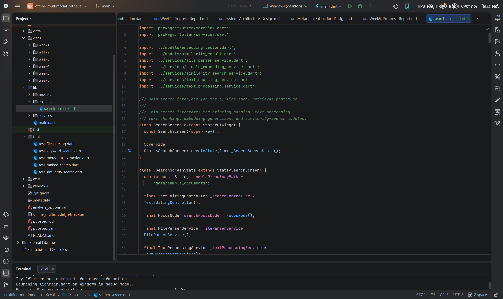

**Figure 3.** Search screen imports, `SearchScreen` widget declaration, local sample directory, query controller, focus node, and initial service declarations.

The screen stores service instances and the UI state required for the retrieval process.

The main state variables include:

```text
_embeddingVectors
_searchResults
_isInitialising
_isSearching
_hasSearched
_initialisationError
_searchError
_parsedDocumentCount
_textChunkCount
_vocabularySize
```

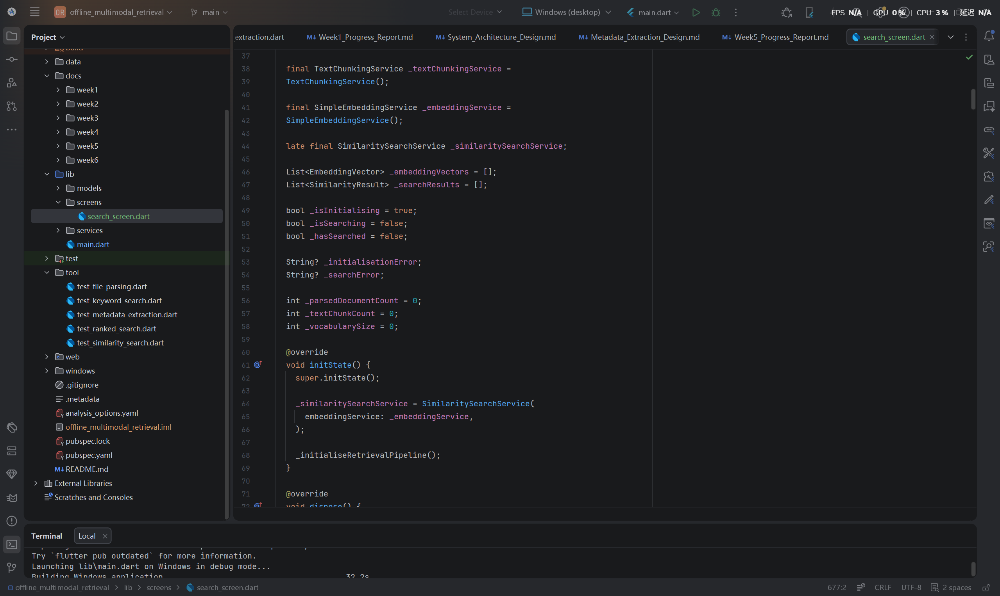

**Figure 4.** Text chunking, embedding and similarity-search services, result collections, UI state flags, counters, and `initState()` integration.

The `initState()` method creates the `SimilaritySearchService` and immediately calls:

```dart
_initialiseRetrievalPipeline();
```

This means that local files are indexed automatically when the application opens.

---

## 8. Retrieval Pipeline Initialisation

The `_initialiseRetrievalPipeline()` method connects the complete retrieval workflow.

It performs five main steps.

### Step 1: Parse local files

```dart
final parsedDocuments =
    await _fileParserService.parseDocumentsFromDirectory(
  _sampleDirectoryPath,
);
```

### Step 2: Convert documents into searchable documents

```dart
final searchableDocuments =
    _textProcessingService.convertToSearchableDocuments(
  parsedDocuments,
);
```

### Step 3: Generate text chunks

```dart
final textChunks = _textChunkingService.chunkDocuments(
  searchableDocuments,
  chunkSize: 40,
);
```

### Step 4: Build a shared vocabulary

```dart
final vocabulary = _embeddingService.buildVocabulary(
  textChunks,
);
```

### Step 5: Generate embedding vectors

```dart
final embeddingVectors =
    _embeddingService.generateEmbeddings(
  textChunks,
  vocabulary: vocabulary,
);
```

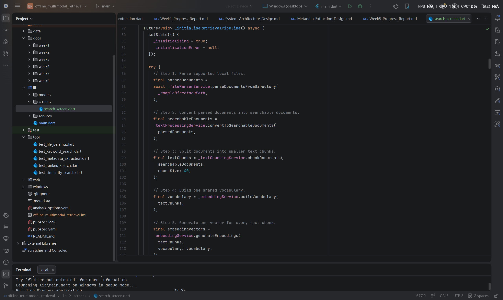

**Figure 5.** Complete UI initialisation workflow from local file parsing to text processing, chunking, vocabulary creation, and embedding-vector generation.

After vector generation, the application updates the interface using:

```dart
setState(() {
  _embeddingVectors = embeddingVectors;
  _parsedDocumentCount = parsedDocuments.length;
  _textChunkCount = textChunks.length;
  _vocabularySize = vocabulary.length;
  _isInitialising = false;
});
```

This state update provides the summary values displayed under the search field.

The initialisation method also:

- Prevents updates after the widget is removed.
- Handles unexpected exceptions.
- Displays an initialisation error message.
- Returns focus to the search input.

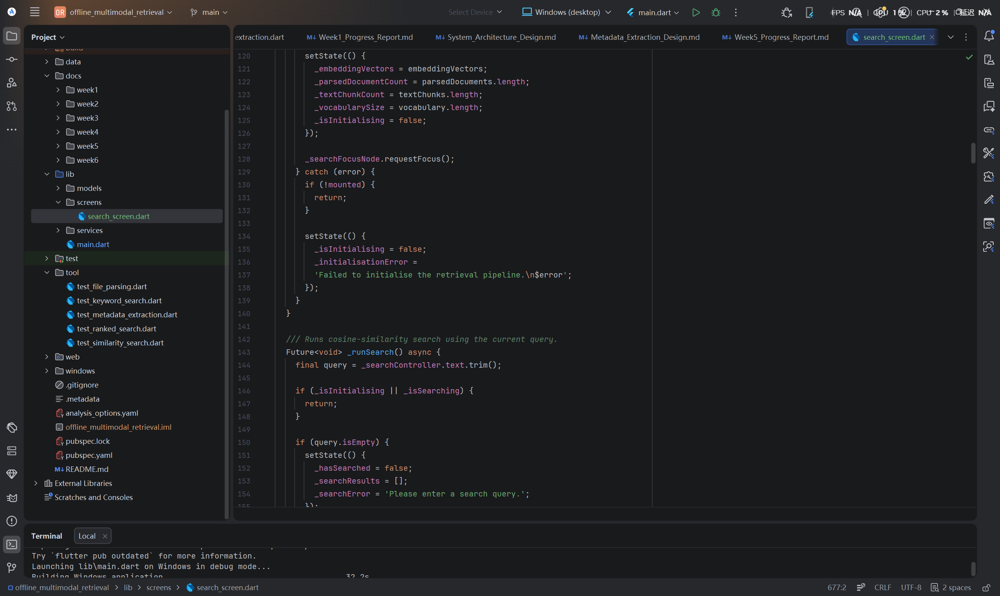

**Figure 6.** Pipeline state update, error handling, focus management, and the beginning of user-query validation.

---

## 9. Search Execution

The `_runSearch()` method reads the current query from the `TextEditingController`.

```dart
final query = _searchController.text.trim();
```

It prevents a search when:

```text
The application is still initialising
A search is already running
The query is empty
```

An empty query displays:

```text
Please enter a search query.
```

For a valid query, the screen calls the Week 6 similarity-search service:

```dart
final results = _similaritySearchService.search(
  query: query,
  embeddings: _embeddingVectors,
  minimumScore: 0.0,
  limit: 10,
);
```

The results are stored using:

```dart
setState(() {
  _searchResults = results;
  _isSearching = false;
});
```

The `minimumScore` value is set to `0.0`, so only positive similarity scores are returned by the existing service implementation.

The `limit` is set to `10`, which prevents an unnecessarily large result list.

The search method also handles exceptions and displays a search error without closing the application.

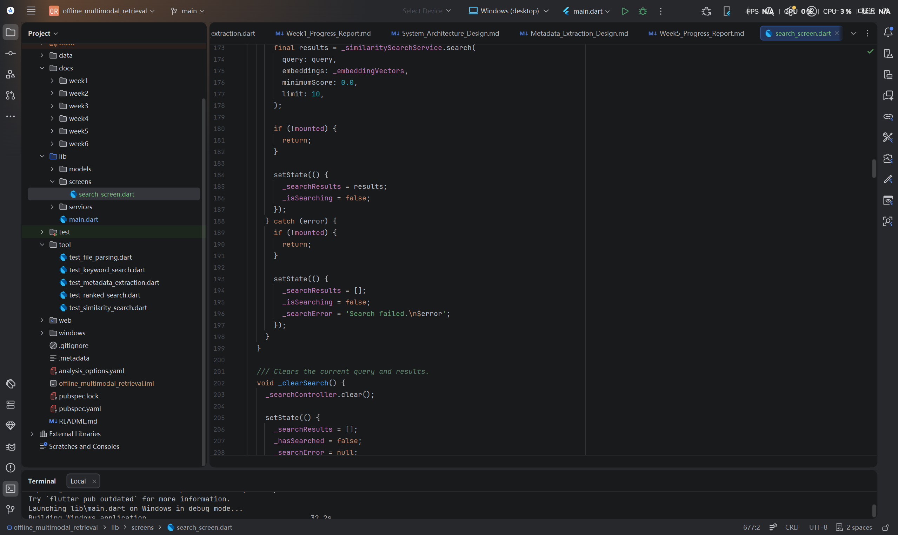

**Figure 7.** Similarity-search service call, result state update, exception handling, and query-clearing logic.

---

## 10. User Interface Components

The Week 7 search interface contains the following components.

### 10.1 Application Bar

The application bar displays:

```text
Offline Multimodal Local Retrieval
```

It also contains a reload button.

The reload button executes:

```dart
_initialiseRetrievalPipeline
```

This allows the application to rebuild its local in-memory index.

### 10.2 Search Input

The search input uses a Flutter `TextField`.

It includes:

- A search icon
- A query label
- An example query
- A search keyboard action
- Automatic focus
- Enter-key submission

The placeholder is:

```text
Example: metadata extraction
```

### 10.3 Search Button

The Search button:

- Calls `_runSearch()`
- Becomes disabled while searching
- Displays a loading indicator
- Changes its text to `Searching...`

### 10.4 Clear Button

The Clear button:

- Removes the current query
- Removes previous results
- Removes previous errors
- Returns focus to the query field

### 10.5 Pipeline Summary

The interface displays four summary chips:

```text
Documents
Text chunks
Vocabulary
Vectors
```

These values confirm that the local indexing process completed successfully.

### 10.6 Result Cards

Each result card displays:

- Ranking number
- Source file name
- Chunk index
- Cosine-similarity score
- Content preview
- Source file path

### 10.7 Empty-Result State

When no relevant chunk is found, the interface displays:

```text
No similar content found
Try another keyword that appears in the indexed documents.
```

### 10.8 Initial State

Before a query is entered, the application displays:

```text
Ready to search
Enter a query above to find relevant local text chunks.
```

---

## 11. Initial Application State

The Windows application successfully loaded and indexed the sample files.

The initial interface displayed:

```text
Documents: 2
Text chunks: 2
Vocabulary: 17
Vectors: 2
```

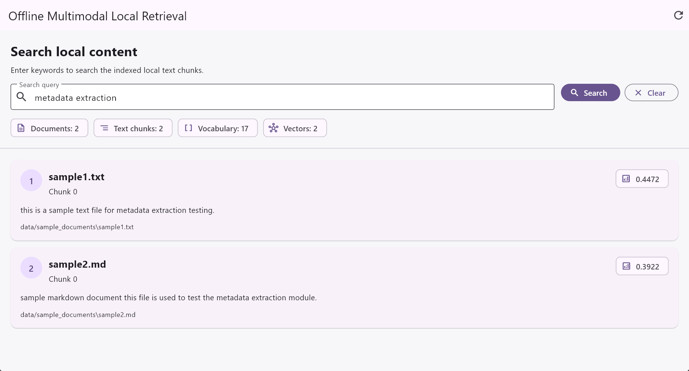

**Figure 8.** Initial Windows desktop interface after local document indexing, showing the search field, Search and Clear buttons, pipeline summary, reload control, and ready state.

The values indicate that:

- Two supported local documents were parsed.
- Two searchable text chunks were generated.
- The shared vocabulary contained 17 terms.
- Two text-chunk vectors were generated.

The PDF file was safely skipped because PDF content extraction has not yet been implemented.

---

## 12. Search Test Results

### 12.1 Query: metadata extraction

The first UI query was:

```text
metadata extraction
```

The interface returned two ranked results.

The first result was:

```text
sample1.txt
Chunk 0
Similarity score: 0.4472
```

The content was:

```text
this is a sample text file for metadata extraction testing.
```

The second result was:

```text
sample2.md
Chunk 0
Similarity score: 0.3922
```

The content was:

```text
sample markdown document this file is used to test the metadata extraction module.
```

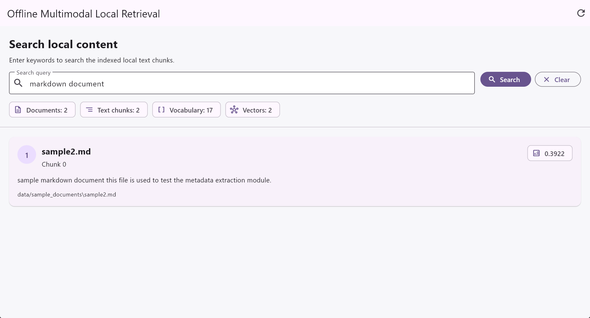

**Figure 9.** Flutter UI results for the query `metadata extraction`, showing two ranked files with similarity scores, content previews, chunk indices, and local file paths.

This result is reasonable because both documents contain the terms `metadata` and `extraction`.

`sample1.txt` received the higher score because the query terms represent a larger proportion of its shorter text.

---

### 12.2 Query: markdown document

The second UI query was:

```text
markdown document
```

The interface returned:

```text
sample2.md
Chunk 0
Similarity score: 0.3922
```

The matching content was:

```text
sample markdown document this file is used to test the metadata extraction module.
```

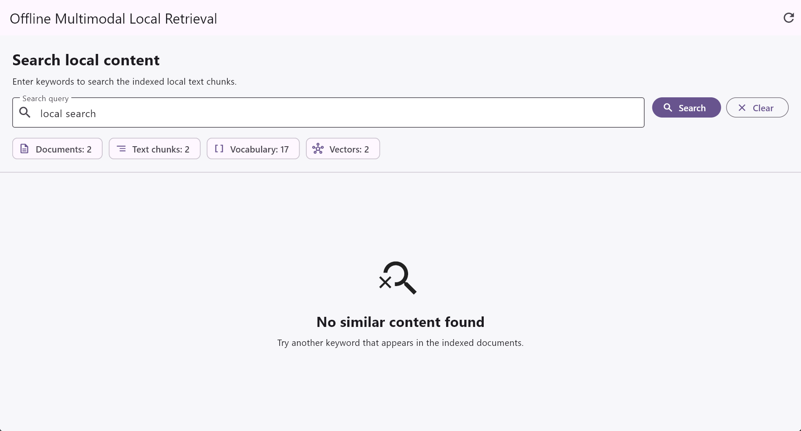

**Figure 10.** Flutter UI result for the query `markdown document`, correctly returning the Markdown sample document as the highest and only positive match.

The result demonstrates that the query vector was compared successfully with the stored text vectors and that zero-score documents were not displayed.

---

### 12.3 Query: local search

The third UI query was:

```text
local search
```

No indexed document contained either query term.

The application therefore displayed the empty-result interface.

### 12.4 Query: unrelated query

The fourth UI query was:

```text
unrelated query
```

This query also contained no terms from the shared vocabulary.

The generated query vector contained only zero values, so the similarity-search service returned no results.


**Figure 11.** Empty-result state for an out-of-vocabulary or unrelated query, showing a clear message instead of an empty or broken result list.

The empty-result test confirms that:

- Unknown query terms are handled safely.
- Zero query vectors do not cause calculation errors.
- The application does not display irrelevant zero-score results.
- The user receives clear feedback.

---

## 13. Keyboard and Accessibility Support

Week 7 added basic accessibility and keyboard support.

### 13.1 Enter-Key Search

The screen uses Flutter `Shortcuts` and `Actions`.

```dart
return Shortcuts(
  shortcuts: const <ShortcutActivator, Intent>{
    SingleActivator(LogicalKeyboardKey.enter):
        _SearchIntent(),
  },
);
```

Pressing Enter triggers:

```dart
_runSearch();
```

The `TextField` also includes:

```dart
textInputAction: TextInputAction.search,
onSubmitted: (_) => _runSearch(),
```

### 13.2 Semantic Labels

Flutter `Semantics` widgets were added to:

- The query input
- Search button
- Clear button
- Reload button
- Loading states
- Empty-result state
- Search-result list
- Individual result cards
- Pipeline summary chips

Examples include:

```dart
Semantics(
  button: true,
  label: 'Search indexed local documents',
)
```

and:

```dart
Semantics(
  liveRegion: true,
  label: 'No similar local content found',
)
```

### 13.3 Tooltips

Tooltips were provided for:

- Reloading local documents
- Cosine-similarity scores

This is an initial accessibility implementation rather than a complete WCAG 2.1 AA audit.

---

## 14. Windows Development Environment

The Week 7 interface was designed to run as a Windows desktop application.

The command used was:

```bash
flutter run -d windows
```

The first attempt failed with:

```text
Error: Unable to find suitable Visual Studio toolchain.
```

The Flutter project itself was valid, but the Windows desktop compiler was incomplete.

---

## 15. Visual Studio Toolchain Problem

The following command was used to inspect the environment:

```bash
flutter doctor -v
```

The output showed that Visual Studio Community 2022 was installed, but required C++ components were missing.

The missing components were:

```text
MSVC v142 - VS 2019 C++ x64/x86 build tools
C++ CMake tools for Windows
Windows 10 SDK
```

The Visual Studio Installer was opened and the following workload was selected:

```text
Desktop development with C++
```

The required individual components were then installed.

After installation, `flutter doctor -v` displayed:

```text
[√] Visual Studio - develop Windows apps
```

and:

```text
No issues found!
```

The application was then successfully compiled and launched on Windows.

This problem was environmental rather than an error in the Dart or Flutter source code.

---

## 16. Static Analysis

The project was checked using:

```bash
flutter analyze
```

Before correction, the new `SearchScreen` contained two compile errors caused by invalid `const` usage around `Semantics` widgets.

The affected pattern was:

```dart
return const Center(
  child: Semantics(
```

Because the `Semantics` widget configuration was not valid inside that constant construction, the outer `const` was removed.

The corrected pattern was:

```dart
return Center(
  child: Semantics(
```

A minor callback naming warning was also corrected by changing:

```dart
separatorBuilder: (_, __)
```

to:

```dart
separatorBuilder: (_, _)
```

After correction, there were:

```text
0 errors
100 info-level notices
```

The remaining notices were mainly:

```text
avoid_print
avoid_relative_lib_imports
```

These notices are located primarily in earlier command-line test scripts and debug service methods.

They do not prevent the project from compiling or running.

---

## 17. Problems and Solutions

### 17.1 SearchScreen Const Errors

**Problem**

`flutter analyze` reported two compile errors in the new search screen.

**Cause**

A `const Center` contained a `Semantics` structure that could not be treated as a constant expression.

**Solution**

The outer `const` keyword was removed, while constant child widgets were kept where valid.

---

### 17.2 Windows Toolchain Missing

**Problem**

The command:

```bash
flutter run -d windows
```

failed with:

```text
Unable to find suitable Visual Studio toolchain.
```

**Cause**

Visual Studio was installed without all required C++ desktop-development components.

**Solution**

The `Desktop development with C++` workload was enabled, including MSVC build tools, CMake tools, and a Windows SDK.

---

### 17.3 Unsupported PDF File

**Problem**

The sample folder contains:

```text
sample3.pdf
```

The current file parser does not support PDF content extraction.

**Solution**

The parser safely skips unsupported files and continues indexing TXT and Markdown documents.

The terminal displays:

```text
Unsupported file type skipped: sample3.pdf
```

---

### 17.4 Out-of-Vocabulary Queries

**Problem**

Queries such as:

```text
local search
unrelated query
```

do not contain any terms from the shared vocabulary.

**Solution**

The embedding service creates a zero query vector.

The similarity-search service detects the zero vector and returns an empty result list.

The UI then displays a clear empty-result state.

---

### 17.5 Different Text Chunk Count from Week 6

Week 6 used:

```dart
chunkSize: 8
```

This produced four small chunks for command-line demonstration.

Week 7 uses:

```dart
chunkSize: 40
```

The current sample documents are shorter than 40 words, so each supported document produces one chunk.

The Week 7 interface therefore displays:

```text
Text chunks: 2
Vectors: 2
```

This is expected and does not indicate an error.

A chunk size of 40 is more appropriate for a practical UI prototype than the small demonstration value used in Week 6.

---

## 18. Current Limitations

### 18.1 Term-Frequency Vectors

The current application uses normalised term-frequency vectors.

It does not use a trained semantic embedding model.

The application can detect shared vocabulary, but it cannot reliably understand synonyms or broader semantic relationships.

### 18.2 Small Dataset

The current test directory contains only a small number of sample files.

The UI has not yet been evaluated using a large local document collection.

### 18.3 Limited File Support

The current parser supports:

```text
TXT
Markdown
```

PDF, Word, PowerPoint, scanned document, and image-content extraction are not yet implemented.

### 18.4 In-Memory Index

The vocabulary and embedding vectors are generated each time the application starts.

They are not persisted in a local vector database.

### 18.5 Static Sample Directory

The current directory is hard-coded as:

```text
data/sample_documents
```

Users cannot yet select another folder through the interface.

### 18.6 No File Opening Action

The result card displays the source path, but clicking a result does not yet open the original file.

### 18.7 Desktop-Focused Layout

The current layout is optimised for a wide Windows desktop window.

Further responsive-layout work is required for smaller displays and mobile devices.

### 18.8 Basic Accessibility Only

Semantic labels and keyboard search are available, but the application has not undergone a complete screen-reader, contrast, or WCAG compliance test.

### 18.9 No Persistent User Settings

The application does not store:

- Recent searches
- Preferred directories
- Search limits
- Theme settings
- Accessibility preferences

### 18.10 No Image Retrieval

The interface is part of a multimodal retrieval project, but the current working pipeline is still text-only.

Image embedding and text-to-image retrieval remain future work.

---

## 19. Week 7 Deliverables

The following Week 7 deliverables were completed:

1. New Flutter `SearchScreen`
2. Updated Flutter application entry point
3. Material 3 application theme
4. Local document pipeline initialisation
5. Automatic document indexing
6. File parsing integration
7. Text processing integration
8. Text chunking integration
9. Vocabulary generation integration
10. Embedding-vector generation integration
11. Cosine-similarity search integration
12. Search query field
13. Search button
14. Clear button
15. Reload button
16. Loading state
17. Initial ready state
18. Empty-result state
19. Initialisation-error state
20. Search-error state
21. Ranked result cards
22. Source file display
23. Chunk-index display
24. Similarity-score display
25. Content-preview display
26. Source-path display
27. Pipeline summary chips
28. Keyboard Enter search
29. Focus management
30. Basic accessibility semantics
31. Windows C++ toolchain configuration
32. Successful Windows desktop build
33. Metadata query test
34. Markdown query test
35. Empty local-search query test
36. Unrelated-query test
37. Static analysis correction
38. Week 7 screenshots
39. Week 7 Progress Report
40. Week 7 GitHub commit and remote push

---

## 20. Current Technical Status

| Area | Status | Notes |
|---|---|---|
| Metadata extraction | Completed | Reads local file information |
| TXT parsing | Completed | Content supported |
| Markdown parsing | Completed | Content supported |
| PDF parsing | Pending | Unsupported PDF files are skipped |
| Text processing | Completed | Cleaning and normalisation |
| Keyword search | Completed | Basic exact-term search |
| Ranked keyword search | Completed | Score-based document ranking |
| Text chunking | Completed | Configurable word-count chunks |
| Shared vocabulary | Completed | Generated from indexed chunks |
| Term-frequency vectors | Completed | Lightweight embedding prototype |
| Query vector generation | Completed | Uses the shared vocabulary |
| Cosine similarity | Completed | Compares query and chunk vectors |
| Similarity ranking | Completed | Highest score displayed first |
| Flutter search screen | Completed | Windows desktop UI |
| Search field | Completed | Supports text input |
| Search button | Completed | Runs similarity search |
| Clear button | Completed | Clears query and results |
| Reload button | Completed | Rebuilds the local index |
| Pipeline statistics | Completed | Documents, chunks, vocabulary, vectors |
| Ranked result cards | Completed | Displays result information |
| Empty-result state | Completed | Handles unrelated queries |
| Loading state | Completed | Shown during initialisation and search |
| Error handling | Completed | Initialisation and search errors |
| Keyboard search | Completed | Enter key supported |
| Basic semantics | Completed | Initial accessibility labels |
| Windows toolchain | Completed | Visual Studio C++ components installed |
| Windows desktop run | Completed | Application launched successfully |
| Persistent vector storage | Pending | Current vectors remain in memory |
| Directory selection | Pending | Uses a fixed sample directory |
| File-opening action | Pending | Paths are display-only |
| BERT/TFLite embedding | Planned | Future semantic model |
| Image embedding | Planned | Future multimodal retrieval |
| Full accessibility audit | Pending | Requires further evaluation |

---

## 21. GitHub Version Control Update

After the Week 7 Flutter interface, functional tests, screenshots, and progress documentation were completed, the new files were committed and pushed to the remote GitHub repository.

The Week 7 update included:

```text
lib/main.dart
lib/screens/search_screen.dart
docs/week7/Week7_Progress_Report.md
docs/week7/images/
```

The commit message was:

```text
Complete Week 7 Flutter search interface
```

The changes were successfully pushed to the `main` branch of the remote repository.

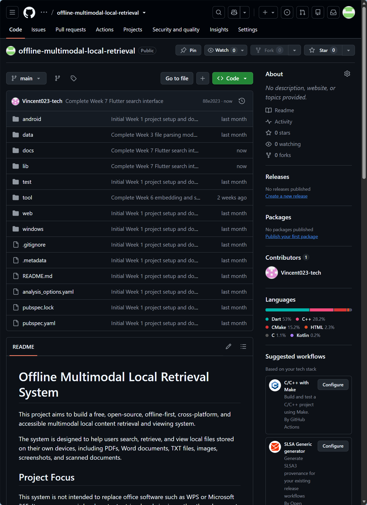

**Figure 12.** GitHub repository after the successful Week 7 push, showing the latest `Complete Week 7 Flutter search interface` commit on the `main` branch and the updated Week 7 source code, screenshots, and documentation.

The successful push confirms that the Week 7 Flutter interface, functional evidence, and progress documentation are stored in the remote repository for version control, backup, and future development.

---

## 22. Week 7 Summary

During Week 7, the project moved from a command-line retrieval prototype to an interactive Flutter Windows application.

The existing file parsing, text processing, text chunking, embedding generation, and similarity-search modules were successfully reused rather than rewritten.

The application can now:

```text
Load local documents
→ Build an in-memory retrieval index
→ Accept a user query
→ Generate a query vector
→ Calculate cosine similarity
→ Rank matching text chunks
→ Display results in a graphical interface
```

The UI also provides loading feedback, empty-result messages, error handling, pipeline statistics, keyboard interaction, and basic accessibility semantics.

The successful Windows desktop build confirms that the backend retrieval architecture can be integrated into a user-facing application.

Week 7 therefore establishes the main demonstration interface required for final documentation, testing, packaging, and presentation.

---

## 23. Week 8 Plan

Week 8 will focus on final system completion, documentation, validation, and project packaging.

The planned Week 8 tasks include:

- Review the complete Week 1 to Week 7 development history.
- Conduct final functional testing.
- Test the initial, successful-result, and empty-result states.
- Review error handling.
- Improve final project documentation.
- Update the root `README.md`.
- Add installation and setup instructions.
- Add Windows build instructions.
- Add user instructions for running searches.
- Document supported and unsupported file types.
- Document the current retrieval algorithm.
- Document known limitations.
- Review open-source licence requirements.
- Add or confirm an appropriate project licence.
- Review dependency information.
- Prepare final screenshots.
- Prepare a final project architecture summary.
- Prepare final demonstration material.
- Organise the GitHub repository.
- Push the final Week 7 and Week 8 updates.
- Create the Week 8 Progress Report.
- Prepare a final project summary for presentation or portfolio use.

The Week 8 work will not replace the existing retrieval implementation. Its purpose will be to convert the completed prototype into a clear, reproducible, documented, and presentable final project.