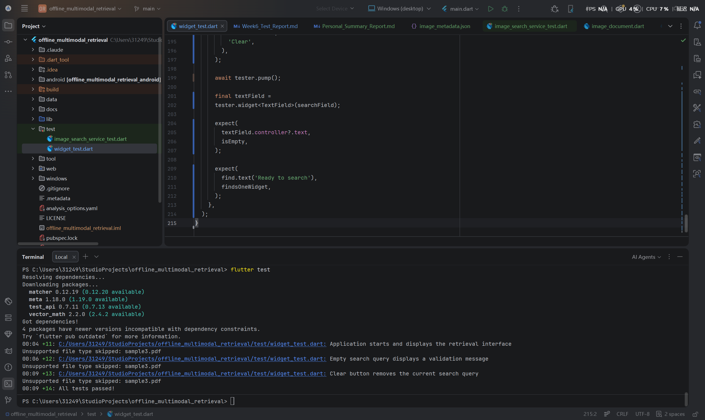
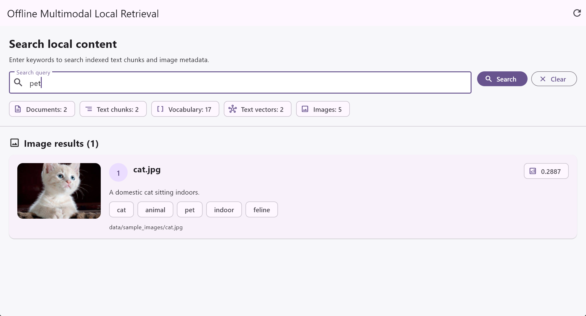
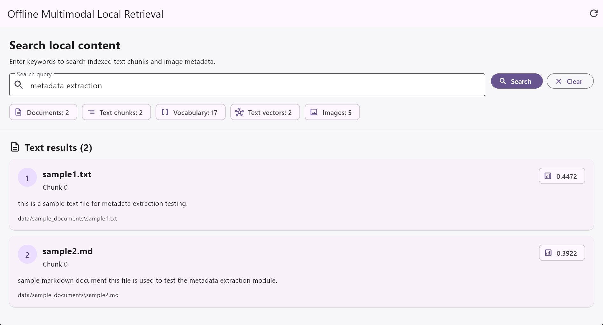

# Offline Multimodal Local Retrieval System

# Final Software Test Report

## 1. Document Control

| Field | Value |
|---|---|
| Project | Offline Multimodal Local Retrieval System |
| Document Title | Final Software Test Report |
| Document Type | Final Functional, Integration, Widget, Image Retrieval, and Execution Test Report |
| Version | 1.1 |
| Status | Final |
| Author | Mingxuan Huang |
| Original Date | 2026/07/27 |
| Final Revision Date | 2026/07/30 |
| Test Stage | Week 8 Final Validation |
| Validated Platform | Windows Desktop |
| Reference Approach | Structured with reference to ISO/IEC/IEEE 29119-3 test documentation principles |

---

## 2. Purpose

This document records the final software testing performed for the Offline Multimodal Local Retrieval System.

The final test phase validates the complete Windows desktop prototype developed from Week 1 to Week 8.

The tested system now includes:

- Local TXT and Markdown file parsing
- File metadata extraction
- Text cleaning and normalisation
- Text chunking
- Vocabulary generation
- Term-frequency vector generation
- Query-vector generation
- Cosine-similarity calculation
- Ranked text retrieval
- JPG, JPEG, and PNG image loading
- Image metadata loading
- Image description and tag processing
- Text-to-image retrieval
- Ranked image-result display
- Local image-thumbnail display
- Flutter user-interface integration
- Windows desktop execution
- Widget-level interaction testing
- Empty-query and empty-result handling
- Unsupported-file handling

This report does not claim formal ISO certification.

Its structure is organised with reference to recognised software-test documentation principles.

---

## 3. Test Objectives

The final test phase had the following objectives:

1. Confirm that the project contains no compile-blocking source-code errors.
2. Confirm that the Flutter application builds successfully for Windows.
3. Confirm that the Windows desktop application starts successfully.
4. Confirm that supported local text documents are loaded and indexed.
5. Confirm that supported local image files are loaded.
6. Confirm that image metadata is converted into searchable image objects.
7. Confirm that unsupported files are skipped safely.
8. Confirm that the search interface is displayed correctly.
9. Confirm that text queries return ranked text results.
10. Confirm that text queries return relevant image results.
11. Confirm that image thumbnails are displayed.
12. Confirm that unrelated queries return an empty-result state.
13. Confirm that an empty query displays a validation message.
14. Confirm that the Clear button removes the current query and both result types.
15. Confirm that Reload rebuilds both text and image indexes.
16. Confirm that Enter-key search works.
17. Confirm that real local file-system operations work during widget tests.
18. Confirm that the image extension does not break the original text-retrieval pipeline.
19. Record known lint notices, defects, limitations, risks, and resolutions.

---

## 4. System Under Test

The system under test is a local-first Flutter Windows desktop retrieval prototype.

The system contains two retrieval branches.

### 4.1 Text Retrieval Branch

```text
Local TXT and Markdown files
→ File parsing
→ Parsed documents
→ Text processing
→ Searchable documents
→ Text chunking
→ Shared vocabulary
→ Term-frequency vectors
→ User query vector
→ Cosine similarity
→ Ranked text results
→ Flutter interface
```

### 4.2 Image Retrieval Branch

```text
Local JPG and PNG files
→ image_metadata.json
→ Image metadata loading
→ Description and tag processing
→ Searchable image text
→ Term-frequency vectors
→ User query vector
→ Cosine similarity
→ Ranked image results
→ Local thumbnail display
```

### 4.3 Unified Query Flow

```text
One text query
├── Search indexed text chunks
└── Search indexed image descriptions and tags
```

The current text directory is:

```text
data/sample_documents
```

The current image directory is:

```text
data/sample_images
```

---

## 5. Supported and Unsupported Types

### 5.1 Supported Text Types

```text
.txt
.md
```

### 5.2 Supported Image Types

```text
.jpg
.jpeg
.png
```

### 5.3 Unsupported Test Type

```text
.pdf
```

The test PDF is detected and skipped safely.

---

## 6. Test Scope

### 6.1 Included

The final test scope included:

- Flutter environment validation
- Windows desktop toolchain validation
- Dependency resolution
- Static source-code analysis
- Image metadata JSON validation
- Image-file existence validation
- Supported image-extension validation
- Text-retrieval service testing
- Image metadata loading
- Text-to-image retrieval
- Query normalisation
- Vocabulary generation
- Vector generation
- Cosine-similarity calculation
- Similarity-score sorting
- Result limiting
- Empty-query handling
- Unrelated-query handling
- Widget tests
- Real asynchronous local file access during widget tests
- Search-interface startup
- Search-field rendering
- Search button rendering
- Clear button rendering
- Pipeline-summary rendering
- Image-count rendering
- Windows desktop build
- Windows desktop execution
- Text-result display
- Image-result display
- Image-thumbnail display
- Image description and tag display
- Reload behaviour
- Enter-key search behaviour
- Unsupported PDF handling
- Regression verification of original text retrieval
- Git status verification

### 6.2 Excluded

The following areas were outside the current final test scope:

- PDF content extraction
- Word document parsing
- PowerPoint parsing
- OCR
- Direct image-pixel analysis
- CLIP or MobileCLIP embeddings
- Image-to-image retrieval
- Neural semantic text embeddings
- Persistent vector-database storage
- Cloud deployment
- REST API testing
- OpenAPI endpoint testing
- Mobile-device testing
- Large-scale load testing
- Formal security penetration testing
- Formal WCAG certification
- Production installer packaging
- Digital signing
- Web local-folder retrieval

---

## 7. Test Environment

| Item | Configuration |
|---|---|
| Operating System | Microsoft Windows |
| Development Framework | Flutter |
| Programming Language | Dart |
| Desktop Target | Windows x64 |
| IDE | Android Studio |
| Source Control | Git |
| Remote Repository | GitHub |
| Main Branch | `main` |
| Test Framework | `flutter_test` |
| Static Analysis Command | `flutter analyze` |
| Automated Test Command | `flutter test` |
| Desktop Execution Command | `flutter run -d windows` |
| Text Test Directory | `data/sample_documents` |
| Image Test Directory | `data/sample_images` |
| Supported Text Files | `sample1.txt`, `sample2.md` |
| Unsupported File | `sample3.pdf` |
| Supported Image Files | `car.jpg`, `cat.jpg`, `mountain.jpg`, `office.jpg`, `微信截图.png` |
| Image Metadata File | `data/sample_images/image_metadata.json` |
| Network Requirement | None for retrieval functionality |

---

## 8. Test Evidence Files

The final evidence files are stored in:

```text
docs/week8/images/
```

The main evidence images include:

```text
flutter_test_final.png
flutter_test_with_image_retrieval.png
text_to_image_search_cat.png
text_retrieval_after_image_extension.png
windows_app_final_initial.png
windows_app_final_search.png
github_week8_final.png
```

The main image-retrieval evidence is:

```text
text_to_image_search_cat.png
```

The final automated-test evidence is:

```text
flutter_test_with_image_retrieval.png
```

The original text-retrieval regression evidence is:

```text
text_retrieval_after_image_extension.png
```

---

## 9. Static Analysis

The following command was executed:

```bash
flutter analyze
```

The final result was:

```text
139 issues found
```

All 139 reported issues were information-level lint notices.

The final analysis status was:

```text
Errors: 0
Warnings: 0
Information-level notices: 139
```

There were no compile-blocking static-analysis errors.

The main notice categories were:

```text
avoid_print
avoid_relative_lib_imports
```

### 9.1 `avoid_print`

This notice identifies the use of:

```dart
print(...)
```

in service classes and command-line test scripts.

The current `print()` statements are used to display:

- Test progress
- Loaded file information
- Search-result information
- Unsupported-file messages
- Error details

These calls do not prevent compilation or execution.

A production implementation should replace them with a structured logging framework.

### 9.2 `avoid_relative_lib_imports`

Some scripts under:

```text
tool/
```

import project libraries through relative paths.

Example:

```dart
import '../lib/services/image_search_service.dart';
```

These scripts execute correctly.

Package imports are recommended for future maintainability.

### 9.3 Dependency Notices

The analysis reported newer available versions for:

```text
matcher
meta
test_api
vector_math
```

The available versions were outside the current dependency constraints.

No upgrade was performed during finalisation because the current dependency set was stable and unnecessary upgrades could introduce regression risk.

---

## 10. Image Metadata Loading Test

The image metadata was first verified using:

```bash
dart run tool/test_image_metadata.dart
```

The final output included:

```text
Total Image Documents: 5
```

The loaded image documents were:

```text
car.jpg
cat.jpg
mountain.jpg
office.jpg
微信截图.png
```

For every image, the command-line script displayed:

- Filename
- File path
- Description
- Tags
- Searchable text

The execution ended with:

```text
Image metadata loading test completed successfully.
```

This confirmed the following pipeline:

```text
image_metadata.json
→ ImageMetadataService
→ Five validated ImageDocument objects
```

---

## 11. Image Search Command-Line Test

The image-search service was verified using:

```bash
dart run tool/test_image_search.dart
```

The final results were:

```text
Query: vehicle road
1. car.jpg
Score: 0.4867
```

```text
Query: animal pet
1. cat.jpg
Score: 0.4082
```

```text
Query: mountain nature
1. mountain.jpg
Score: 0.4523
```

```text
Query: office computer
1. office.jpg
Score: 0.6030
```

```text
Query: video website gaming
1. 微信截图.png
Score: 0.5893
```

```text
Query: completely unrelated words
No matching images found.
```

The execution ended with:

```text
Image search test completed successfully.
```

Every planned image query returned the expected result.

---

## 12. Formal Automated Test Files

The final automated test files are:

```text
test/image_search_service_test.dart
test/widget_test.dart
```

The image-search test file contains:

```text
11 independent automated tests
```

The widget-test file contains:

```text
3 independent automated tests
```

The total automated test count is:

```text
14
```

---

## 13. Image Metadata Automated Tests

The image metadata group contains two tests.

| Test ID | Test Case | Expected Result | Actual Result | Status |
|---|---|---|---|---|
| IT-W8-001 | Load supported image documents | Five valid image documents are loaded | Five loaded | Pass |
| IT-W8-002 | Generate searchable image text | Description and tags are included | Searchable text generated | Pass |

The searchable image text is formed from:

```text
description
+
tags
```

Example:

```text
A domestic cat sitting indoors.
cat animal pet indoor feline
```

---

## 14. Image Retrieval Automated Tests

The image retrieval group contains nine tests.

| Test ID | Query or Function | Expected Result | Actual Result | Status |
|---|---|---|---|---|
| IT-W8-003 | `vehicle road` | `car.jpg` ranked first | `car.jpg` ranked first | Pass |
| IT-W8-004 | `pet` | `cat.jpg` ranked first | `cat.jpg` ranked first | Pass |
| IT-W8-005 | `mountain nature` | `mountain.jpg` ranked first | `mountain.jpg` ranked first | Pass |
| IT-W8-006 | `office computer` | `office.jpg` ranked first | `office.jpg` ranked first | Pass |
| IT-W8-007 | `video website gaming` | `微信截图.png` ranked first | Screenshot ranked first | Pass |
| IT-W8-008 | Unrelated query | Empty result | Empty result returned | Pass |
| IT-W8-009 | Empty query | Empty result | Empty result returned | Pass |
| IT-W8-010 | Result limit | Returned result count respects limit | Limit respected | Pass |
| IT-W8-011 | Similarity sorting | Results sorted in descending order | Correct descending order | Pass |

---

## 15. Widget-Test Scope

The final widget-test file is:

```text
test/widget_test.dart
```

Three widget tests were implemented:

1. Application startup and retrieval-interface display
2. Empty-search-query validation
3. Clear-button query removal

The startup test validates:

- Application title
- Loading message
- Completion of local text and image indexing
- Search field
- Search button
- Clear button
- Document summary
- Text chunk summary
- Vocabulary summary
- Text vector summary
- Image count
- Ready state

---

## 16. Widget-Test Cases

| Test ID | Test Case | Expected Result | Actual Result | Status |
|---|---|---|---|---|
| WT-W8-001 | Start application in widget test | Application title appears | Title displayed | Pass |
| WT-W8-002 | Display initial loading state | Updated loading message appears | Message displayed | Pass |
| WT-W8-003 | Complete asynchronous local indexing | Search interface appears | Interface displayed | Pass |
| WT-W8-004 | Render query field | One `TextField` appears | Field displayed | Pass |
| WT-W8-005 | Render Search button | Search button appears | Button displayed | Pass |
| WT-W8-006 | Render Clear button | Clear button appears | Button displayed | Pass |
| WT-W8-007 | Render pipeline summaries | Text and image counters appear | Counters displayed | Pass |
| WT-W8-008 | Render ready state | `Ready to search` appears | Ready state displayed | Pass |
| WT-W8-009 | Submit empty query | Validation message appears | Message displayed | Pass |
| WT-W8-010 | Enter query text | Query appears in field | Query displayed | Pass |
| WT-W8-011 | Press Clear | Query field becomes empty | Query removed | Pass |
| WT-W8-012 | Return to ready state | Ready state appears | Ready state displayed | Pass |
| WT-W8-013 | Skip unsupported PDF | Pipeline continues | PDF skipped safely | Pass |
| WT-W8-014 | Detect rendering exception | No exception occurs | No exception | Pass |

These 14 rows describe the behaviours covered by the three widget-test functions.

They should not be interpreted as 14 separate widget-test functions.

---

## 17. Widget-Test Implementation Strategy

The application performs real local file-system operations during startup.

The final widget-test design required special handling.

### 17.1 Real Asynchronous File I/O

The startup pipeline performs:

```text
Directory listing
Text-file reading
Document parsing
Image metadata reading
Image-file existence validation
```

Flutter widget tests normally use a controlled test clock.

The final implementation therefore used:

```dart
tester.runAsync(...)
```

This allowed real asynchronous local file operations to complete.

### 17.2 Bounded Waiting

The tests used a bounded helper that repeatedly checked whether:

```text
Search local content
```

had appeared.

This prevented unlimited waiting and produced a clear failure if indexing did not finish.

### 17.3 Desktop Viewport

The widget-test viewport was configured as:

```text
1280 × 900
```

The device pixel ratio was configured as:

```text
1.0
```

This represents a realistic Windows desktop window and prevents artificial layout overflows caused by Flutter's smaller default widget-test viewport.

---

## 18. Initial Test Failure: Obsolete Counter Test

### Problem

The original Flutter template included:

```text
Counter increments smoke test
```

It expected:

```text
0
1
```

and a counter button.

### Root Cause

The counter demonstration interface had already been replaced by the local retrieval interface.

The old test no longer represented the actual application.

### Resolution

The obsolete test was replaced with tests for:

- Retrieval-interface startup
- Empty-query validation
- Clear-button behaviour

### Result

The obsolete counter test was removed successfully.

---

## 19. Test Failure: `pumpAndSettle()` Timeout

### Problem

The first replacement tests used:

```dart
pumpAndSettle()
```

The tests timed out.

### Root Cause

The startup interface displayed an animated:

```dart
CircularProgressIndicator()
```

The animation continuously scheduled frames.

`pumpAndSettle()` could not reach a completely settled state.

### Resolution

`pumpAndSettle()` was replaced with a bounded widget-search helper.

### Result

The animation-related timeout was removed.

---

## 20. Test Failure: Real File I/O Did Not Complete

### Problem

The bounded helper initially could not find:

```text
Search local content
```

after the maximum number of attempts.

### Root Cause

Repeated calls to:

```dart
tester.pump()
```

advance Flutter test frames but do not automatically complete real local file-system operations.

The application required both text and image file access.

### Resolution

The helper used:

```dart
tester.runAsync(...)
```

combined with:

```dart
tester.pump()
```

### Result

The local text and image I/O completed successfully.

---

## 21. Test Failure: RenderFlex Overflow

### Problem

The empty-query test produced:

```text
A RenderFlex overflowed by 20 pixels on the bottom.
```

### Root Cause

The default widget-test viewport was too small for the Windows desktop interface.

### Resolution

The test viewport was configured to:

```text
1280 × 900
```

The pixel ratio was set to:

```text
1.0
```

The values were reset after each test.

### Result

The artificial layout overflow was removed.

---

## 22. Test Failure: Updated Loading Message

### Problem

After image loading was added, the interface message changed from:

```text
Loading and indexing local documents...
```

to:

```text
Loading and indexing local documents and images...
```

The old test still expected the previous text.

### Resolution

The widget-test expectation was updated to the new message.

### Result

The loading-state test passed.

---

## 23. Test Failure: Updated Vector Label

### Problem

The earlier interface displayed:

```text
Vectors: 2
```

The new interface displayed:

```text
Text vectors: 2
```

The old widget test searched for:

```text
Vectors:
```

### Resolution

The expectation was changed to:

```text
Text vectors:
```

A new expectation was added for:

```text
Images:
```

### Result

The startup widget test passed.

---

## 24. Test Failure: Missing Image-Test File

### Problem

The first command for the image test reported:

```text
Does not exist
```

### Root Cause

The image-search test file had not yet been created in the `test` directory.

### Resolution

The file was created at:

```text
test/image_search_service_test.dart
```

### Result

The image tests loaded and executed normally.

---

## 25. Final Automated Test Result

The full test command was:

```bash
flutter test
```

The final result was:

```text
00:09 +14: All tests passed!
```

The final statistics were:

| Test Group | Planned | Executed | Passed | Failed | Pass Rate |
|---|---:|---:|---:|---:|---:|
| Image metadata tests | 2 | 2 | 2 | 0 | 100% |
| Image retrieval tests | 9 | 9 | 9 | 0 | 100% |
| Widget tests | 3 | 3 | 3 | 0 | 100% |
| **Total** | **14** | **14** | **14** | **0** | **100%** |

Overall automated result:

```text
PASS
```



**Figure 1.** Final complete Flutter test suite showing 14 passed tests and no failures.

The terminal also displayed:

```text
Unsupported file type skipped: sample3.pdf
```

This is expected behaviour.

---

## 26. Text-to-Image Functional Evidence

The query:

```text
pet
```

returned:

```text
cat.jpg
```

The image result displayed:

- Image thumbnail
- Filename
- Description
- Tags
- Similarity score
- Local path



**Figure 2.** Text-to-image retrieval result for the query `pet`.

The result confirms:

```text
Text query
→ Description and tag matching
→ Image ranking
→ Local thumbnail display
```

---

## 27. Text Retrieval Regression Evidence

After integrating image retrieval, the original text search was tested again.

The query:

```text
metadata extraction
```

returned:

```text
sample1.txt
sample2.md
```



**Figure 3.** Original text retrieval continuing to work after the image extension.

This confirmed that the image extension did not break the original text-retrieval pipeline.

---

## 28. Windows Desktop Build Test

The following command was executed:

```bash
flutter run -d windows
```

The output included:

```text
Launching lib\main.dart on Windows in debug mode...
Building Windows application...
Built build\windows\x64\runner\Debug\offline_multimodal_retrieval.exe
Syncing files to device Windows...
```

The generated executable was:

```text
build/windows/x64/runner/Debug/offline_multimodal_retrieval.exe
```

The application built and started successfully.

### Overall Windows Build Result

```text
PASS
```

---

## 29. Windows Execution Test

The final Windows execution confirmed that:

- The application launched.
- The retrieval screen rendered.
- Two local text documents were indexed.
- Five local images were loaded.
- The unsupported PDF was skipped.
- Text search controls were available.
- Text results could be displayed.
- Image results could be displayed.
- Image thumbnails rendered.
- Descriptions and tags rendered.
- Empty results were handled.
- Clear worked.
- Reload worked.
- Enter-key search worked.
- The application exited normally.

The final summary counters were:

```text
Documents: 2
Text chunks: 2
Vocabulary: 17
Text vectors: 2
Images: 5
```

### Overall Windows Execution Result

```text
PASS
```

---

## 30. Manual Functional Test Cases

| Test ID | Function | Test Action | Expected Result | Result |
|---|---|---|---|---|
| MF-W8-001 | Application startup | Run Windows application | Interface opens | Pass |
| MF-W8-002 | Text initialisation | Wait for startup | Text counters appear | Pass |
| MF-W8-003 | Image initialisation | Wait for startup | `Images: 5` appears | Pass |
| MF-W8-004 | Metadata query | Search `metadata extraction` | Text results appear | Pass |
| MF-W8-005 | Markdown query | Search `markdown document` | Markdown result appears | Pass |
| MF-W8-006 | Cat query | Search `pet` | `cat.jpg` appears | Pass |
| MF-W8-007 | Car query | Search `vehicle road` | `car.jpg` appears | Pass |
| MF-W8-008 | Mountain query | Search `mountain nature` | `mountain.jpg` appears | Pass |
| MF-W8-009 | Office query | Search `office computer` | `office.jpg` appears | Pass |
| MF-W8-010 | Website query | Search `video website gaming` | Screenshot appears | Pass |
| MF-W8-011 | Image thumbnail | View image result | Thumbnail renders | Pass |
| MF-W8-012 | Image metadata | View image result | Description and tags appear | Pass |
| MF-W8-013 | Unrelated query | Search unrelated terms | Empty-result state appears | Pass |
| MF-W8-014 | Empty query | Press Search with empty field | Validation appears | Pass |
| MF-W8-015 | Clear control | Enter query and press Clear | Query and results removed | Pass |
| MF-W8-016 | Reload control | Press Reload | Text and image indexes rebuild | Pass |
| MF-W8-017 | Keyboard search | Press Enter | Search starts | Pass |
| MF-W8-018 | Unsupported file | Include `sample3.pdf` | PDF skipped safely | Pass |
| MF-W8-019 | Regression check | Run text search after image extension | Original text retrieval works | Pass |
| MF-W8-020 | Normal exit | Close application | Application exits normally | Pass |

---

## 31. Final Test Summary

| Test Category | Passed | Failed | Result |
|---|---:|---:|---|
| Static analysis | Completed | 0 blocking issues | Pass |
| Image metadata automated tests | 2 | 0 | Pass |
| Image retrieval automated tests | 9 | 0 | Pass |
| Widget tests | 3 | 0 | Pass |
| Windows build | 1 | 0 | Pass |
| Windows execution | 1 | 0 | Pass |
| Manual functional checks | 20 | 0 | Pass |
| Unsupported-file handling | 1 | 0 | Pass |

Overall final result:

```text
PASS
```

---

## 32. Defects and Resolutions

| Defect ID | Description | Severity | Resolution | Status |
|---|---|---|---|---|
| DEF-W8-001 | Default counter test no longer matched the application | Medium | Replaced with retrieval-interface tests | Closed |
| DEF-W8-002 | `pumpAndSettle()` timed out | Medium | Added bounded widget waiting | Closed |
| DEF-W8-003 | Real file I/O did not complete under controlled test clock | High | Added `tester.runAsync()` | Closed |
| DEF-W8-004 | Default test viewport caused vertical overflow | Medium | Configured 1280 × 900 viewport | Closed |
| DEF-W8-005 | Updated loading text caused old test failure | Low | Updated expected text | Closed |
| DEF-W8-006 | Updated vector label caused old test failure | Low | Updated label and added image-count check | Closed |
| DEF-W8-007 | Image test file was initially missing | Low | Created test file in correct directory | Closed |
| DEF-W8-008 | Sample image originally did not match metadata | Medium | Replaced image with matching cat image | Closed |
| DEF-W8-009 | PDF parsing unsupported | Low | PDF safely skipped | Open limitation |
| DEF-W8-010 | Static analysis reports 139 info notices | Low | Documented for future cleanup | Open improvement |
| DEF-W8-011 | Four dependencies have newer incompatible versions | Low | Upgrade deferred | Open improvement |
| DEF-W8-012 | Image search depends on manually prepared metadata | Medium | Documented clearly | Open limitation |

---

## 33. Known Limitations

The final prototype still has the following limitations:

- PDF content extraction is not implemented.
- Word parsing is not implemented.
- PowerPoint parsing is not implemented.
- OCR is not implemented.
- Image pixels are not analysed directly.
- CLIP or MobileCLIP is not used.
- Image-to-image retrieval is not implemented.
- Image search depends on manually prepared descriptions and tags.
- Incorrect image metadata can produce inaccurate results.
- Text embeddings are based on term frequency.
- Semantic synonyms are not reliably recognised.
- Search index data is stored in memory.
- The sample directories are fixed.
- Users cannot select folders through the interface.
- Result cards do not open source files.
- Large-scale performance has not been evaluated.
- Automated continuous integration has not been configured.
- Production logging has not replaced all `print()` calls.
- Some command-line scripts use relative imports.
- Formal accessibility certification has not been performed.
- A production Windows installer has not been created.
- Web local-folder retrieval is not supported.

---

## 34. Risk Assessment

| Risk ID | Risk | Impact | Likelihood | Mitigation |
|---|---|---|---|---|
| RISK-W8-001 | Small text dataset may hide performance problems | High | High | Add larger text collections |
| RISK-W8-002 | Small image dataset may hide ranking problems | High | High | Add more varied images |
| RISK-W8-003 | Exact-term matching limits semantic retrieval | High | High | Add neural embeddings |
| RISK-W8-004 | Incorrect manual image metadata affects results | High | Medium | Validate descriptions and tags |
| RISK-W8-005 | In-memory indexing increases startup work | Medium | High | Add persistent storage |
| RISK-W8-006 | Unsupported formats reduce usability | High | High | Add PDF and Office parsers |
| RISK-W8-007 | Lint notices reduce maintainability | Medium | Medium | Replace prints and imports |
| RISK-W8-008 | Dependency upgrades may break compatibility | Medium | Medium | Test upgrades in separate branch |
| RISK-W8-009 | Desktop-only validation limits cross-platform confidence | Medium | Medium | Add further platform testing |
| RISK-W8-010 | No direct image understanding limits multimodal quality | High | High | Add CLIP or MobileCLIP |

---

## 35. Regression Test Recommendations

The following commands should be rerun after future changes:

```bash
flutter analyze
flutter test
flutter run -d windows
```

The following behaviours should always be rechecked:

- Startup text indexing
- Startup image loading
- Unsupported-file handling
- Search-field rendering
- Summary counters
- Empty-query validation
- Clear-button behaviour
- Ranked text-result display
- Ranked image-result display
- Image-thumbnail display
- Empty-result display
- Reload behaviour
- Enter-key search
- Windows build
- Text retrieval regression
- Image retrieval regression

Regression testing is especially important after:

- Changing the file parser
- Changing image metadata format
- Changing the tokenizer
- Changing chunk size
- Replacing term-frequency vectors
- Adding neural embeddings
- Adding a persistent vector database
- Adding PDF support
- Adding direct image analysis
- Adding image-to-image retrieval
- Changing the search interface

---

## 36. Accuracy of the Image-Retrieval Claim

The image-retrieval function should be described as:

> Metadata-based text-to-image retrieval using local image descriptions and tags.

The system currently performs:

```text
Text query
→ Text comparison with image descriptions and tags
→ Ranked image result
```

The system does not currently perform:

```text
Image pixels
→ Neural image encoder
→ Visual-semantic embedding
```

Therefore, the project should not claim direct neural image understanding.

This distinction keeps the test report accurate and technically honest.

---

## 37. Test Conclusion

The final Week 8 test phase successfully validated the current Offline Multimodal Local Retrieval System prototype.

The complete test sequence included:

```text
Static analysis
→ Image metadata tests
→ Image retrieval tests
→ Widget tests
→ Local file-I/O tests
→ Windows desktop build
→ Windows desktop execution
→ Manual text retrieval
→ Manual image retrieval
→ Regression verification
```

The final static-analysis result was:

```text
0 errors
0 warnings
139 information-level notices
```

The final automated-test result was:

```text
14 tests passed
0 tests failed
100% pass rate
```

The Windows application built and launched successfully.

The original text-retrieval pipeline remained functional after the image-retrieval extension.

The image-retrieval pipeline correctly loaded five local images and returned expected ranked results for the planned queries.

All critical functional checks passed.

The remaining issues are documented limitations and future improvements rather than critical execution failures.

The overall final software-test result is:

```text
PASS
```