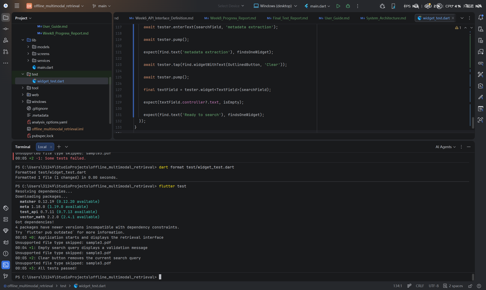
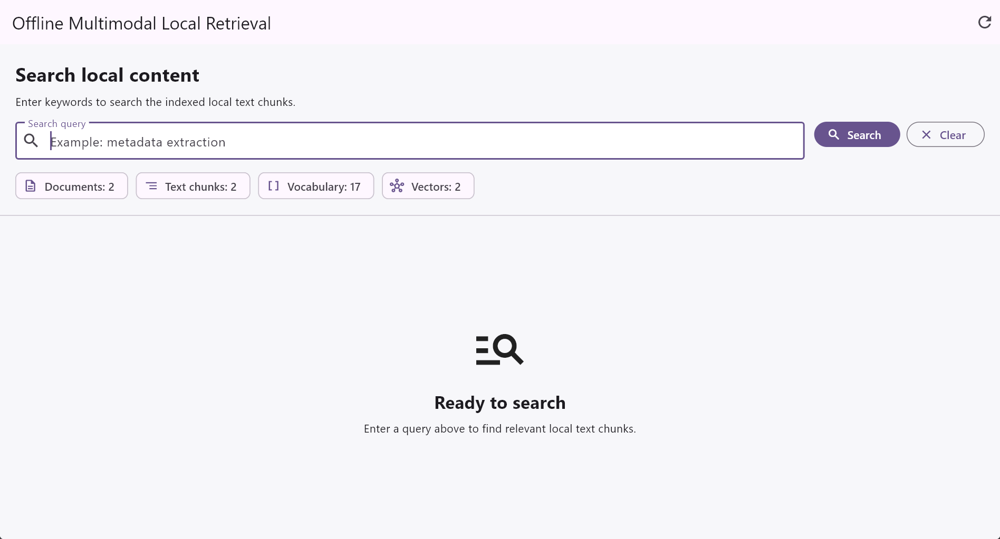
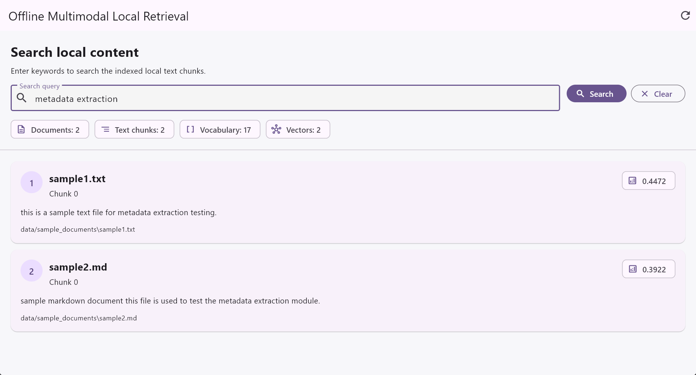
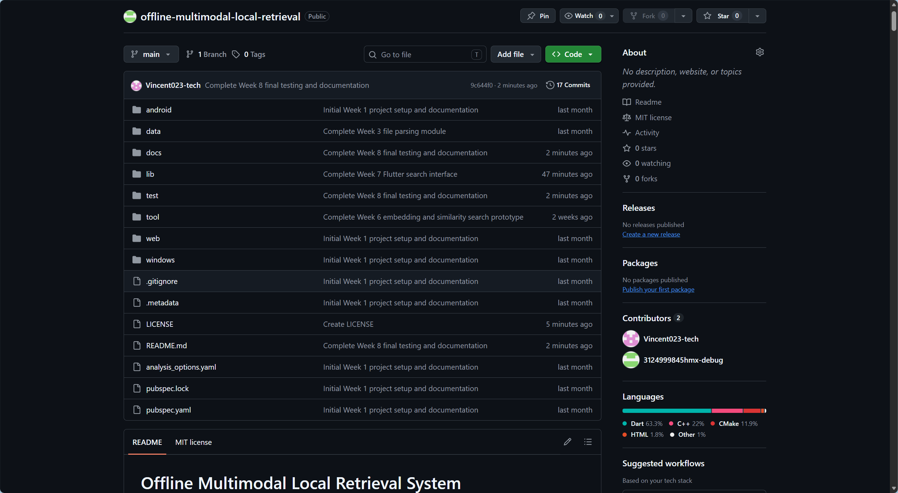

# Offline Multimodal Local Retrieval System

# Week 8 Progress Report

**Student Name:** Mingxuan Huang  
**Project Title:** Offline Multimodal Local Retrieval System  
**Week:** Week 8  
**Date:** 2026/07/27

---

## 1. Week 8 Objectives

The main objective of Week 8 was to complete the final validation, testing, documentation, and delivery preparation for the Offline Multimodal Local Retrieval System.

Week 1 to Week 7 focused on progressively implementing:

- Flutter project setup
- File metadata extraction
- Local text-file parsing
- Text cleaning and normalisation
- Keyword search
- Ranked keyword search
- Text chunking
- Term-frequency vector generation
- Cosine-similarity search
- Flutter desktop search-interface integration

Week 8 focused on converting these weekly development outputs into a complete and reviewable project package.

The specific Week 8 objectives were:

- Review the complete project from Week 1 to Week 7.
- Create a final Week 8 documentation structure.
- Run final static analysis.
- Replace the obsolete default Flutter counter test.
- Add automated widget tests for the retrieval interface.
- Resolve asynchronous file-I/O issues in widget tests.
- Resolve widget-test layout overflow.
- Run the final automated test suite.
- Run the Windows desktop application.
- Perform final manual functional testing.
- Create a final software test report.
- Create a user guide.
- Create a system architecture document.
- Prepare the Week 8 progress report.
- Prepare final README and licence updates.
- Prepare the project for final GitHub delivery.

---

## 2. Week 8 Deliverable Structure

The following Week 8 documentation files were created:

```text
docs/week8/
├── images/
├── Final_Test_Report.md
├── System_Architecture.md
├── User_Guide.md
└── Week8_Progress_Report.md
```

The current Week 8 evidence images include:

```text
flutter_test_final.png
windows_app_final_initial.png
windows_app_final_search.png
github_week8_final.png
```

The updated automated widget-test file is:

```text
test/widget_test.dart
```

---

## 3. Week 8 Development Workflow

The Week 8 finalisation workflow was:

```text
Review project state
→ Create Week 8 documentation structure
→ Run flutter analyze
→ Run flutter test
→ Identify obsolete test
→ Replace default widget test
→ Resolve asynchronous test issues
→ Resolve test viewport overflow
→ Confirm all automated tests pass
→ Run Windows application
→ Perform manual functional checks
→ Record evidence screenshots
→ Write final test report
→ Write user guide
→ Write system architecture
→ Write Week 8 progress report
→ Update README and licence
→ Final GitHub commit and push
```

---

## 4. Week 8 Project Structure

The main Week 8 files are:

```text
docs/week8/Final_Test_Report.md
docs/week8/System_Architecture.md
docs/week8/User_Guide.md
docs/week8/Week8_Progress_Report.md
docs/week8/images/
test/widget_test.dart
```

The Week 8 work does not replace the earlier weekly documentation.

Instead, it provides final validation and delivery documentation for the complete prototype.

---

## 5. Final Static Analysis

The following command was executed:

```bash
flutter analyze
```

The result was:

```text
100 issues found
```

However, all reported issues were information-level lint notices.

The final result contained:

```text
0 errors
0 warnings
100 info-level notices
```

The main notice categories were:

```text
avoid_print
avoid_relative_lib_imports
```

### 5.1 `avoid_print`

Several service classes and command-line test scripts use:

```dart
print(...)
```

This is acceptable for the current prototype and debugging workflow.

A production implementation should replace these calls with a structured logging framework.

### 5.2 `avoid_relative_lib_imports`

Several command-line scripts under:

```text
tool/
```

use relative paths to import project libraries.

The scripts still function correctly, but package imports are preferred.

### 5.3 Dependency Notices

The analysis output also reported newer available versions for:

```text
matcher
meta
test_api
vector_math
```

These versions were incompatible with the current dependency constraints.

No upgrade was performed during finalisation because unnecessary dependency changes could introduce regression risk.

---

## 6. Initial Automated Test Failure

The first Week 8 automated test command was:

```bash
flutter test
```

The test failed with:

```text
Counter increments smoke test
```

The failure message included:

```text
Expected: exactly one matching candidate
Actual: Found 0 widgets with text "0"
```

### Cause

The original Flutter project template contained a counter demonstration.

The default test expected:

```text
0
+
1
```

However, Week 7 replaced the counter interface with the retrieval search interface.

The default test was therefore obsolete.

### Solution

The old counter test was removed.

A new retrieval-interface widget-test suite was created.

---

## 7. New Widget-Test Scope

The final test suite covers three user-interface behaviours:

```text
1. Application startup and retrieval-interface display
2. Empty-query validation
3. Clear-button query removal
```

The modified file is:

```text
test/widget_test.dart
```

The final test implementation is shown below.

```dart
import 'package:flutter/material.dart';
import 'package:flutter_test/flutter_test.dart';
import 'package:offline_multimodal_retrieval/main.dart';

/// Configures the widget test viewport to represent a Windows desktop window.
///
/// Flutter widget tests use a relatively small default viewport. The actual
/// application is designed for a desktop window, so the tests should use a
/// realistic desktop size to avoid artificial RenderFlex overflow errors.
void configureDesktopTestView(WidgetTester tester) {
  tester.view.physicalSize = const Size(1280, 900);
  tester.view.devicePixelRatio = 1.0;

  addTearDown(() {
    tester.view.resetPhysicalSize();
    tester.view.resetDevicePixelRatio();
  });
}

/// Waits for a widget while allowing real asynchronous operations,
/// including local directory access and file reading, to complete.
///
/// Widget tests normally use a controlled clock. The application performs
/// real file-system I/O during retrieval-pipeline initialisation, so
/// tester.runAsync() is required.
Future<void> pumpUntilFoundWithIo(
  WidgetTester tester,
  Finder finder, {
  int maximumAttempts = 30,
  Duration interval = const Duration(milliseconds: 100),
}) async {
  for (var attempt = 0; attempt < maximumAttempts; attempt++) {
    await tester.runAsync(() async {
      await Future<void>.delayed(interval);
    });

    await tester.pump();

    if (finder.evaluate().isNotEmpty) {
      return;
    }
  }

  throw TestFailure(
    'The expected widget was not found after '
    '$maximumAttempts attempts: $finder',
  );
}

void main() {
  testWidgets(
    'Application starts and displays the retrieval interface',
    (WidgetTester tester) async {
      configureDesktopTestView(tester);

      await tester.pumpWidget(const MyApp());

      expect(
        find.text('Offline Multimodal Local Retrieval'),
        findsOneWidget,
      );

      expect(
        find.text('Loading and indexing local documents...'),
        findsOneWidget,
      );

      await pumpUntilFoundWithIo(
        tester,
        find.text('Search local content'),
      );

      expect(
        find.text('Search local content'),
        findsOneWidget,
      );

      expect(
        find.byType(TextField),
        findsOneWidget,
      );

      expect(
        find.widgetWithText(FilledButton, 'Search'),
        findsOneWidget,
      );

      expect(
        find.widgetWithText(OutlinedButton, 'Clear'),
        findsOneWidget,
      );

      expect(
        find.textContaining('Documents'),
        findsOneWidget,
      );

      expect(
        find.textContaining('Text chunks'),
        findsOneWidget,
      );

      expect(
        find.textContaining('Vocabulary'),
        findsOneWidget,
      );

      expect(
        find.textContaining('Vectors'),
        findsOneWidget,
      );

      expect(
        find.text('Ready to search'),
        findsOneWidget,
      );
    },
  );

  testWidgets(
    'Empty search query displays a validation message',
    (WidgetTester tester) async {
      configureDesktopTestView(tester);

      await tester.pumpWidget(const MyApp());

      await pumpUntilFoundWithIo(
        tester,
        find.text('Search local content'),
      );

      await tester.tap(
        find.widgetWithText(FilledButton, 'Search'),
      );

      await tester.pump();

      expect(
        find.text('Please enter a search query.'),
        findsOneWidget,
      );

      expect(
        tester.takeException(),
        isNull,
      );
    },
  );

  testWidgets(
    'Clear button removes the current search query',
    (WidgetTester tester) async {
      configureDesktopTestView(tester);

      await tester.pumpWidget(const MyApp());

      await pumpUntilFoundWithIo(
        tester,
        find.text('Search local content'),
      );

      final searchField = find.byType(TextField);

      await tester.enterText(
        searchField,
        'metadata extraction',
      );

      await tester.pump();

      expect(
        find.text('metadata extraction'),
        findsOneWidget,
      );

      await tester.tap(
        find.widgetWithText(OutlinedButton, 'Clear'),
      );

      await tester.pump();

      final textField = tester.widget<TextField>(
        searchField,
      );

      expect(
        textField.controller?.text,
        isEmpty,
      );

      expect(
        find.text('Ready to search'),
        findsOneWidget,
      );
    },
  );
}
```

---

## 8. Widget-Test Problem: `pumpAndSettle()` Timeout

The first replacement widget tests used:

```dart
pumpAndSettle()
```

All tests timed out.

### Cause

The application displays an animated:

```dart
CircularProgressIndicator()
```

during startup indexing.

`pumpAndSettle()` waits until the widget tree stops scheduling frames.

The continuously animated progress indicator prevented the interface from reaching a completely settled state.

### Solution

`pumpAndSettle()` was replaced with a bounded waiting helper.

The helper repeatedly checked whether:

```text
Search local content
```

had appeared.

---

## 9. Widget-Test Problem: Local File I/O

The bounded helper still failed to find the retrieval interface.

The test output reported:

```text
The expected widget was not found after 30 attempts
```

### Cause

The application performs real asynchronous operations:

```text
Directory listing
File reading
Document parsing
```

Flutter widget tests normally use a controlled test clock.

Calling only:

```dart
tester.pump()
```

did not allow the real local file-system operations to complete properly.

### Solution

The final helper used:

```dart
tester.runAsync(...)
```

This allowed real asynchronous file operations to execute.

The test then called:

```dart
tester.pump()
```

to rebuild the interface after the indexing state changed.

---

## 10. Widget-Test Problem: RenderFlex Overflow

After file I/O was resolved, the empty-query test reported:

```text
A RenderFlex overflowed by 20 pixels on the bottom.
```

### Cause

Flutter widget tests use a relatively small default viewport.

The application is designed for a Windows desktop window.

When the validation message appeared, the small default viewport did not contain enough vertical space for the full interface.

### Solution

The test viewport was configured as:

```text
1280 × 900
```

The device pixel ratio was set to:

```text
1.0
```

The viewport values were reset after each test.

This removed the artificial layout overflow.

---

## 11. Final Automated Test Result

After all corrections, the following commands were run:

```bash
dart format test/widget_test.dart
flutter test
```

The result was:

```text
00:03 +0: Application starts and displays the retrieval interface
00:04 +1: Empty search query displays a validation message
00:05 +2: Clear button removes the current search query
00:05 +3: All tests passed!
```

The terminal also displayed:

```text
Unsupported file type skipped: sample3.pdf
```

This message is expected.

It confirms that the parser safely skips unsupported PDFs without terminating the test.



**Figure 1.** Final automated widget-test output showing three passed tests and no failures.

The final automated test result was:

```text
Passed: 3
Failed: 0
Pass rate: 100%
```

---

## 12. Automated Test Coverage

The final automated tests validate:

- Application title
- Loading state
- Completion of local indexing
- Search interface
- Search query field
- Search button
- Clear button
- Document summary
- Text chunk summary
- Vocabulary summary
- Vector summary
- Ready state
- Empty-query validation
- Query entry
- Query clearing
- Absence of rendering exceptions

The tests do not yet cover every retrieval result in detail.

The earlier command-line tests continue to provide service-level and integration-level evidence.

---

## 13. Windows Desktop Execution

The final Windows desktop command was:

```bash
flutter run -d windows
```

The output included:

```text
Launching lib\main.dart on Windows in debug mode...
Building Windows application...
Built build\windows\x64\runner\Debug\offline_multimodal_retrieval.exe
Syncing files to device Windows...
```

The application built successfully in approximately:

```text
10.1 seconds
```

The generated executable was:

```text
build/windows/x64/runner/Debug/offline_multimodal_retrieval.exe
```

The application then started normally.

---

## 14. Final Windows Initial State

After startup, the application:

- Scanned the local sample directory
- Parsed supported files
- Skipped the unsupported PDF
- Processed text
- Generated chunks
- Generated a vocabulary
- Generated vectors
- Displayed the ready state



**Figure 2.** Final Windows desktop application after local indexing and before a user query is entered.

The current application displays summary information such as:

```text
Documents: 2
Text chunks: 2
Vocabulary: 17
Vectors: 2
```

These values are consistent with the current sample dataset and Week 7 chunk configuration.

---

## 15. Final Search Verification

The main final manual query was:

```text
metadata extraction
```

The application returned ranked results from the indexed local files.

Each result displayed:

- Ranking number
- Source filename
- Chunk index
- Similarity score
- Text preview
- Local file path



**Figure 3.** Final Windows desktop search result showing ranked local content for the query `metadata extraction`.

---

## 16. Manual Functional Validation

The following functions were manually checked:

| Test ID | Function | Result |
|---|---|---|
| MF-W8-001 | Windows application starts | Pass |
| MF-W8-002 | Initial loading state appears | Pass |
| MF-W8-003 | Local indexing completes | Pass |
| MF-W8-004 | Summary counters appear | Pass |
| MF-W8-005 | `metadata extraction` returns results | Pass |
| MF-W8-006 | `markdown document` returns Markdown result | Pass |
| MF-W8-007 | `unrelated query` displays empty state | Pass |
| MF-W8-008 | Empty query displays validation | Pass |
| MF-W8-009 | Clear removes query and results | Pass |
| MF-W8-010 | Reload rebuilds index | Pass |
| MF-W8-011 | Enter key triggers search | Pass |
| MF-W8-012 | Unsupported PDF is skipped | Pass |
| MF-W8-013 | Application exits normally | Pass |

---

## 17. Repeated PDF Skip Messages

During final execution, the terminal displayed:

```text
Unsupported file type skipped: sample3.pdf
```

multiple times.

This occurred because the local indexing pipeline was executed multiple times during:

- Application startup
- Reload tests
- Repeated widget tests
- Repeated manual validation

This is expected behaviour.

The message confirms that the unsupported file is detected and skipped safely.

---

## 18. Final Test Documentation

A separate final test document was created:

```text
docs/week8/Final_Test_Report.md
```

It records:

- Test scope
- Test environment
- Static-analysis results
- Automated test cases
- Manual test cases
- Test failures
- Root-cause analysis
- Corrective actions
- Final pass result
- Known limitations
- Regression recommendations

The final test report is marked:

```text
Version: 1.0
Status: Final
```

---

## 19. User Guide

A final user guide was created:

```text
docs/week8/User_Guide.md
```

The guide explains:

- System requirements
- Required development tools
- Supported file types
- Dependency installation
- Windows execution
- Search operation
- Result interpretation
- Clear and Reload controls
- Keyboard interaction
- Troubleshooting
- Privacy and offline behaviour
- Current limitations

The user guide allows another developer or evaluator to reproduce the main application workflow.

---

## 20. System Architecture Document

A final architecture document was created:

```text
docs/week8/System_Architecture.md
```

It describes:

- Architectural layers
- Project structure
- Data models
- Service modules
- UI coordination
- Retrieval pipeline
- Vocabulary model
- Term-frequency vectors
- Cosine similarity
- Local storage
- Offline-first design
- Error handling
- Accessibility
- Testing architecture
- Future extension architecture

The architecture document also clarifies that the project currently uses internal Dart APIs rather than an existing REST API.

---

## 21. Week 6 Documentation Completion

Before Week 8, two missing Week 6 documents were identified and added:

```text
docs/week6/Week6_API_Interface_Definition.md
docs/week6/Week6_Test_Report.md
```

The API interface document describes:

- Internal Dart data models
- Service interfaces
- Parameters
- Return types
- Preconditions
- Error behaviour
- Dependencies
- Traceability

The Week 6 test report describes:

- Similarity-search testing
- Pipeline test cases
- Expected and actual results
- Defects
- Risks
- Traceability

These documents were reviewed during Week 8 finalisation and confirmed against the completed Week 6 source code and test evidence.

Their document-control status was updated to:

```text
Version: 1.0
Status: Final
```

---

## 22. Documentation Standards

The testing documents were organised with reference to:

```text
ISO/IEC/IEEE 29119-3 test documentation principles
```

The project does not claim formal ISO certification.

The API document uses a structured internal interface-definition format.

OpenAPI was not used because the current application does not implement HTTP or REST endpoints.

---

## 23. Current Final Documentation Set

The project now includes:

```text
Weekly progress reports
Week 6 API interface definition
Week 6 software test report
Week 7 Flutter UI progress report
Week 8 final test report
Week 8 user guide
Week 8 system architecture document
Week 8 progress report
```

The final project-level files were also completed:

```text
README.md
LICENSE
```

The root README now documents installation, execution, testing, architecture, supported features, limitations, and future development.

The repository is distributed under the MIT License.

---

## 24. Current Technical Status

| Area | Status | Notes |
|---|---|---|
| Flutter project setup | Completed | Multi-platform project structure |
| Metadata extraction | Completed | Local metadata available |
| TXT parsing | Completed | Supported |
| Markdown parsing | Completed | Supported |
| PDF parsing | Pending | Safely skipped |
| Text processing | Completed | Cleaning and normalisation |
| Keyword search | Completed | Exact-term matching |
| Ranked keyword search | Completed | Ranked results |
| Text chunking | Completed | Configurable chunk size |
| Shared vocabulary | Completed | Generated locally |
| Term-frequency vectors | Completed | Lightweight vector model |
| Query-vector generation | Completed | Shared vocabulary used |
| Cosine similarity | Completed | Ranked similarity |
| Flutter search UI | Completed | Windows desktop interface |
| Loading state | Completed | Startup and reload |
| Empty-query validation | Completed | User feedback |
| Empty-result state | Completed | Safe no-result handling |
| Clear button | Completed | Clears query and results |
| Reload button | Completed | Rebuilds index |
| Keyboard search | Completed | Enter supported |
| Accessibility semantics | Completed | Initial semantic support |
| Static analysis | Completed | No errors or warnings |
| Widget tests | Completed | Three passed |
| Windows build | Completed | Successful |
| Windows execution | Completed | Successful |
| Final test report | Completed | Week 8 |
| User guide | Completed | Week 8 |
| System architecture | Completed | Week 8 |
| README finalisation | Completed | Root README updated |
| MIT licence | Completed | Root `LICENSE` added |
| Persistent storage | Future work | In-memory only |
| Neural embeddings | Future work | Not implemented |
| Image retrieval | Future work | Not implemented |

---

## 25. Problems and Solutions

### 25.1 Obsolete Counter Test

**Problem**

The default Flutter counter test failed.

**Cause**

The counter interface had been replaced.

**Solution**

The old test was replaced with retrieval-interface tests.

---

### 25.2 Animated Loading Timeout

**Problem**

`pumpAndSettle()` timed out.

**Cause**

The loading indicator continuously scheduled animation frames.

**Solution**

A bounded widget-search helper was introduced.

---

### 25.3 File-System I/O in Widget Tests

**Problem**

The indexed search interface did not appear during the test.

**Cause**

Real directory and file operations did not complete under the normal controlled test clock.

**Solution**

`tester.runAsync()` was used to allow real asynchronous file access.

---

### 25.4 Test Viewport Overflow

**Problem**

The empty-query test produced a vertical RenderFlex overflow.

**Cause**

The default widget-test viewport was too small for the desktop-oriented interface.

**Solution**

The test viewport was configured to 1280 × 900.

---

### 25.5 Dependency Update Notices

**Problem**

Four packages had newer versions.

**Cause**

The newer versions were outside the current dependency constraints.

**Solution**

The stable working dependency set was retained.

---

### 25.6 Static Analysis Notices

**Problem**

The analyzer reported 100 information-level notices.

**Cause**

Debug prints and relative imports remain in earlier services and tools.

**Solution**

The notices were documented as maintainability improvements rather than release-blocking errors.

---

## 26. Current Limitations

The final prototype does not yet include:

- PDF content extraction
- Word parsing
- PowerPoint parsing
- OCR
- Image embeddings
- Multimodal retrieval
- Neural semantic embeddings
- Persistent vector storage
- User-selected folders
- Incremental indexing
- Background indexing
- File opening from result cards
- Search history
- Production logging
- Automated CI
- Formal accessibility certification
- Windows installer packaging

---

## 27. Key Week 8 Achievements

Week 8 completed the following major tasks:

1. Created Week 8 documentation structure.
2. Ran final static analysis.
3. Recorded no compile-blocking errors.
4. Replaced obsolete default Flutter test.
5. Added three retrieval-interface widget tests.
6. Added realistic desktop viewport testing.
7. Added real asynchronous file-I/O support in widget tests.
8. Resolved `pumpAndSettle()` timeout.
9. Resolved file-I/O waiting failure.
10. Resolved RenderFlex overflow.
11. Achieved three passing automated tests.
12. Achieved 100% widget-test pass rate.
13. Built the Windows desktop application.
14. Successfully launched the application.
15. Verified local document indexing.
16. Verified ranked retrieval.
17. Verified empty-query validation.
18. Verified empty-result handling.
19. Verified Clear control.
20. Verified Reload control.
21. Verified Enter-key search.
22. Created final test evidence.
23. Created final test report.
24. Created user guide.
25. Created system architecture document.
26. Created Week 8 progress report.
27. Completed the final root README.
28. Added the MIT License.
29. Committed and pushed the Week 8 finalisation.
30. Captured final GitHub delivery evidence.

---

## 28. Final Test Summary

The final validation result was:

```text
Static analysis:
0 errors
0 warnings
100 information-level notices

Widget tests:
3 passed
0 failed

Windows build:
Passed

Windows execution:
Passed

Manual functional checks:
Passed
```

The overall final technical result is:

```text
PASS
```

---

## 29. Finalisation Completion Status

The finalisation checklist was completed:

```text
1. Root README.md updated
2. MIT LICENSE added
3. Week 8 Markdown documents reviewed
4. Image links checked
5. flutter analyze rerun
6. flutter test rerun
7. git status reviewed
8. Intended files staged
9. Week 8 finalisation committed
10. Changes pushed to the main branch
11. Final GitHub evidence captured
12. Working tree confirmed clean
```

The final verification results were:

```text
flutter analyze:
0 errors
0 warnings
100 information-level notices

flutter test:
3 passed
0 failed

git status:
nothing to commit, working tree clean
```

---

## 30. Week 8 Summary

Week 8 converted the working retrieval prototype into a more complete and professionally documented software project.

The project now includes:

```text
Working Windows desktop application
+
Automated widget tests
+
Manual functional validation
+
Final test report
+
User guide
+
System architecture document
+
Weekly progress documentation
```

The final application successfully performs:

```text
Local file parsing
→ Text processing
→ Text chunking
→ Vector generation
→ Query comparison
→ Ranked result display
```

The Week 8 testing process also demonstrated an important software-engineering workflow:

```text
Test failure
→ Root-cause analysis
→ Code correction
→ Retest
→ Final pass
```

The project-level presentation, open-source licensing, and repository delivery were also completed.

The final Week 8 result confirms that the current prototype is functional, testable, reproducible, documented, licensed, and delivered through the remote GitHub repository.

---

## 31. Final GitHub Delivery

The completed Week 8 source code, automated tests, final documentation, screenshots, README update, and MIT licence were committed and pushed to the remote GitHub repository.

The final Week 8 update included:

```text
README.md
LICENSE
test/widget_test.dart
docs/week8/Final_Test_Report.md
docs/week8/System_Architecture.md
docs/week8/User_Guide.md
docs/week8/Week8_Progress_Report.md
docs/week8/images/
```

The commit message was:

```text
Complete Week 8 final testing and documentation
```

The changes were successfully pushed to the `main` branch.



**Figure 4.** Final GitHub repository state showing the Week 8 documentation, automated tests, updated README, MIT licence, and final delivery commit.

The repository was confirmed to be synchronised with the remote `main` branch, with no remaining uncommitted changes.

